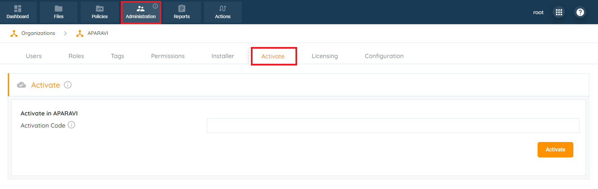

To activate an APARAVI node, use the activation code in the installer tab. Log in to your client level in the APARAVI platform, then go to the "Administration" menu and choose the "Activate" tab.

Input the activation code and click “**Activate**“.
