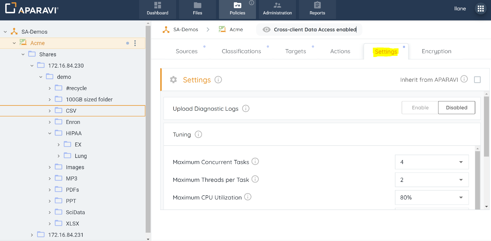

## Purpose

Settings control system functionality. In the tunings section, adjust runtime and resource consumption for Aggregators and Collectors.

## Usage

Access Settings by clicking "Policies" in the ribbon menu, then the Settings tab. Options are initially grayed out due to inherited policies; keep the default or uncheck "Inherited from Organizations" to customize. Click 'Save All Changes' at the bottom left to apply.

 

## Feature Settings

#### Upload Diagnostic Logs

Enabling the Upload Diagnostics Logs feature facilitates further technical analysis of issues. Once activated, logs and engine crash details are automatically sent to the hosted platform for analysis.

### Tuning

- #### Maximum Concurrent Tasks
    
    - The maximum allowable simultaneous tasks, include scanning, indexing, and classification. A higher number speeds up processes but increases resource consumption.
- #### Maximum Threads per Task
    
    - The maximum number of simultaneous processes allowed per task.
- #### Maximum CPU Utilization
    
    - Limits the CPU consumption of Aparavi processes. New tasks require the CPU consumption on the Aggregator or Collector to be below this threshold for initiation; otherwise, they won't start.
- #### Free memory Threshold
    
    - Sets a limit on Aparavi process memory/RAM usage; a task starts only if Aggregator or Collector memory stays below this threshold.
- #### Maximum Normalized System Load (Linux)
    
    - Limits the CPU consumption of Aparavi processes. Before a new task starts, the CPU consumption on the Aggregator or Collector must be below this threshold else the task will not start.
- #### Maximum Disk IO Utilization (Windows)
    
    - Limits the disk utilization of Aparavi processes. Before a new task starts, the IO utilization on the Aggregator or Collector must be below this threshold else the task will not start.
- #### Maximum Historical Tasks
    
    - Specifies the number of historical tasks retained on the Aggregator. The Dashboard Status widget utilizes this task history for visualization. Upon reaching the limit, older task history is automatically purged.
- #### Trace Flags
    
    - Trace Flags empower administrators to adjust logging levels for tasks like engine, network, and queuing, offering enhanced information for issue troubleshooting.
- #### Maximum File Size to Index and Classify
    
    - This setting limits the file size for indexing and classification, optimizing system resources, and preventing issues with large files. Users can customize it based on system capabilities.
- #### Maximum Dynamic Workers
    
    - Determines the maximum concurrent dynamic workers for adaptive task execution, ensuring scalability and resource efficiency.
- #### Database Buffer pool size
    
    - Defines the memory size for the database buffer pool, improving data retrieval and boosting performance by caching frequently accessed information.
