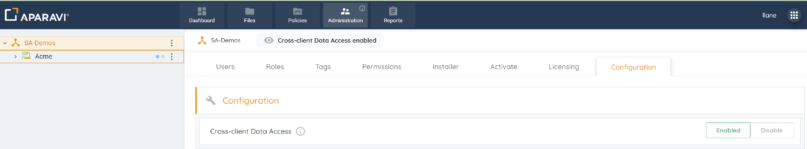
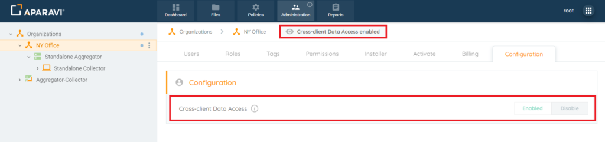
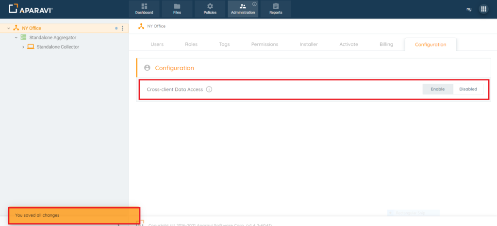

Administrative users can enable Cross-Client Data Access, allowing the parent organization to view files within a client. If disabled, the higher organization loses file access. This feature is off by default for new clients and requires administrative activation. Note: Disabling it doesn't affect Dashboard widget visibility, but restricts file access within the widgets.

## Enabling Cross-Client Data Access

The Cross-Client Data Access feature is initially disabled for the top organization's administrative user. Only the assigned client's administrative user can enable or disable it. When enabled, the parent organization gains access to the client's data for file searches and views.

1. Select the organization from the left navigation tree; it will be highlighted in yellow to show it's chosen. Note: Ensure administrative privileges are available for the Configuration subtab.
2. Navigate to the Administration tab, then select the Configuration subtab.
3. Enable Cross-Client Data Access by clicking the Enable button; it will turn green and display "Enabled."
4. Save changes by clicking the "Save All Changes" button, then confirm by clicking "Ok" in the pop-up box.

## Disabling Cross-Client Data Access

1. Choose the organization in the left navigation (highlighted in yellow).
2. In Administration > Configuration, click Disable for Cross-Client Data Access.
3. Save changes by clicking "Save All Changes" and confirming with "Ok."

Now, the higher organization can't access the client's files, and an alert message confirms the changes.

