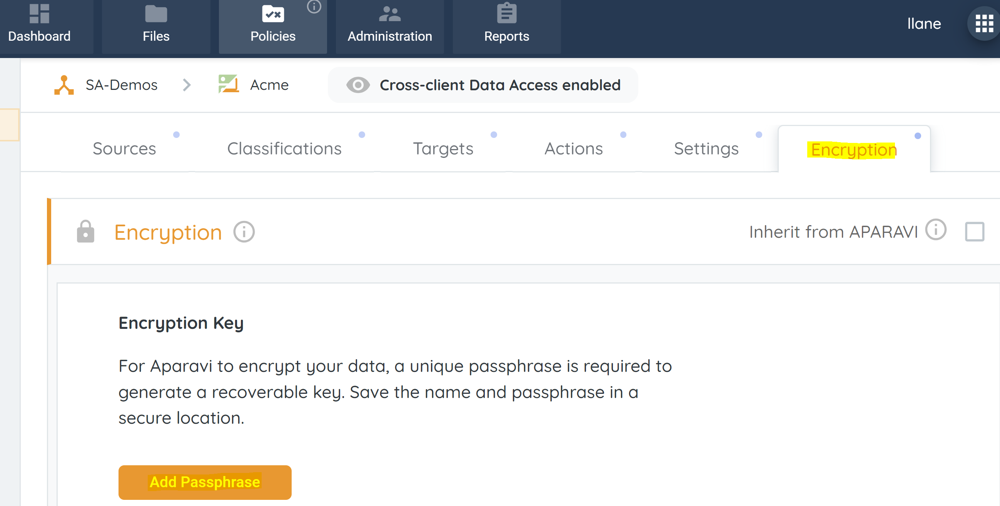
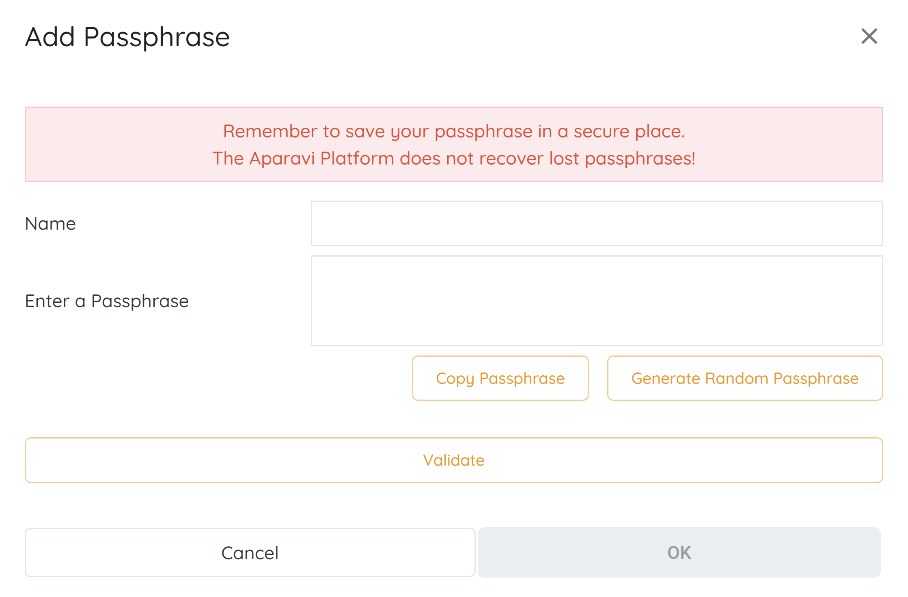
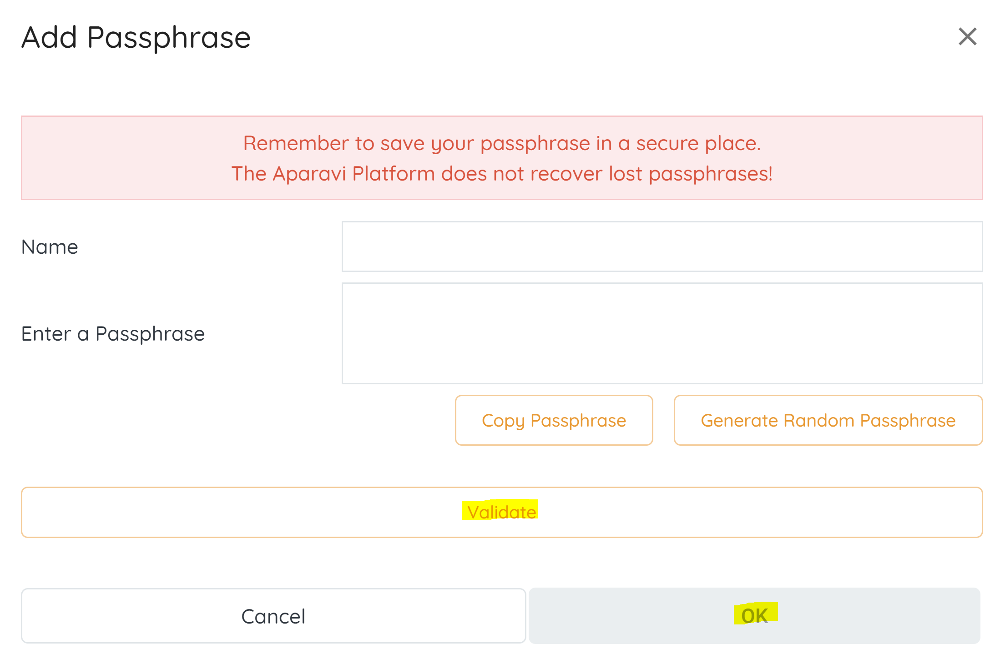

APARAVI's encryption feature allows users to encrypt data using a designated encryption key. The data is secured during transmission and storage on the aggregator node or when sent to a target for retention.

> When configuring encryption, store the key passphrase securely, as it cannot be retrieved if lost. Access this feature on your client level in the APARAVI platform under the "Policies" menu and the "Settings" tab by clicking "Add Passphrase."

To create an encryption key input the below details:

- **Name** – Name of the encryption key.
- **Enter a passphrase** – Input box where you can input the passphrase. You can generate a random passphrase using the “**Generate Random Passphrase**“ button as well as copy the passphrase with the “**Copy Passphrase**“ button. This should then be stored in an external secure location.

 

Click on the “**Validate**“ button to confirm the encryption key and click on the “**OK**“ button to save the encryption setting.

When wanting to remove the encryption key, use the “**Delete**“ button.
