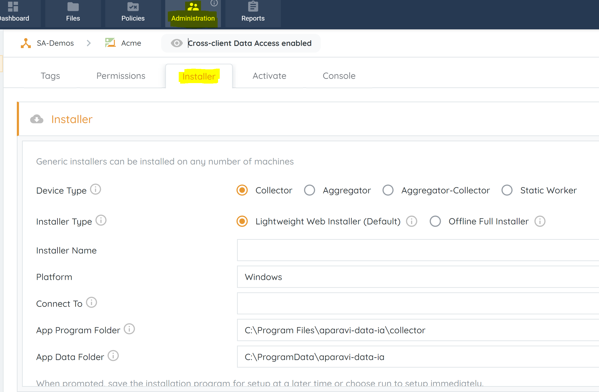
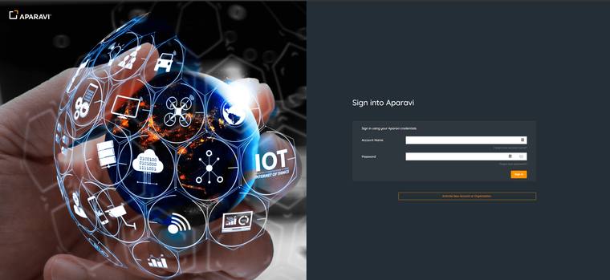
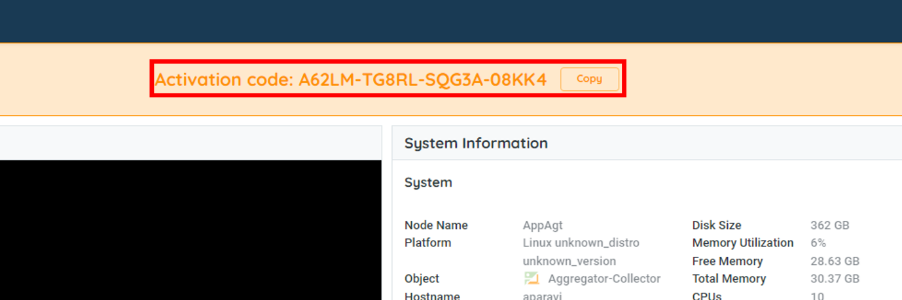

The APARAVI installer offers two download methods: from the object tree and the installer tab. Downloading from the object tree links to your logged-in account, while the installer tab requires activation using the node's code found on the server. To install, log in at the client level, go to e"Administration," and select the "Installer" tab.

Access the Administration tab only with the 'admin' administrator permissions.

Selecting the APARAVI installer mirrors the process of choosing the node from the object tree. Components include Collector, Aggregator, and Aggregator-Collector, streamlining installation. Input necessary details, and follow the documented process for configuration and setup. Obtain the activation key after installation by logging in via IP address and node port:

- Collector: 9652
- Aggregator: 9552
- Aggregator-Collector: 9752

Example connection: "192.168.0.11:9752."

When successfully connected to the node, input the account name and password

- **Account name** – root
- **Password** \- root

When logged into the node you will see the activation code on the top of the browser see the below example.

When successfully activated, the node will show up in the object tree.
