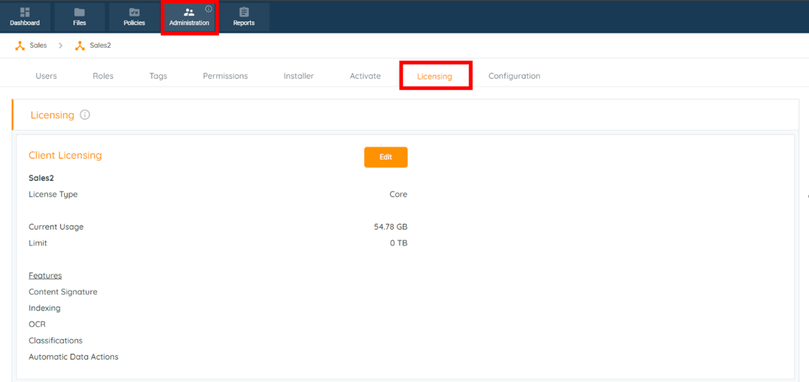
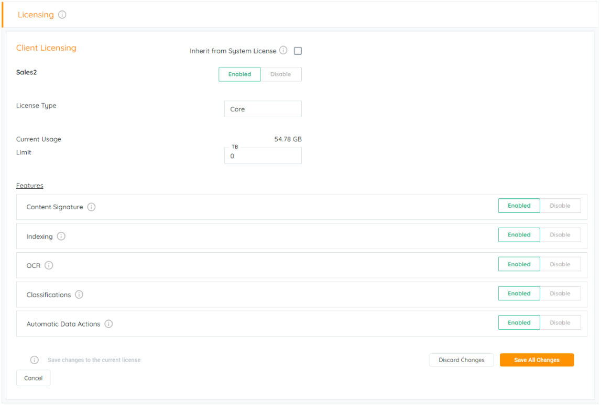

APARAVI's Licensing feature allows users to control and limit platform usage. In the License tab, users can manage and restrict scan types at the client level, including access control, usage, and data actions.Login on your client level in the APARAVI platform. The "**Licensing"** tab can be located within the “**Administration**“ tab.

When in the Licensing tab you will find the following options that can be Enabled / Disabled by clicking on the “**Edit**“ button.

> At any point in time, one can only change the license settings for their corresponding sub-Clients and not the Client itself.

When in the edit mode of the license tab of the sub-client you can alter the settings of the sub-client account. These settings enable the main client level to view and alter the below.

- **Client level enable/disable** - Enable / Disable the sub-client level account
- **License type** - Name of the License type; this can be altered to reflect your requirements.
- **Current usage** - Current amount of data scanned.
- **Limit** - Soft Limit for data scanned.

Features:

- **Content signature** - Enable or Disable the node to perform a scan to create a content signature.
- **Indexing** - Enable or Disable the node to perform an Indexing scan.
- **OCR** - Enable or Disable the node to perform a scan using OCR.
- **Classifications** - Enable or Disable the node to perform a scan using classification.
- **Automatic data actions** - Enable or Disable the data actions features.
