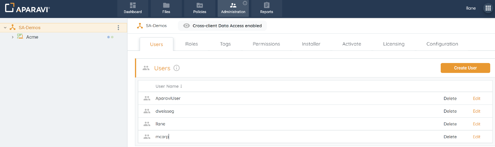
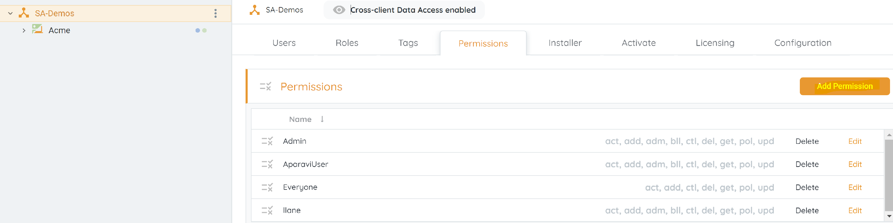
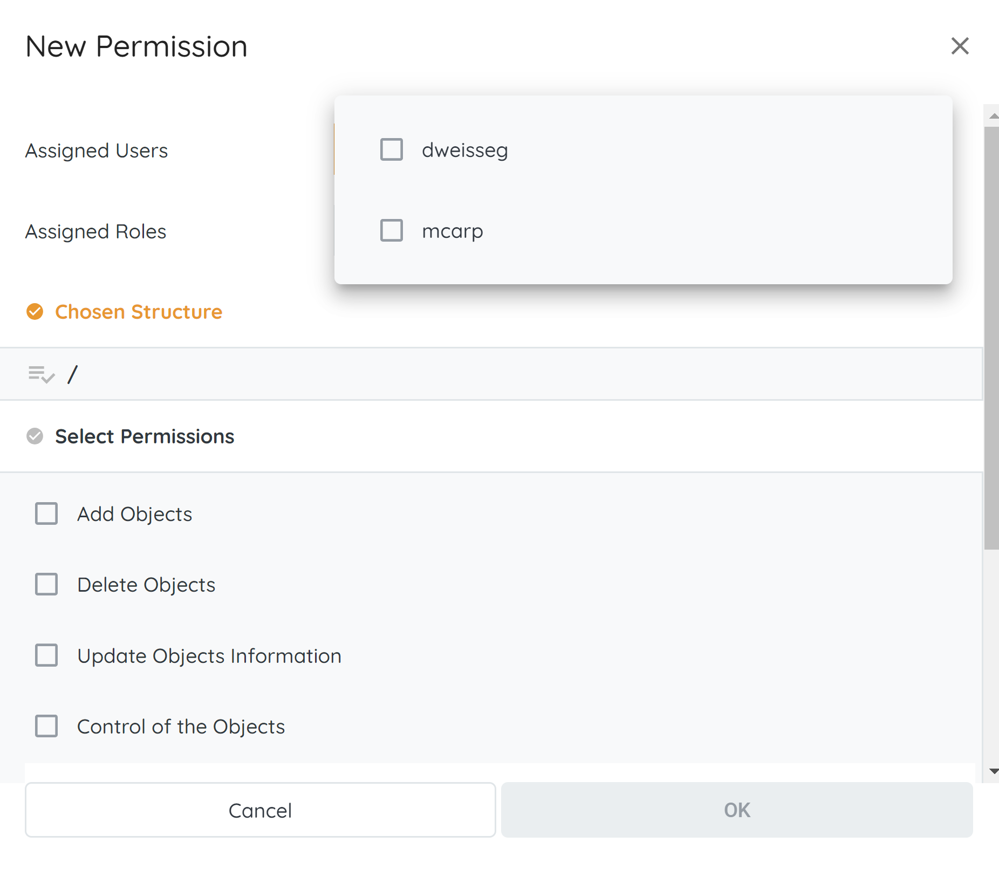
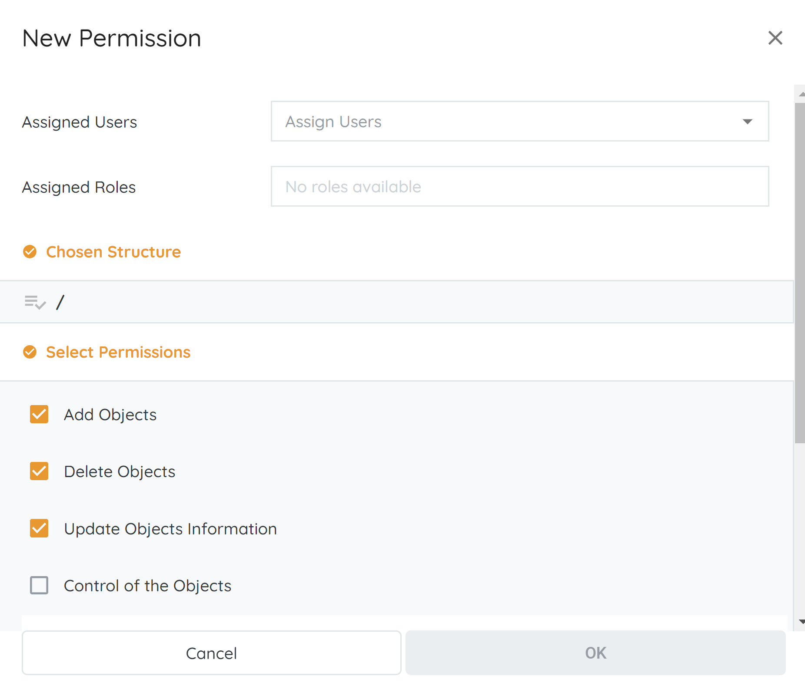
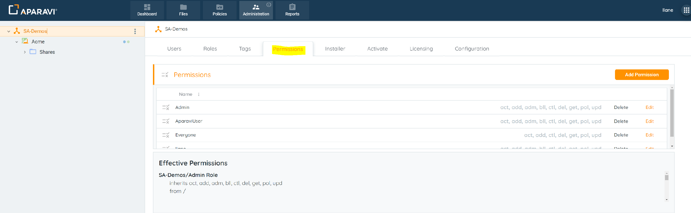
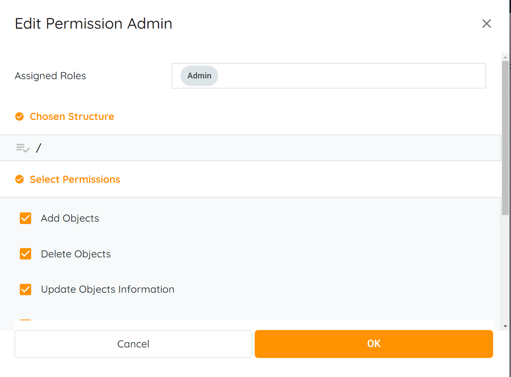
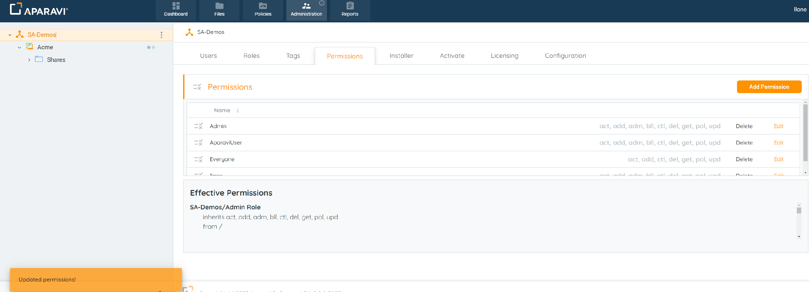
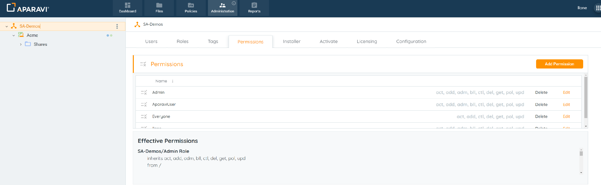
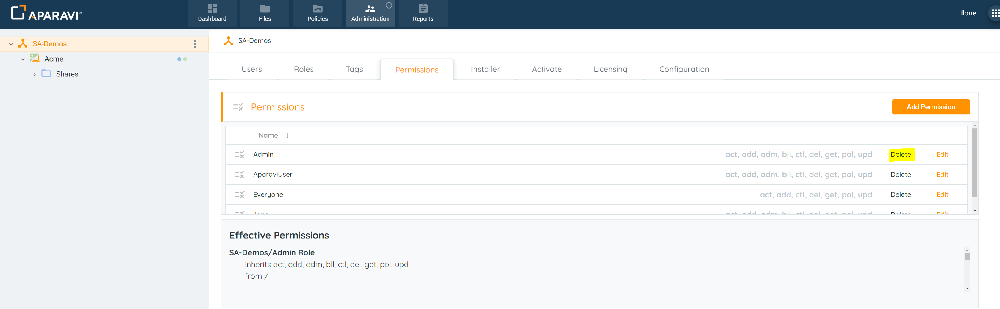
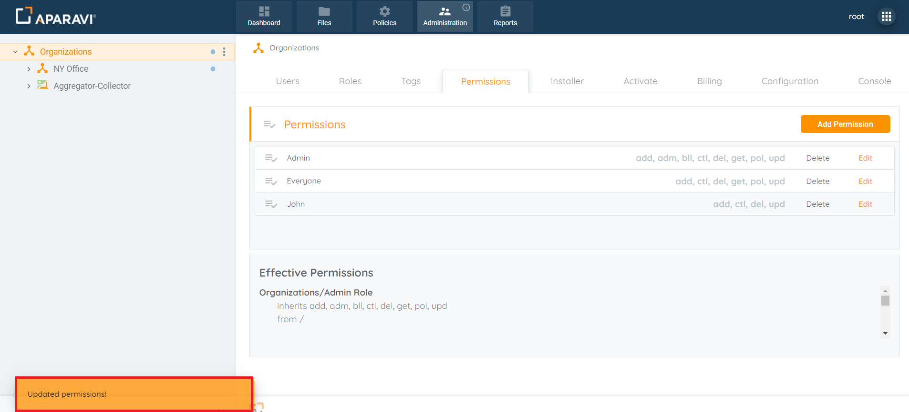

The system allows admins to grant tailored access to file systems. Users can perform actions like adding, deleting, and editing nodes or be restricted to specific features. Permissions are configurable individually, during role creation, or when editing user accounts for precise control.

## Overview

- Adding Permissions
- Editing Permissions
- Deleting Permissions

## Adding Permissions

Different accounts can be created based on assigned permissions. Users may have capabilities limited to adding, editing, and running queries, while others can be granted policy-changing or administrative privileges.

1. Select the Organization from the navigation tree on the left. It will be highlighted with a yellow background when chosen.

> Ensure the Organization Node is selected with Administrative privileges for access to the Permissions subtab.

- Navigate to the Administration tab in the top menu and select the Permissions subtab. Click the "Add Permission" button in the upper right corner to open the New Permission pop-up box.

- Select user(s) from the drop-down menu in the Assigned Users field. Note that saving a new permission requires at least one user to be selected.

- To choose a permission, click the checkbox next to its name; the selected checkboxes are highlighted. Select by clicking again. After making selections, click OK to save permissions.

 

- After clicking OK, the New Permission pop-up box closes, and the new permission is displayed under the Permissions subtab. A success alert appears in the bottom left to confirm the save.

> Each assigned user generates a separate entry; for instance, adding two users results in two new permissions entries under the subtab.

## Edit

Once a Permission has been created, it can be edited to change the individual permissions that were granted to the user during creation of the permission.

1. Select the Organization in the navigation tree with Administrative privileges.
2. Navigate to Administration Tab > Permissions subtab.

3. Click Edit adjacent to the desired Permission to open the Edit Permission pop-up box.
4. Modify individual permissions by selecting or deselecting checkboxes.

6. Click OK, an alert confirms the update.
7. the changes will be immediately applied, with an alert message indicating the update.

## Delete

Once a Permission has been created for a user, it can also be deleted from the system for effective management and organization. Deleting Permissions provides streamlined control over your system access and permissions, contributing to a well-organized and secure environment.

1. Select the organization from the left navigation with administrative privileges.
2. In the Administration tab, click on the Permissions subtab.

3. Click Delete adjacent to the Permission's name.

4. Confirm the deletion in the pop-up box by clicking the Delete button.
5. The Permission will be removed from the Permissions subtab.

