In the Administration tab, the Roles subtab creates permission groups assigned to users at different Organization levels, ensuring restricted access to granted features.

During role creation, choose a unique name, assign users, and select nodes for permissions. Default roles upon installation include Admin and Everyone.

1. Choose the Organization with Admin privileges for the yellowish background to appear.
2. Navigate to the Administration tab > Roles subtab.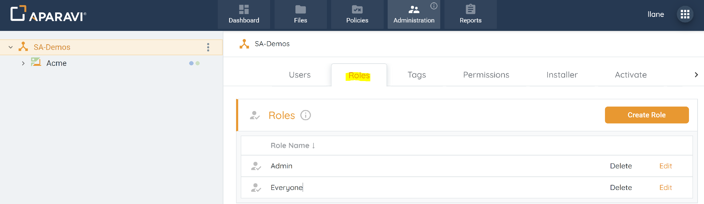
3. Click Create Role in the upper left corner to open the Create Role pop-up.
4. Enter Role Name and assign users from the drop-down list. 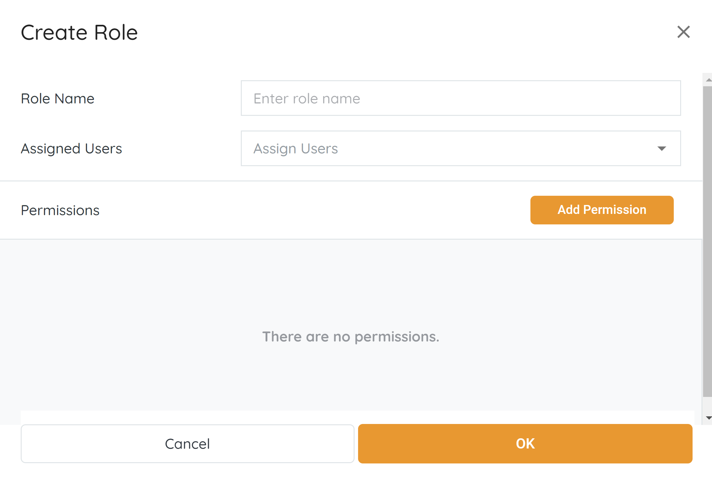
5. Click Add Permission and choose the node level.
6. In the New Permissions pop-up, select individual permissions and click Save. 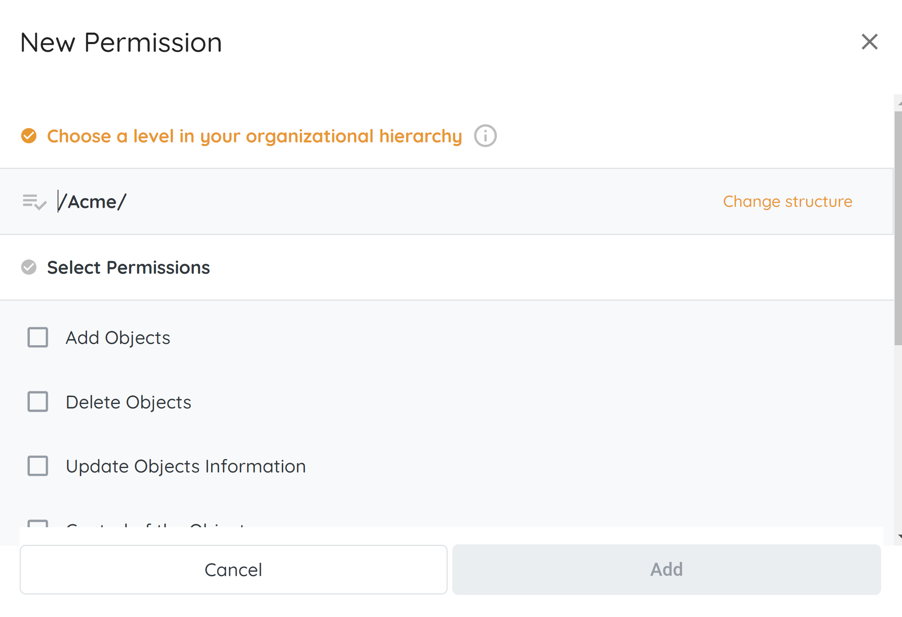
7. Once all selections are made, click Save in the Create Role pop-up.
8. Click OK, and the newly added Role will appear under the Roles subtab.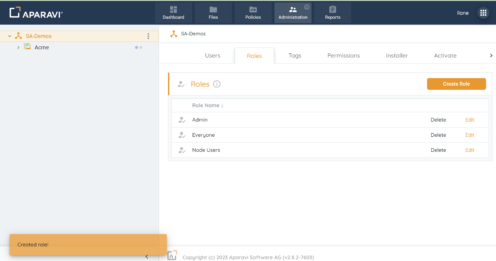

## Edit

Once a Role has been created, it can also be edited to reflect new permissions or assign and remove new users to the role.

1. Choose the Organization, by clicking on it in the navigation tree, located on the left-hand side. Once selected, it will appear with a yellowish background color to indicate that it is selected.
    
    > It is important that the Organization Node is selected and the user has Administrative privileges or the Roles subtab will not be available.
    
2. 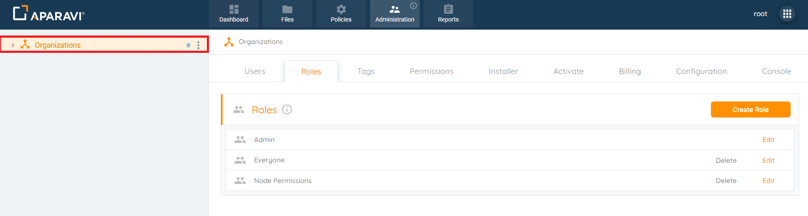Click the Administration Tab and then click on the Roles subtab.
3. 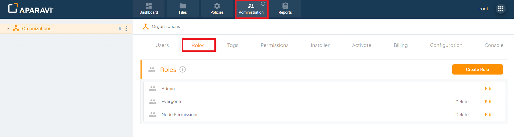Click the Edit button next to the Role's name to open the \[Name of Role\] Properties pop-up box. In this view, you can assign or remove users, add permissions for a different node, or edit existing permissions using the same steps mentioned above.
4. 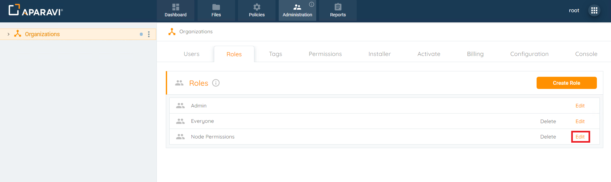Once all changes have been made, click OK, located in the bottom right-hand side of the pop-up box to save the changes.
5. 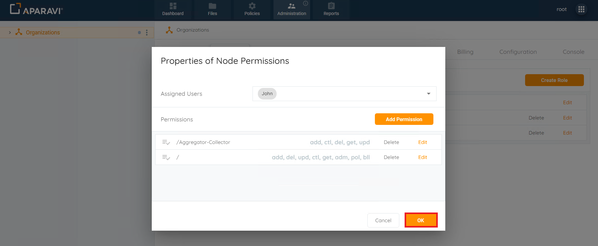The newly edited Role’s changes will now be applied to all users that are assigned the Role.
    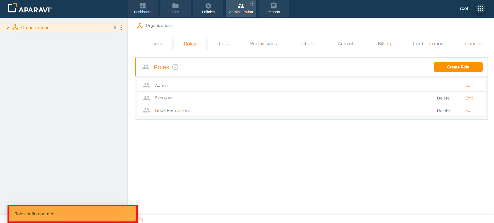
    

## Delete

After creating a Role, it can be deleted from the system. However, users must be unassigned from the Role before deletion, as Roles with assigned users cannot be deleted.

1. Choose the organization from the left navigation (highlighted in yellow) and ensure administrative privileges.
2. In the Administration Tab, click on the Roles subtab.
    
    
3. Click the Edit button adjacent to the Role's name.
4. In the pop-up box, remove users by unchecking the checkboxes next to their names in the User Roles field. Click OK.
    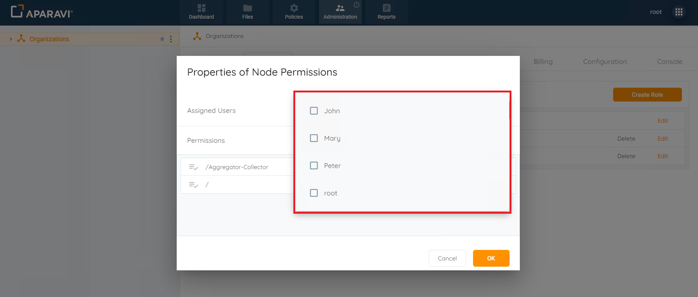
    
5. After removing all users, click Delete next to the Role's name.
6. Confirm the deletion in the pop-up box by clicking Delete.
7. The Role will be removed, and an alert message will confirm the deletion in the Roles subtab.
    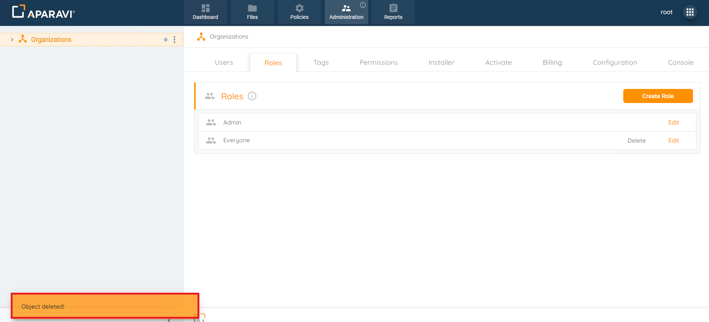
