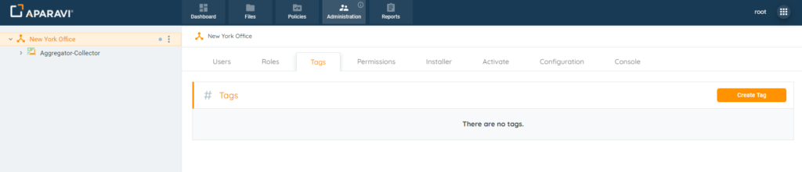
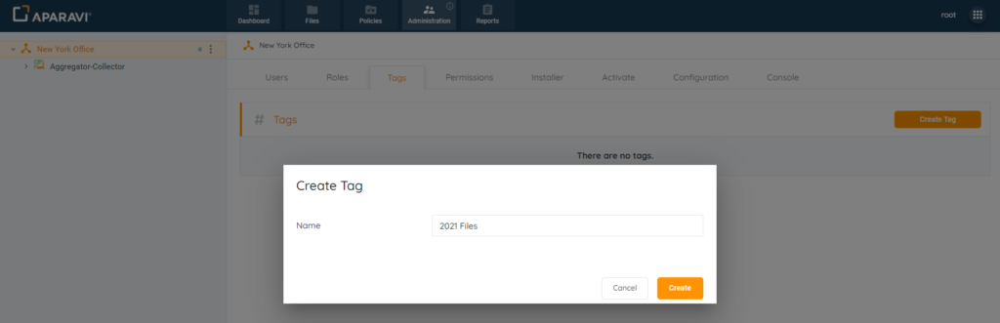
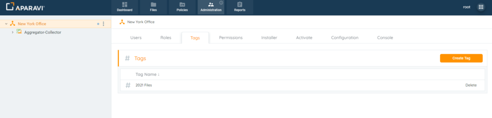
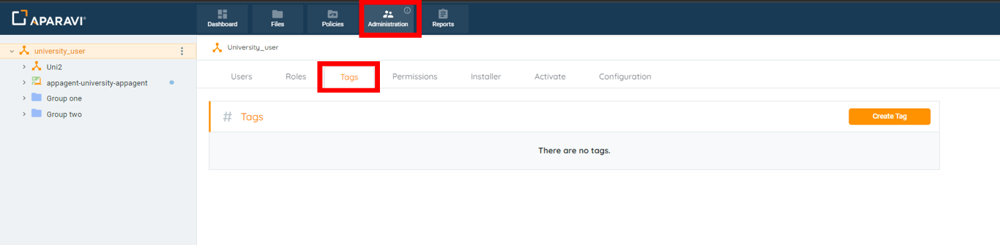
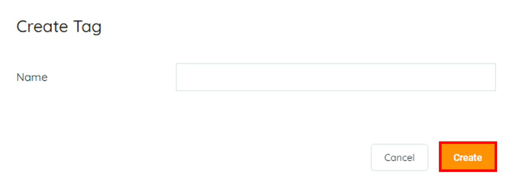
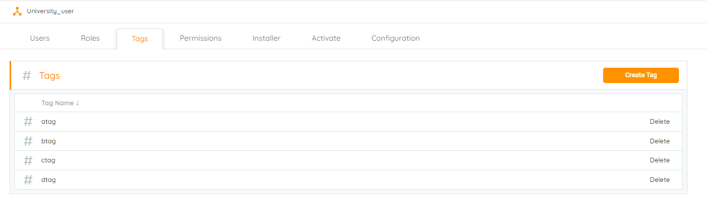
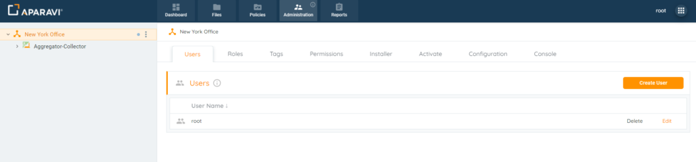
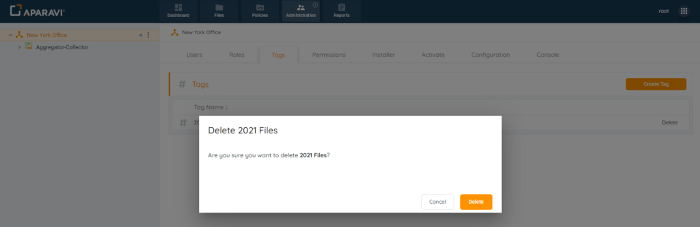

Only users with administrative privileges can create tags. All others can use the tagging feature for tagging, searching, and reporting purposes.

1. Click on the Administration Tab, located in the top navigation menu.
2. Click on the Tags subtab, located under the Administration Tab.
3. Click on the Create Tag button. Once clicked, the Create Tag pop-up box will appear.
4. Inside of the Create Tag pop-up box, enter the name of the custom tag.
5. Click Create.
6. Once the tag has been successfully saved, it will appear under the Tags subtab, with the option to delete the newly created tag.

Tags in Aparavi simplify file location and organization. Creating custom tags is beneficial for various business processes like collaboration, ROT remediation, compliance efforts, legal file cleanup, or setting reminders.

Here's how to create tags:

1. Log in to your APARAVI client level.
2. Go to the "Administration" menu and select the "Tags" tab (requires administrator permissions).

3. Click "Create Tag," enter the tag name in the new window, and click "Create."

4. Create as many unique tags as needed; they will be listed in the Tags tab.

> To assign tags to scanned files, conduct a search query and assign tags to the results.

## Delete

The system allows for custom tags to also be deleted. Once the tag is deleted, it will disappear and will no longer be available for tagging, reporting or searching for files by the tag’s name.

It’s important to note that the system will not retroactively review and delete tags from previously tagged files. If this is not completed before deleting the tag, the tagged files will no longer have the ability to be untagged without recreating the tag again. To remove a deleted tag from a file, recreate the same custom tag with an identical name. Once the tag has been restored, the system will allow for the untagging of files.

1. Click on the Administration Tab, located in the top navigation menu.
2. Click on the Tags subtab, located under the Administration Tab.
3. Click Delete, located to the right of the custom tag.
4. Click Delete to save the changes.
5. Once the Delete button has been clicked, the pop-up box will close, and the custom tag will no longer appear under the Tags subtab.
