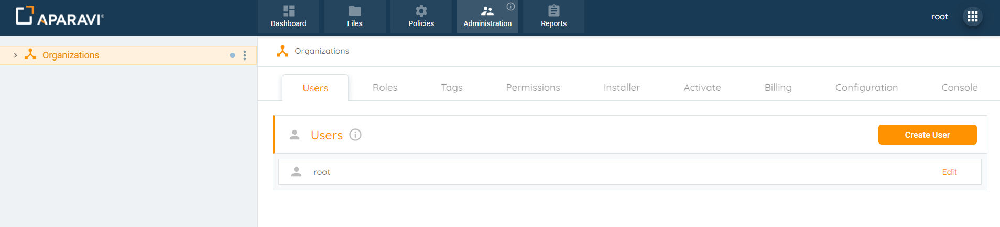
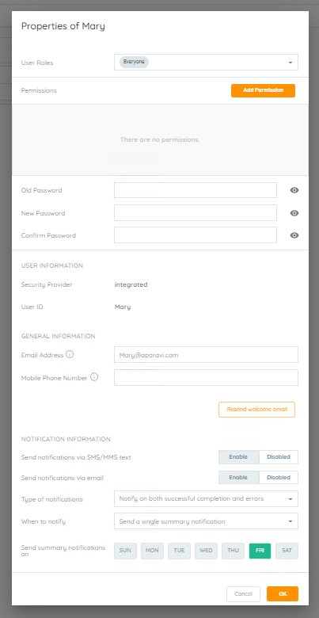
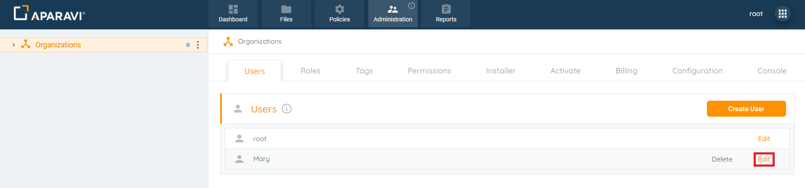
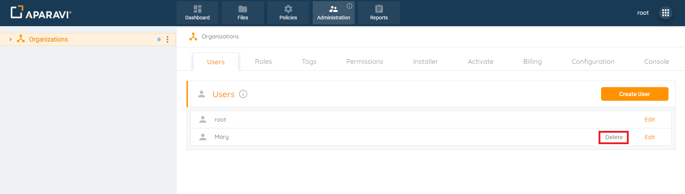
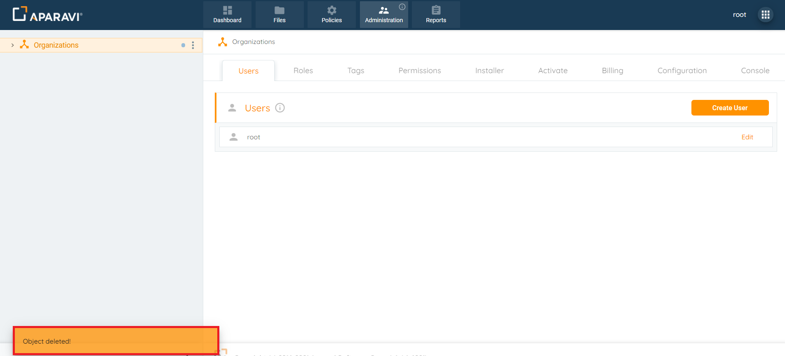
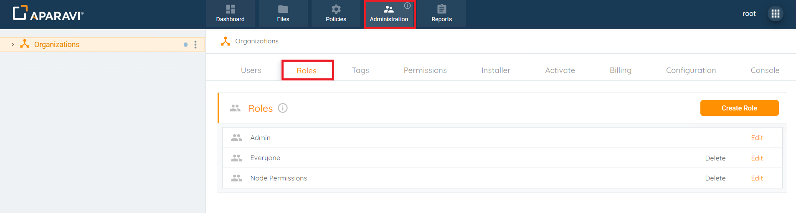
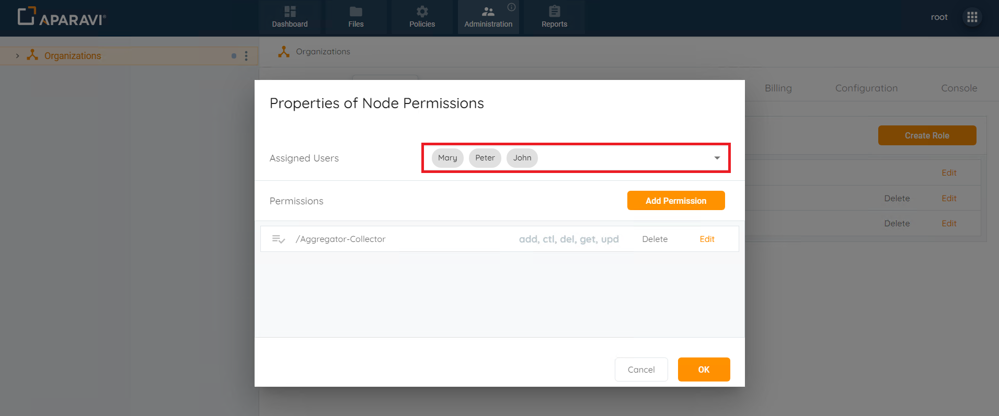
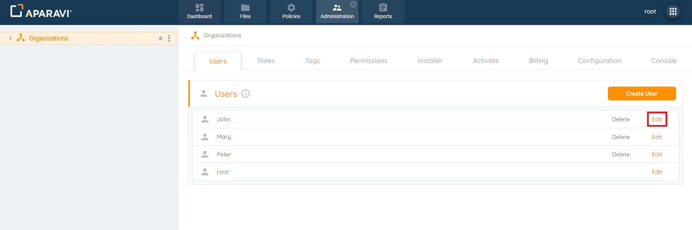

Upon installation, the Aparavi system generates an Administrative account with full permissions, enabling the addition/removal of users. Administrative users can set custom permissions for precise control over user access to specific nodes.

## Adding a User

The original administrative user account or any other accounts that have been created that have been given administrative privileges, are able to add new users to the Aparavi system.

1. Choose the Organization from the left navigation, ensuring administrative privileges.
2. Navigate to the Administrative Tab and click on the Users subtab.
3. Click the Create User button in the upper right corner, triggering the Create User pop-up box.
4. Fill in user details, including Username, Email Address, Mobile Phone Number, and activation preferences.
5. Click Ok to create the user account.
6. Upon confirmation, the Create User pop-up box closes, and the new user is listed under the Users subtab.

> New users are automatically assigned the "Everyone" role, granting access to all functions except the Administration tab. Role adjustments can be made if needed.

## Edit

Once a user account has been created, it can also be edited to reflect new options such as adding new permissions to the user, changing the password and many more features.

1. Select the Organization from the left navigation with administrative privileges.
2. Navigate to the Administrative Tab and click on the Users subtab.
3. Click the Edit button next to the user's name, triggering the Properties of \[Name of User\] pop-up box.
4. Make desired changes inside the pop-up box.

5. Click OK to save the changes. Upon confirmation, the pop-up box closes, and the changes take effect. An alert appears in the bottom left corner.
6. To view updated changes, click the Edit button next to the user's name.

## Delete

Once a user account has been created, it can also be deleted. Once a user account has been deleted, the user will no longer be able to access the Aparavi system.

1. Choose the Organization from the left navigation with administrative privileges (yellowish background).
2. Navigate to Administrative Tab > Users subtab.
3. Click Delete next to the user's name.

4. In the Delete pop-up box, click Delete in the bottom right corner.
5. Confirm, and the pop-up box disappears. The user is removed from the Users subtab.

## Assign Roles

After a role has been created, it can be assigned or removed from existing or newly added users.

1. Select the Organization in the navigation tree with Administrative privileges.
2. Navigate to Administration Tab > Roles subtab.

3. Click Edit next to the desired role to access the Properties pop-up box.
4. In the pop-up box, manage Assigned Users by selecting or deselecting checkboxes.

6. Click Ok to save changes; an alert confirms the update.
7. Verify the Role application in the Users subtab by checking the User Roles field in the user's Properties pop-up box.

