This can be used to search for what files/data are stored on a particular service or service type, which can then be used for budgeting and cost optimization analysis, or identification of ROT data.

Searching for files by various configured services is easy using the file discovery feature. The file discovery has a query builder which enables to build any custom query tailored to your needs yielding expected results. Services can be searched by using the \[By Service: Service Type\] or the \[By Service: Service Name\] filters on the file search.

## Searching for Files by Service

Although all Service types will be available for selection during the search, only Services that have been configured prior to the search will yield file results.

1. Select the appropriate node/folder to perform the search on, by clicking on it in the navigation tree. Once selected, it will appear with a yellowish background color to indicate that it is selected. 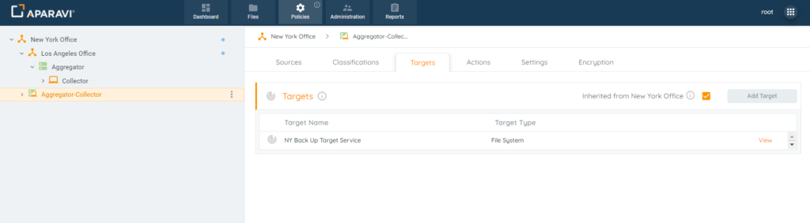
    
    > It is important to select the correct node/folder. The system will only search for files contained within that specific node/folder selected.
    
2. Click on the Files tab in the top navigation menu. 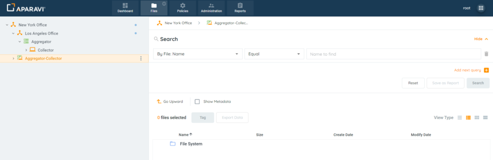
3. Click on the first search filter drop-down field and then click on _\[By Service: Service Name\]_ or select _\[By Service: Service Type\]_, depending on which type of Service search is being performed. Once selected the chosen filter will appear inside the first field and the drop-down menu will disappear.
4. Click on the second search filter drop-down field and choose one of the operators listed. Once selected, the chosen operator will appear inside the field and the drop-down menu will close.
5. In the third search filter drop-down field, choose from the services listed. Once selected, the name of the service will appear inside the field. 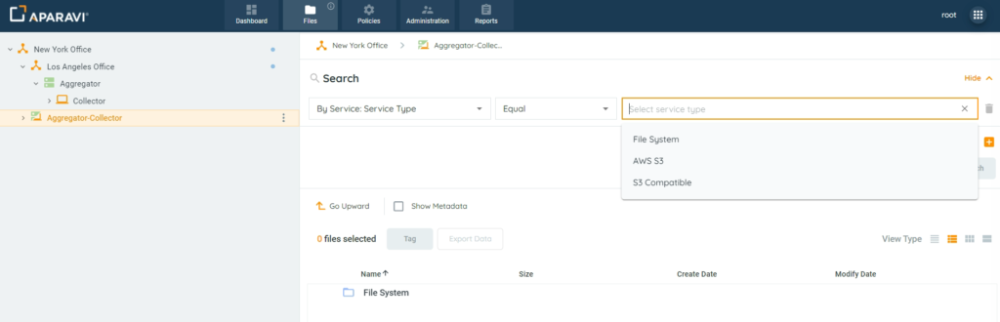
6. Click Search.
7. All folders and files that were copied to the Service will appear inside of the search results, located just below the search filters.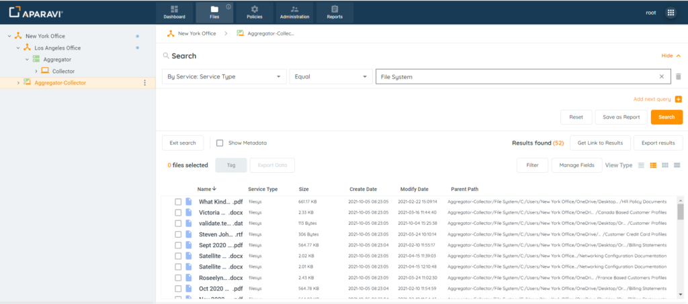

## Metadata

Metadata is the true embedded data intelligence within files across various sources about unstructured data. Metadata can be created manually to be more accurate, or automatically. The amount of metadata can vary from file to file and contain basic information or advanced information related to the data.

1. Click on the Files Tab, located in the top navigation menu.
2. Using the Query Builder, click on the first search filter drop-down field and then click on \[By Metadata\] option.
3. Click on the second search filter drop-down field and select the appropriate operators listed.
4. Click on the third field and enter the search criteria. For example: _pdf:hasXFA_ (if pdf has XFA forms inside).
5. Once all search criteria have been properly entered into all the search filter fields, click the Search button to perform the search.
6. The search results will be displayed in the window directly below the search filter fields, showing all files with the metadata field _pdf:hasXFA_. 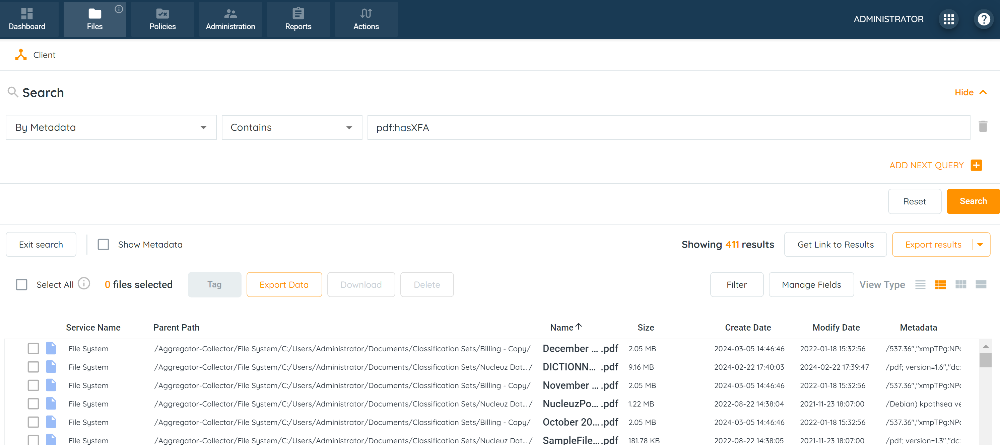 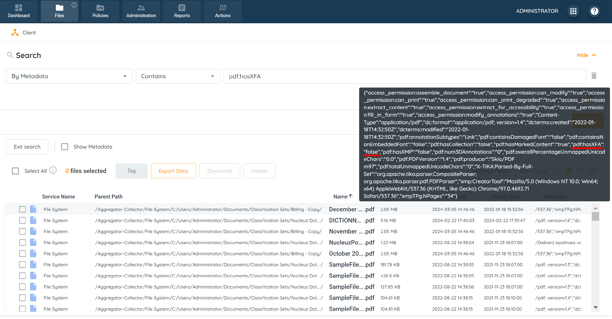 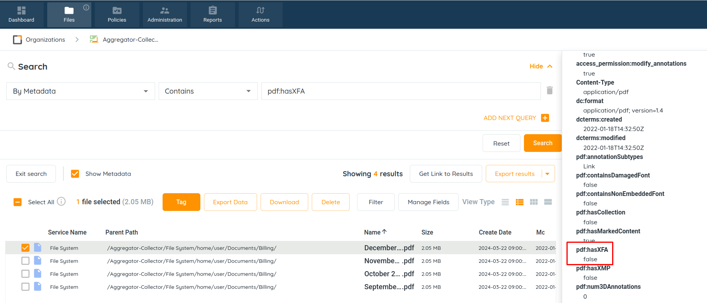
7. There is an option to view the metadata of the file in the Show Metadata window. To do this, select a file and tick the Show Metadata checkbox.
    
    > Not each file will not have a rich display metadata selection as in the above example it will vary from file to file.
    
8. Once the metadata search has been performed that has been described [here](https://secure.helpscout.net/docs/64b0120a114ed272f0d4712a/article/64de6f0bb3cacb0d1fcdc9f4/), the metadata of each file can be viewed by clicking on the _Show Metadata_ checkbox. This allows for quick viewing of all metadata, for only the files returned using the by file search.
    1. Perform File Search using Query Builder. 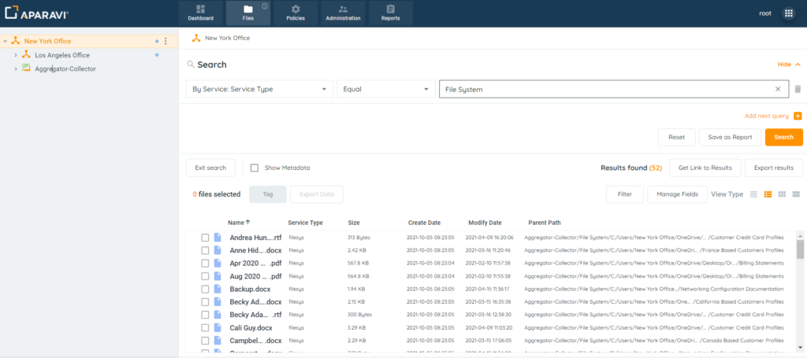
    2. Select a file within the search results and click on the Show Metadata checkbox located in the toolbar. 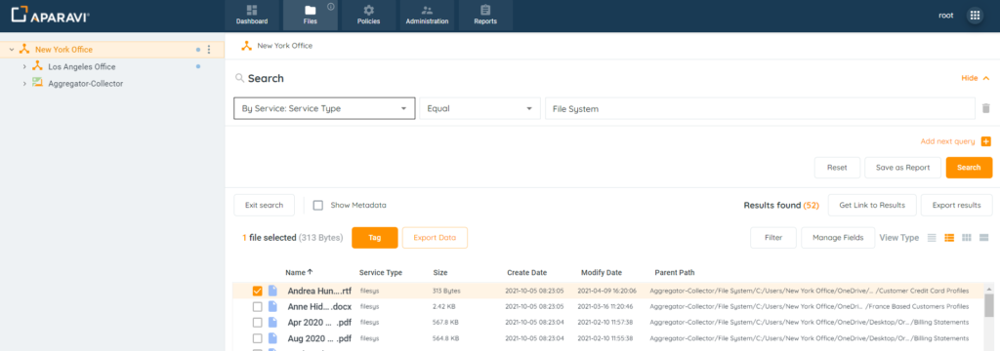
    3. The metadata details window will appear on the right-hand side of the screen and display all metadata specific to the file that was selected. 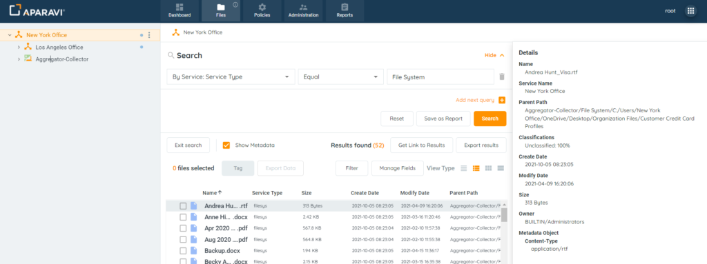
    4. To view the metadata for any other matching files that also have the same criteria, in the search results window, simply click on the next file and the Metadata details window will update with the newly selected file’s metadata. 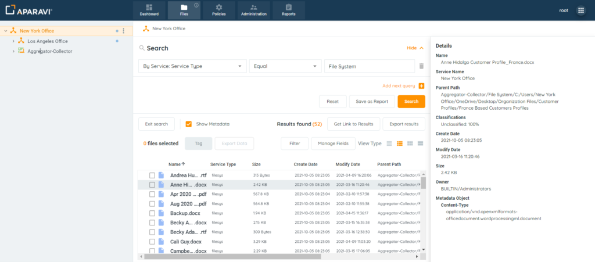
