## Tagging

After a tag has been created, tagging files can be performed while browsing in the system or after a search has been completed. This process simplifies locating specific files for organization, searching, and reporting capabilities.

1. Click on the Files Tab, located in the top navigation menu. 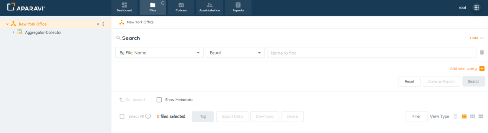
2. Perform any file search using the three query parameters and click Search 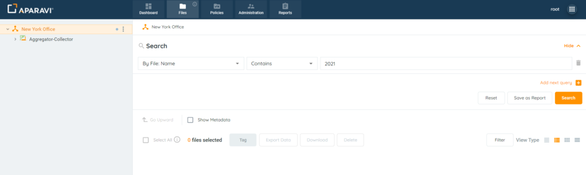
3. Once the file results are displaying, ensure that the Details View option is selected as the View Type. 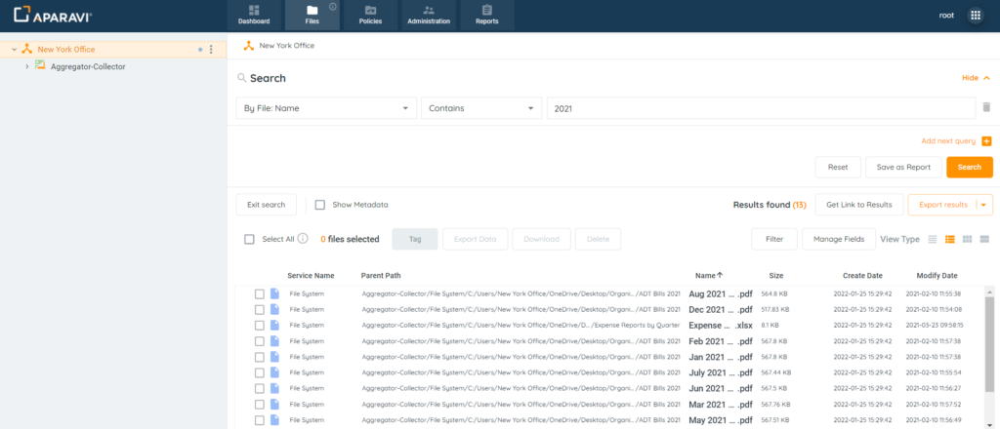
4. Select the checkboxes located to the left of the file’s name for tagging. 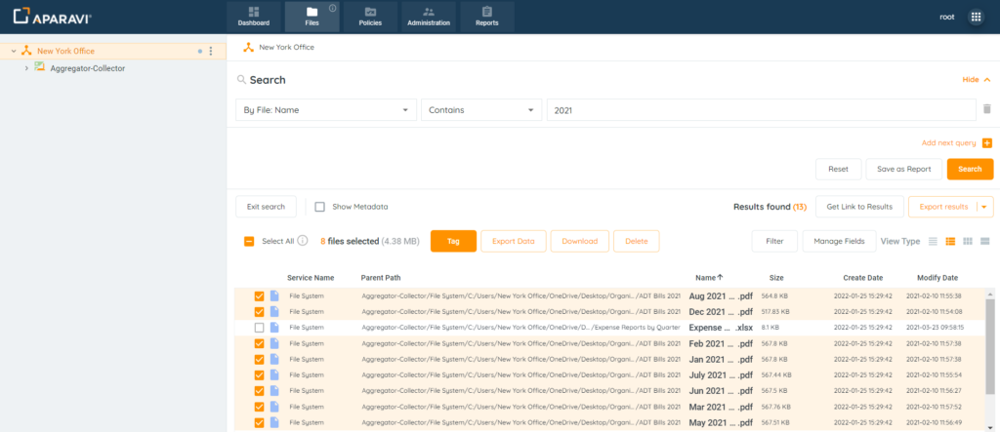
5. Click the Tag button, located in the toolbar above the file results. 
6. Use the drop-down menu to view the list of available tags and click on the tag’s checkbox to select it. 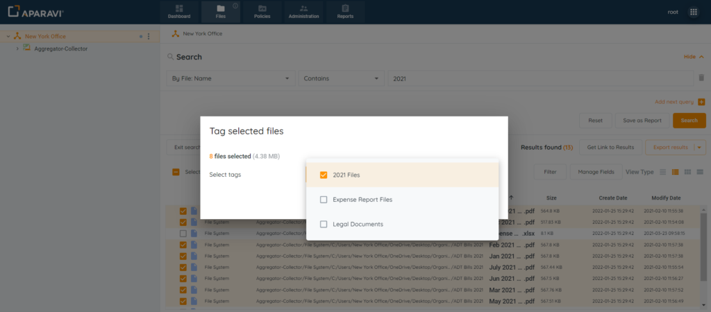
7. Once the tag is selected, click OK to save the changes. 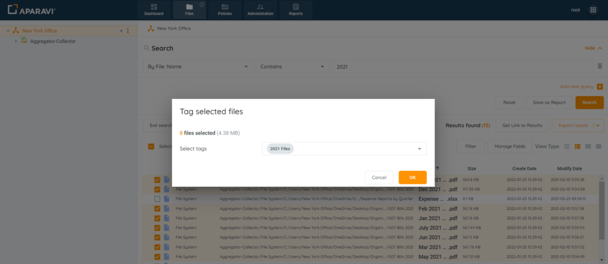
8. Now that the files are tagged, this feature can be used to assist with collaboration towards ROT remediation or compliance efforts.

## Searching

1. After files have been tagged, file searches and reports can be generated to view only the selected files.
2. Click on the Files Tab, located in the top navigation menu. 
3. A file search using the tag’s name and click the search button when completed.
    - First Filter: Select \[By Tag\]
    - Second Filter: \[Choose an operator\]
    - Third Filter: Select the \[tag’s name\]
4. 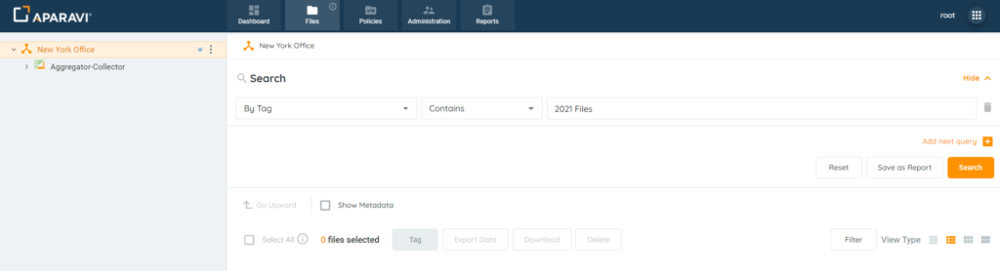The system will display all the selected tag’s files. From this point, the search can be exported, printed, fields can be altered, and a report can be generated for future use.
5. 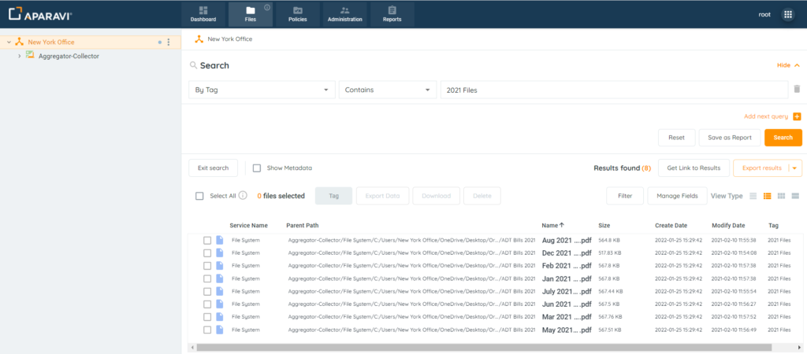

#### Reporting on Tagged Files

1. Click on the Reports tab, located in the top navigation menu. 
2. 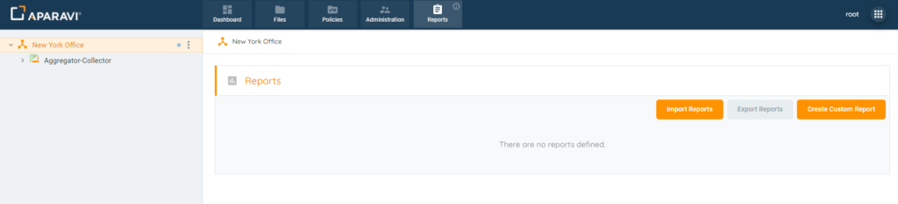
    - First Filter: Select \[By Tag\]
    - Second Filter: \[Choose an operator\]
    - Third Filter: Select the \[tag’s name\]
3. 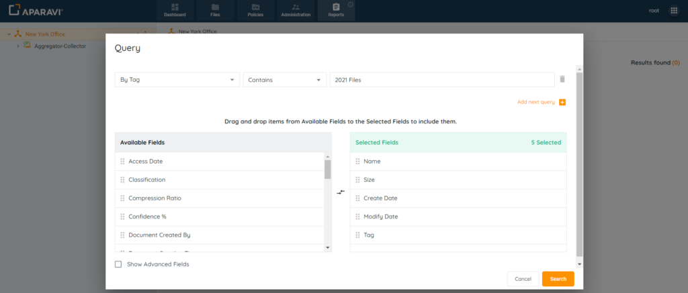
4. 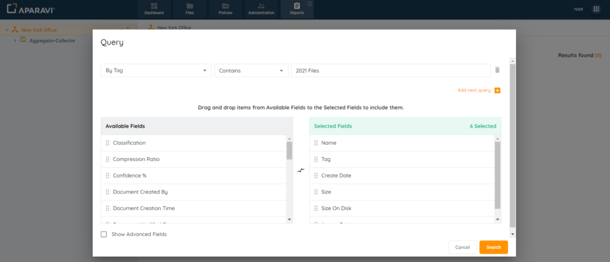
5. 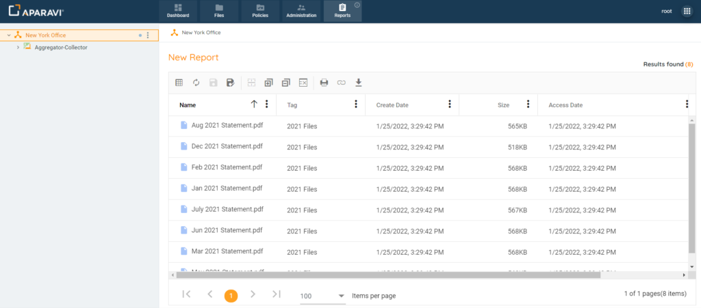

## Removing Tags

After files have been tagged, the tag can be removed. The simplest way to find the tagged files is to complete a files search using the tag’s name. It’s important to note that the system will not allow files to be untagged if the tag has been deleted. Once the tag has been deleted, the tagged files will no longer have the ability to be untagged without recreating the tag again. To remove a deleted tag from a file, recreate the same custom tag with an identical name. Once the tag has been restored, the system will allow for the untagging of files.

1. Click on the Files Tab, located in the top navigation menu. 
2. Perform a file search using the tag’s name and click the search button when completed.
    - First Filter: Select \[By Tag\]
    - Second Filter: \[Choose an operator\]
    - Third Filter: Select the \[tag’s name\]
        - 
        - 
        - 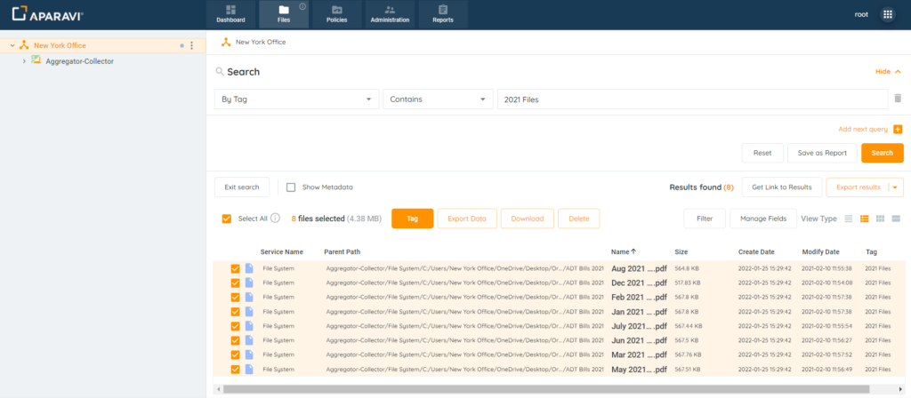
        - 
        - 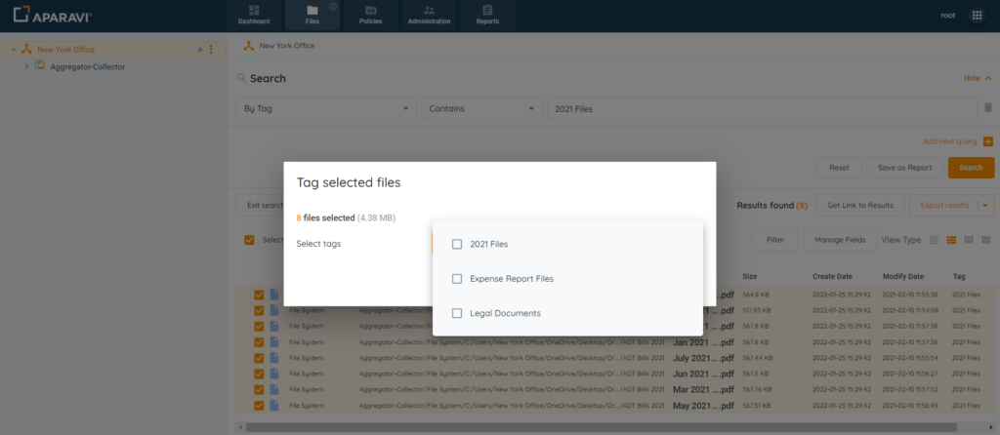
        - 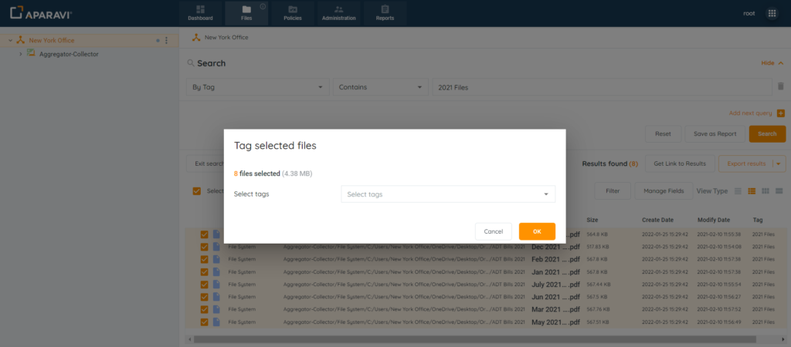
