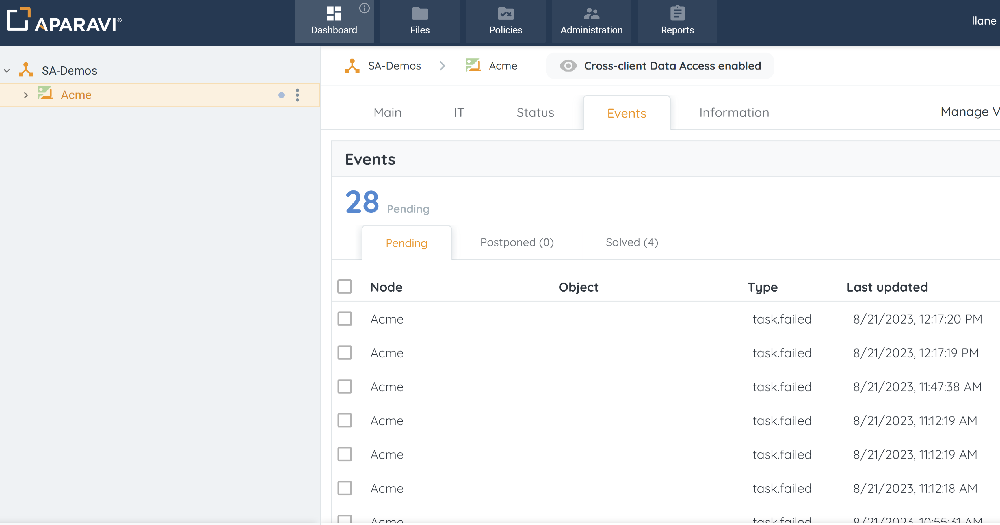
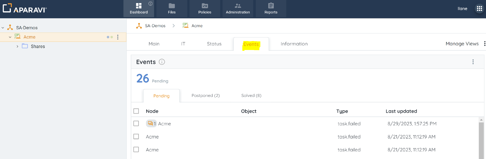
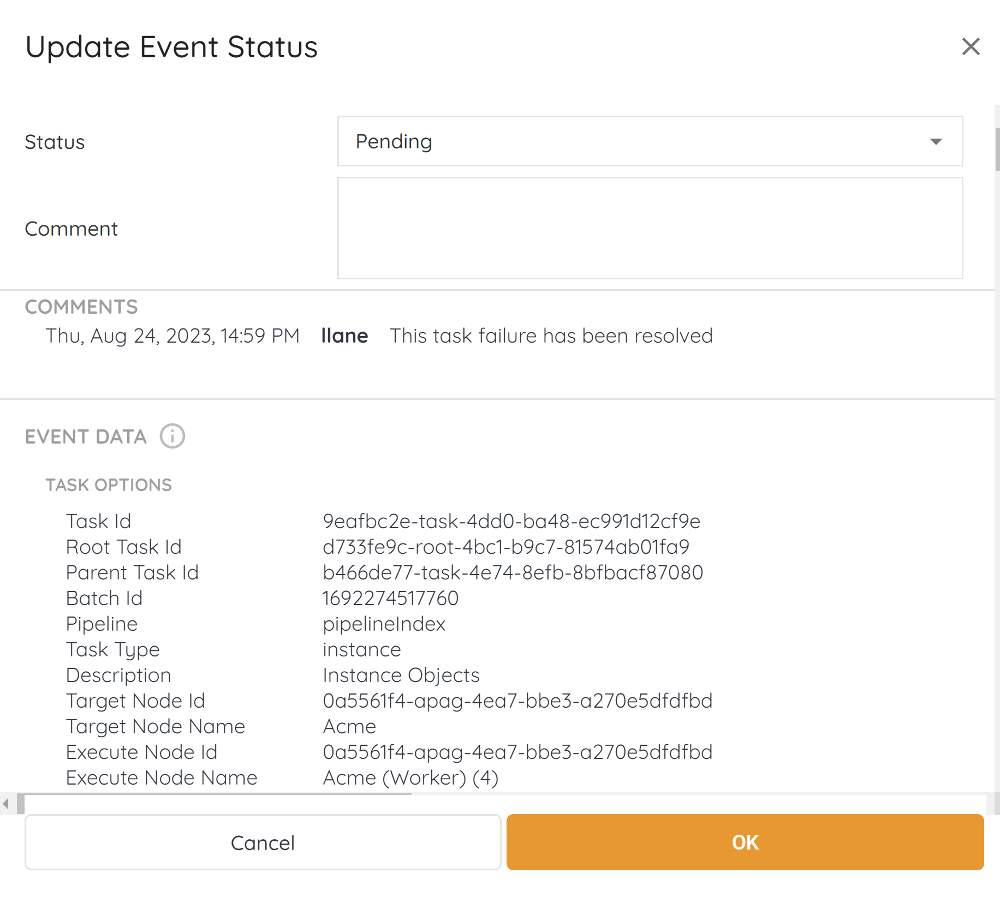
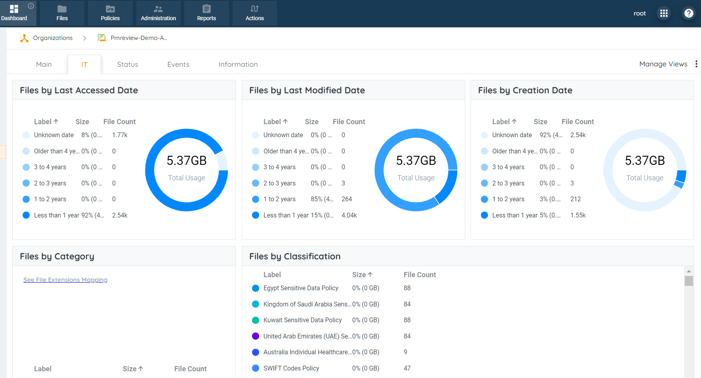
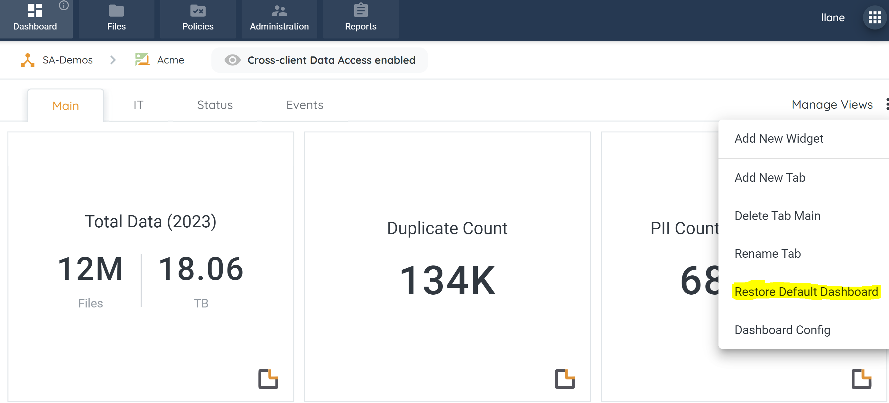
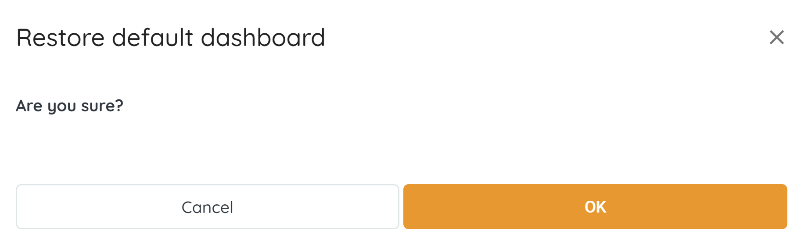
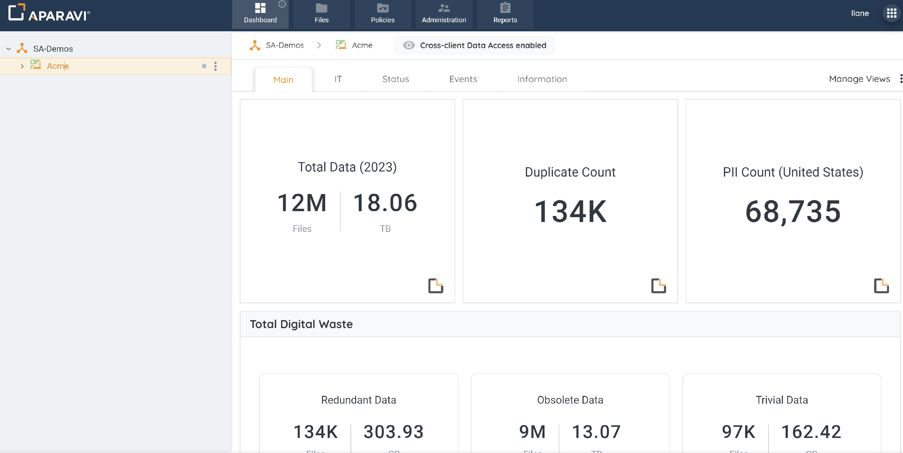

## Event Subtabs

Select the appropriate node from the navigation tree to view the system information.

The Events subtab will allow for viewing of system events regarding the scanning of the files from the local host. The Events widget is broken down into three subtabs:

- Pending – displays a list of task failures during a file scan.
- Postponed - displays a list of events that a user has moved to this tab to be resolved later.
- Solved - displays a list of resolved events that a user has moved to this tab.

This widget displays the failures for the system tasks running in the background and provides the ability to add comments to each event and select if the event was postponed or resolved.

> Ensure that the appropriate node is selected since different nodes may have different dashboards entirely.

1. Select the appropriate node from the navigation tree to view the system information.

> It is important to select the correct node. The system will only display the system information for that specific node selected.

2. Click on the Events subtab, located under the Dashboard tab.

3. To view the details about any event, click on the event’s name and the Update Event Status pop-up box will appear, displaying all the information regarding the event.
4. Click **OK.** This would update the corresponding event status accordingly.

## IT Subtab

The IT subtab provides the insights of the Data Estate scanned for the node selected. There are various widgets within this IT Tab which provides information about

- Files by Last Accessed Date
- Files by Last Modified Date
- Files by Creation Date
- Files by Category
- Files by Classification
- Permissions
- Data Owners

This tab is customizable as the user is allowed to design the dashboard widgets of their choice.

> Ensure that the appropriate node is selected since different nodes may have different dashboards entirely.

## Restore to Default

If the Dashboard has been customized as per the user's preferences, it can restored to it’s original state upon installation of the node. When this option is selected, it will also restore the Main Page subtab to it’s original state as well.

1. Click on the Dashboard Tab, located in the top navigation menu.
2. Click on the Manage Views button, located in the upper right-hand side. Once clicked on, a menu will expand with options to select from.
3. Click on the Restore Default Dashboard option from the menu that appears.

4. The Restore default dashboard pop-up box will appear to confirm the restoration of the Dashboard.

5. Click OK, located in the bottom right-hand side of the the Restore default dashboard pop-up box.
6. Now, the Main Page subtab is restored with all the default widgets and settings.

