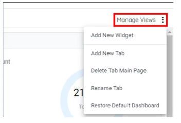
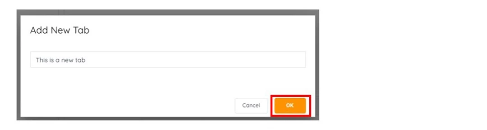
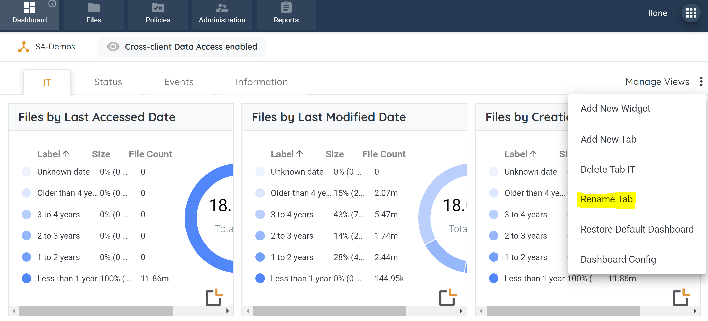
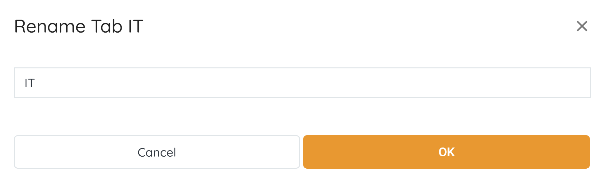
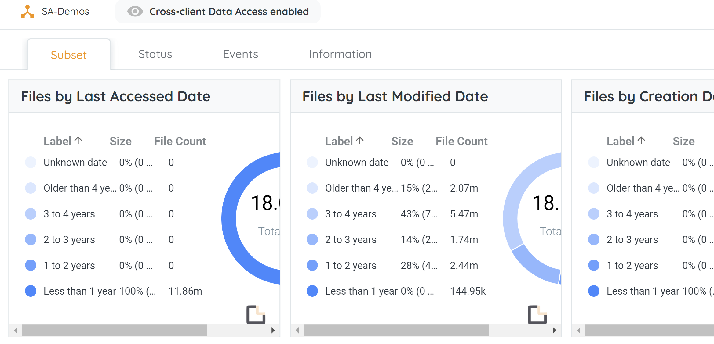

## Add and Remove

A dashboard can be added or removed from the Dashboard Tab.

1. Click on any Subtab, located in the top navigation menu.
2. Click on the Manage Views button, located in the upper right-hand side. Once clicked on, a menu will expand with options to select from.

    

3. Click on 'Add New Tab' or 'Delete Tab XYZ' option from the menu.If adding a new tab, name the tab and click 'Create', If deleting a pop-up box will appear to confirm the removal of the subtab.

    

4. Click the Delete button to confirm deletion. Once clicked on, the Main Page subtab will disappear from the Dashboard tab.

## Rename

Subtabs under Dashboard can be renamed to reflect something more meaningful if desired.

1. Click on the Dashboard Tab, located in the top navigation menu, and then click on the subtab.
2. Click on the Manage Views button, located in the upper right-hand side. Once clicked on, a menu will expand with options to select from.
3. Click on the Rename Tab option from the menu that expands. Once clicked on, the Rename Tab pop-up box will appear.

4. Type the new name of the tab into the text box, located inside of the Rename Tab pop-up box.

5. Once completed, click OK, located at the bottom right-hand side of the the Rename Tab pop-up box.
6. The updated name will be automatically visible in the new subtab.

