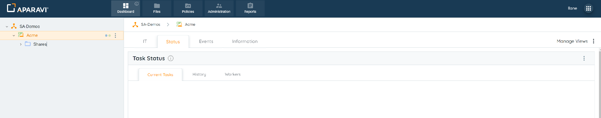
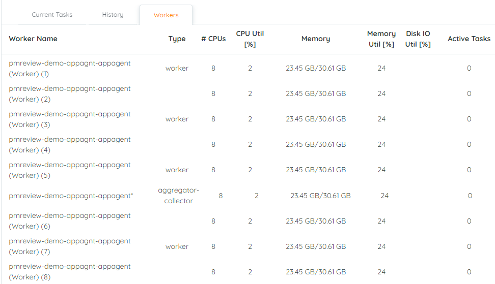
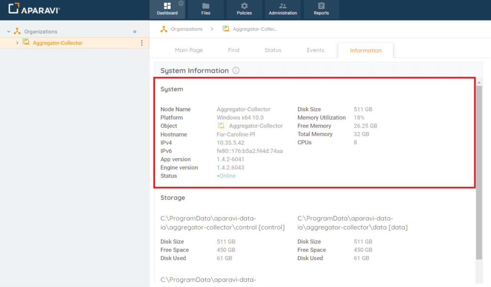
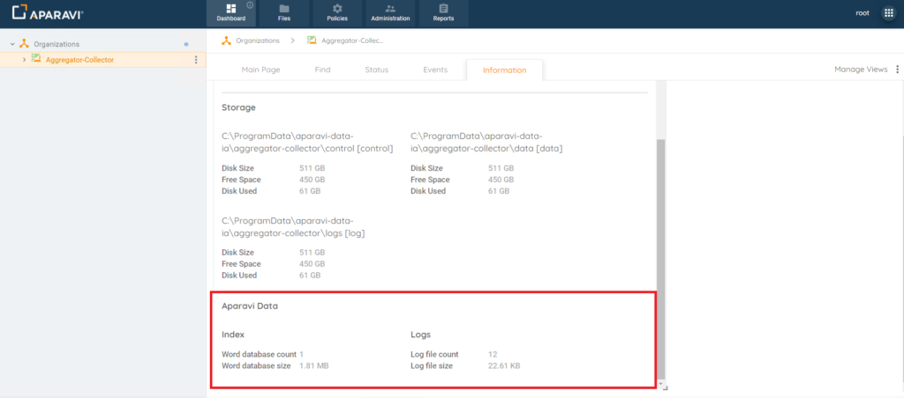

## Task Widget

Click on the Dashboard tab in the top navigation menu.

- There are three subtabs under the Status Subtab:
    - Current Tasks subtab: This tab should display all the running tasks and their statuses. The Status subtab displays information about files that are scanned and whether or not the task completed or failed during current and past scans.
    - History subtab: This tab records all completed tasks, providing essential historical task information for the corresponding Client. This is very valuable information for troubleshooting and monitoring.
    - Workers subtab: This tab records all workers that are available (static and local dynamic workers) which support the execution of the tasks. The availability of these workers showcases the scalability of the system at any given time for the corresponding Client. 

## System Widget

1. Select the appropriate node from the navigation tree to view the system information.
    
    > It is important to select the correct node. The system will only display the system information for that specific node selected.
    
2. Click on the Dashboard Tab, located in the top navigation menu, and then click on the Information subtab.
3. Once clicked on, the System Information widget will display the details focused in three different sections:
    - System
    - Storage 
    - Aparavi Data 
