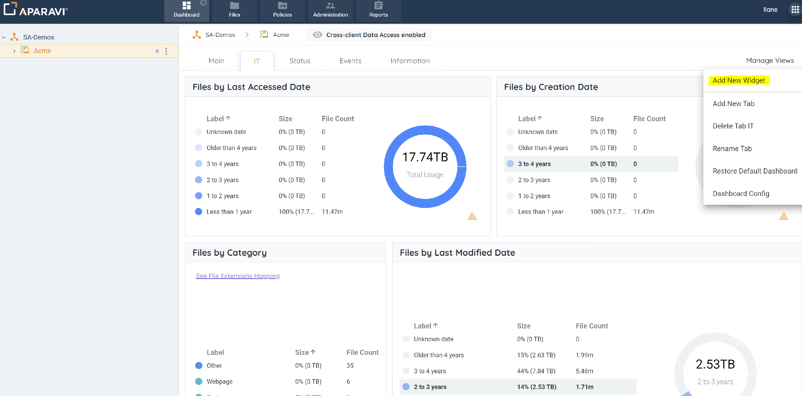
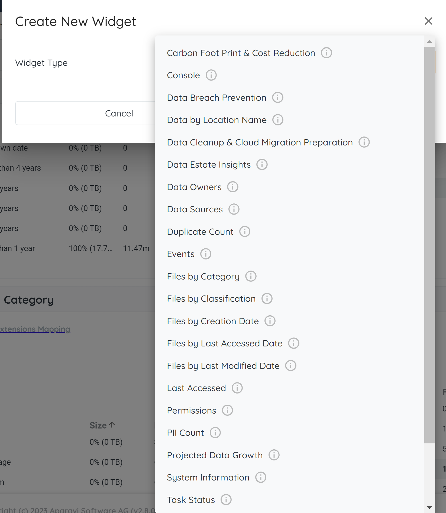
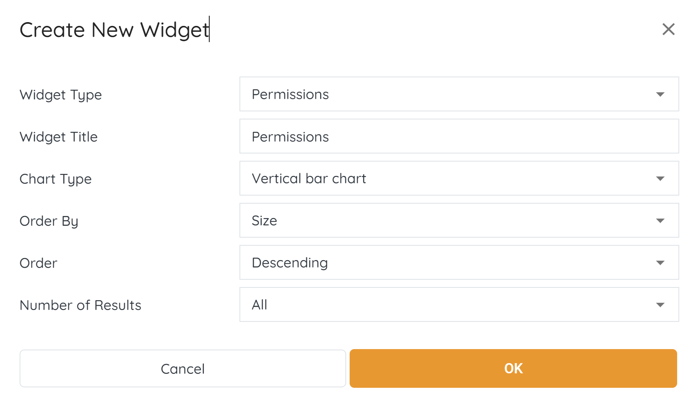
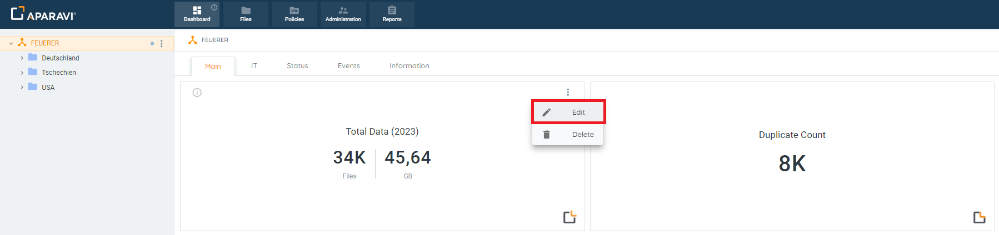
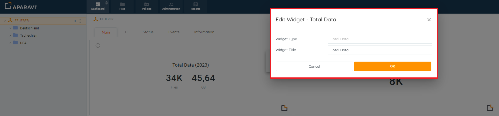
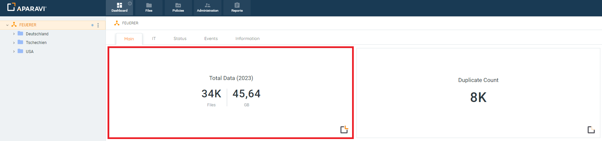
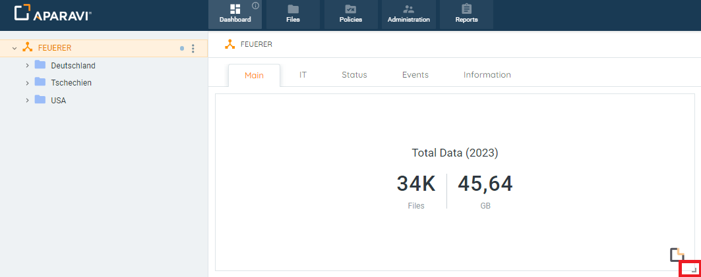

Dashboards offer many widgets to easily view the data metrics of the files scanned by the system. The widgets are typically added to the Main Page subtab, but the system offers the ability to add the widgets to any subtab located under the Dashboard tab.

> Ensure that the appropriate node is selected to which you would wish to add widgets, since different nodes may have different dashboards entirely.

## **Add a Widget**

1. Click on the Dashboard Tab, located in the top navigation menu, and then click on the IT subtab.
2. Click on the Manage Views button, located in the upper right-hand side. Once clicked, a menu will expand with options to select from.
3. Click on the Add New Widget option from the menu that expands. Once clicked, the Create New Widget pop-up box will appear. 
4. Select the desired Widget from the drop-down menu from the wide range of widget options displayed. 
5. Once selected, the name of the Widget will appear inside the Widget Type field. Depending on the Widget selected, the Create New Widget pop-up box will expand to offer additional visual setting options to select from. 
6. Choose the appropriate visualization settings in the Create New Widget pop-up box and Click "**OK**".
7. The new widget will appear on the Dashboard’s Main Page (or any sub-tab where the user desires to add the Widget) automatically.

> Ensure that the appropriate node is selected to which you would wish to add widgets, since different nodes may have different dashboards entirely.

## **Edit Widgets**

1. Click on the Dashboard Tab, located in the top navigation menu, and then click on the Main Page subtab.
2. Hover over the widget that needs to be edited, and click on the vertical ellipsis (the 3 vertical blue dots) located in the very upper right-hand corner of the widget. Once clicked on, a menu will appear to edit or delete the widget.
3. Click on the Edit button from the menu that expanded. 
4. The Edit Widget – \[_Name of Widget_\] pop-up box will appear with the same visual setting options that were available when the widget was originally added. From here the fields can be altered to reflect the information in a different format or even in some cases display different data altogether. 
5. Once all changes have been made, click the **OK** button.
6. Once the **OK** button has been clicked, the Edit widget pop-up box will close and the widget will update with the reflected changes. 
7. Editing a widget, as outlined above, can be applied to the subsequent tabs:
    - Information
    - Status
    - Events
    - IT

## **Resize Widgets**

1. Click on the Dashboard Tab, located in the top navigation menu, and then click on the Main Page subtab.
2. Click on the widget that needs resizing and then click on the tiny arrow that appears in the very bottom right-hand side of the widget. When at the correct spot for resizing the mouse will become a double-sided arrow to indicate it is ready for dragging. 
3. If the widget should display larger on the screen, while clicking on the edge of the widget, drag the mouse away from the center of the widget until it changes into the appropriate size. Once the widget is the correct size, release the mouse and the widget will remain the new size.
4. If the widget should display smaller on the screen, while clicking on the edge of the widget, drag the mouse toward the center of the widget until it changes into the appropriate size. Once the widget is the correct size, release the mouse and the widget will remain the new size.

## Moving Widgets

1. Hover over the widget that needs to be relocated until the cursor turns into a hand icon. Once the hand icon appears, click on the widget and while holding down the mouse, drag the widget to the new desired location and release the mouse.
2. Once the mouse has been released, the widget will appear in the new location of the Dashboard’s Main Page subtab.
3. The resizing and repositioning of widgets, as outlined previously, can be applied to the subsequent tabs:
    - Information
    - Status
    - Events
    - IT
