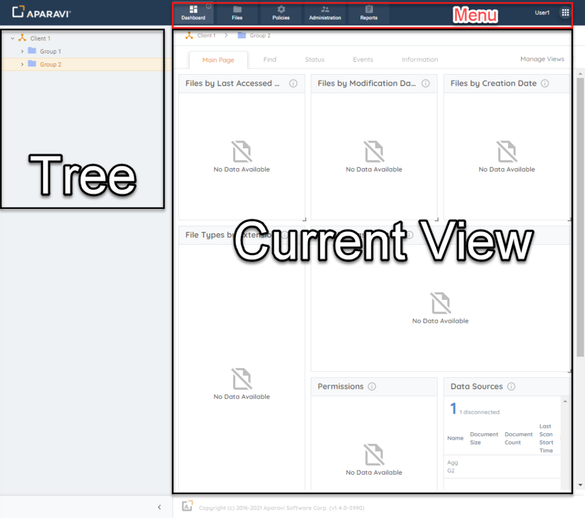
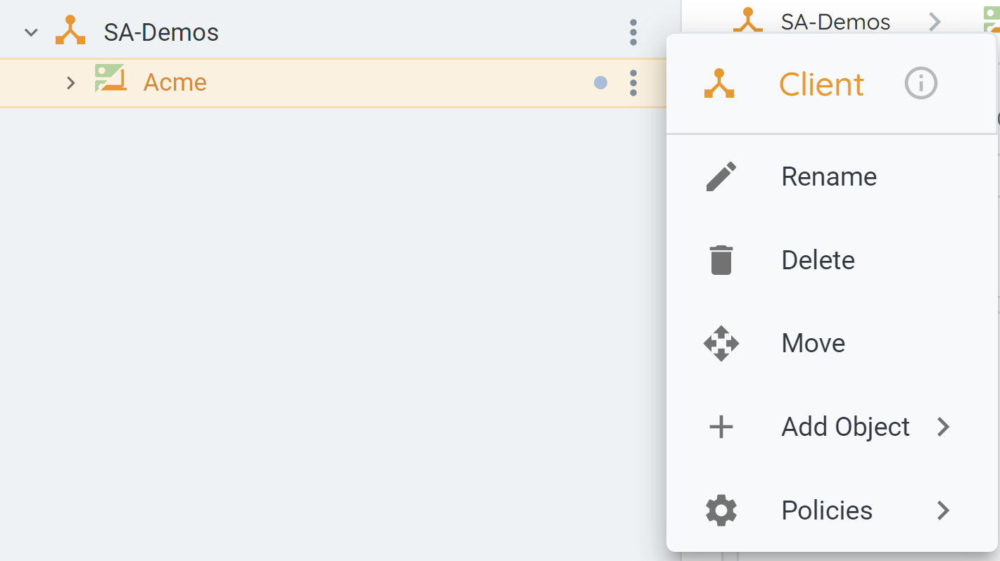

Logging into the Aparavi platform initially will present you with this initial view.

### Navigation Areas

 There are three Navigation Areas within the Aparavi Platform, they are:

- Menu Bar
    - The Menu Bar has Current User Profile, Support, and Logout options in the upper right corner. There are also six distinct modules across the Menu Bar.
        - Dashboard
        - Files
        - Policies
        - Administration
        - Reports
        - Actions
- Object Tree
    
    - The Object Tree expands to show the Aggregator and Collector architecture.
    - The Object tree is unique to each environment and grows as you add objects to your Aparavi deployment. Access administration options at the top client level by clicking the three dots next to the client or right-clicking on the object.
    
    
- Current View
    - Choosing a new Menu option changes the Current View window. It depends on both the Menu and the selected object in the Tree.
    - Selecting Add Object or Policies opens an extra menu, changing the object tree. The available options depend on the selected object, and various objects can be added, as listed in the table.
        - New Client 
        - Group 
        - Aggregator 
        - Aggregator Group 
        - Aggregator-Collector 
        - Collector 
