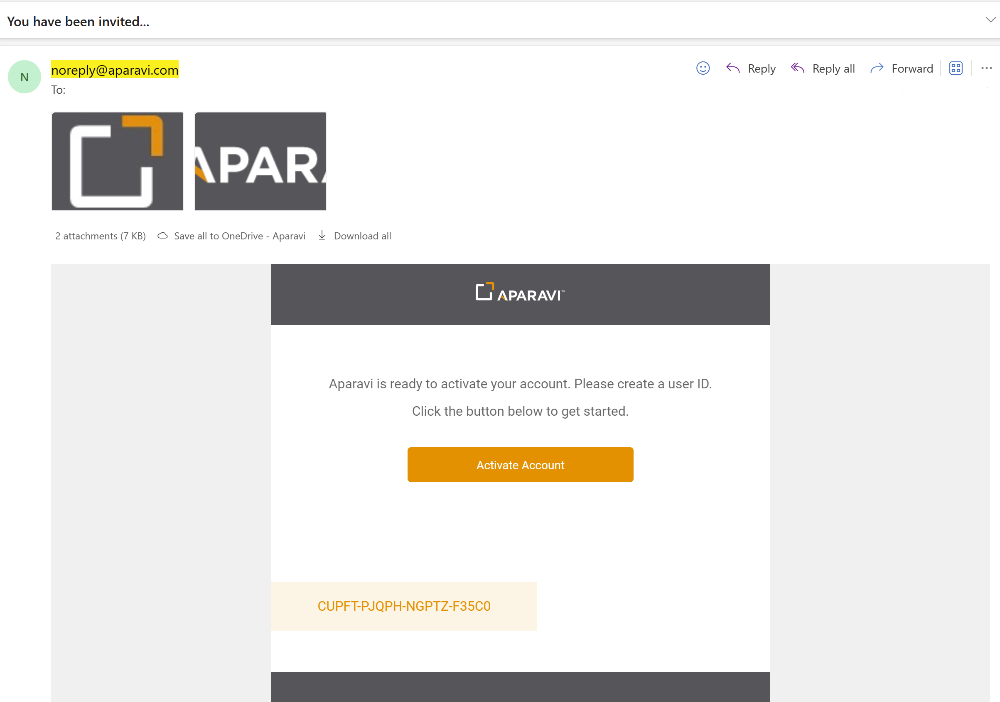
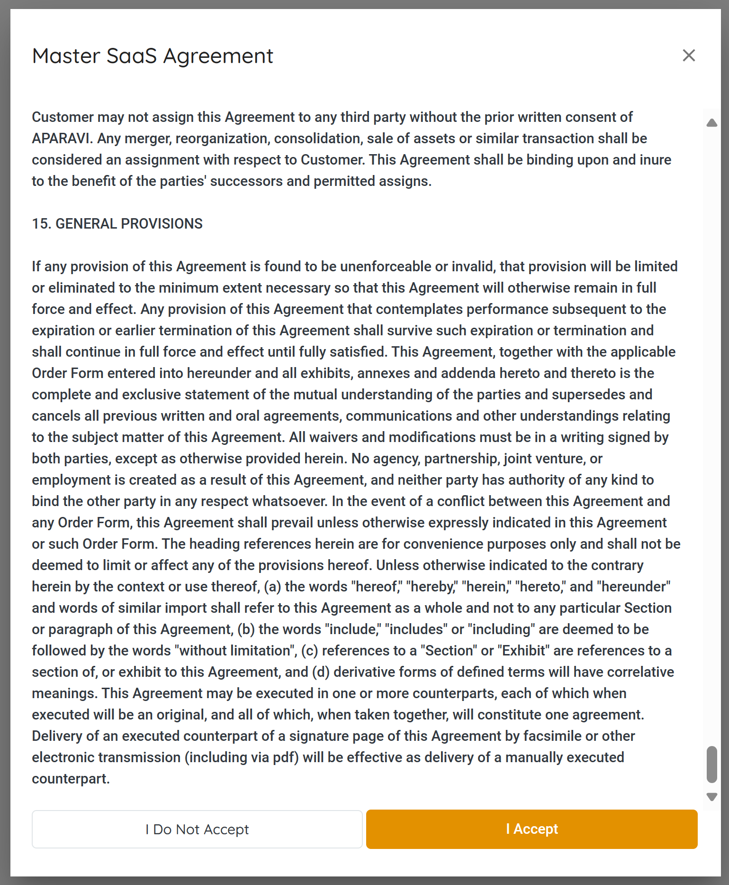

1. To access the Aparavi platform, an administrator will create your account. An email will be sent from noreply@aparavi.com to your mailbox.
2. Click on the Activate Account link within the email to get started. This will open up a web browser session.
3. You will be accessing the Aparavi portal where the activation code in the email should already be populated. The next step is to create your login credentials. There are three options here:
    1. Use Aparavi credentials
    2. Sign in with Google
        1. Without changing any of the other fields on the webpage, click on the "Sign in with Google" button.
    3. Sign in with Microsoft.
        1. Without changing any other fields on the webpage, click the "Sign in with Microsoft" button.
4. Once you’ve selected your preferred sign in method and began the sign in process, the next step is reading and accepting the Master SaaS agreement. You will need to scroll all the way to the bottom in order to be able to click "I Accept" button. Repeat the steps for the End User License Agreement.
5. Once all agreements have been accepted, you will be logged into the Aparavi platform. Now you can begin the administration and deployment processes, see other articles in the Overall Architecture & Preparation section.
6. Once your desired infrastructure has been deployed and configured, you will need to navigate to the Sources section and define all the data sources you would like to scan, index and classify.
