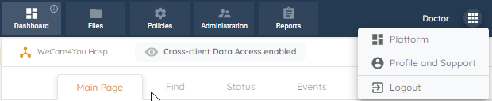
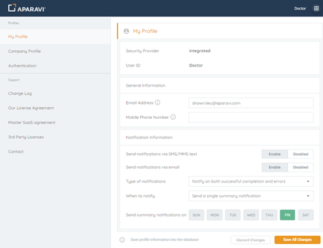
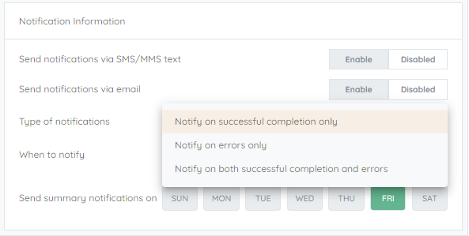
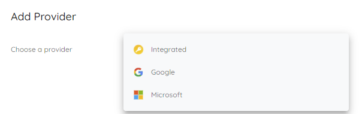
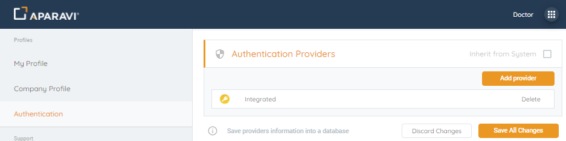
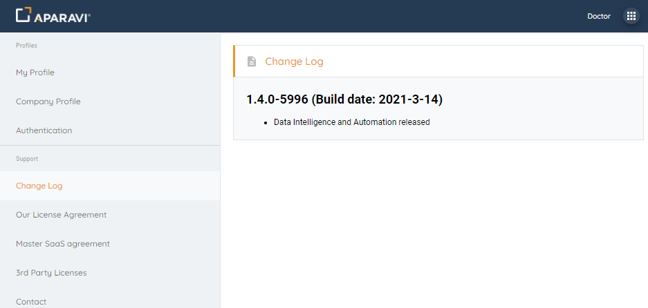
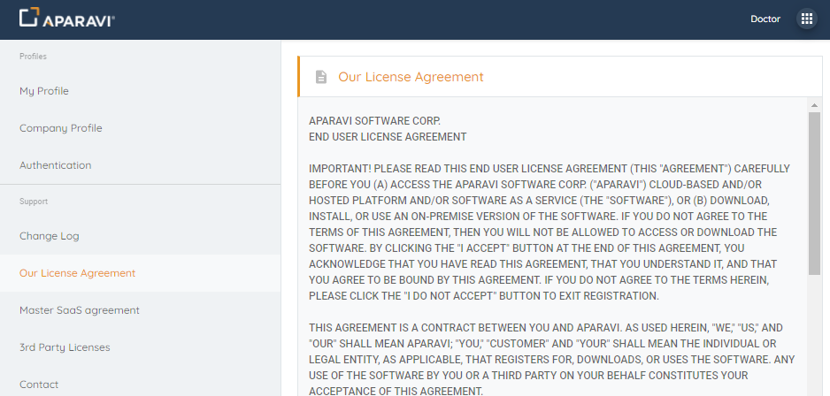
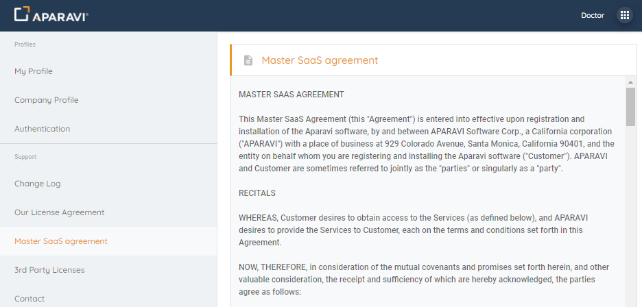
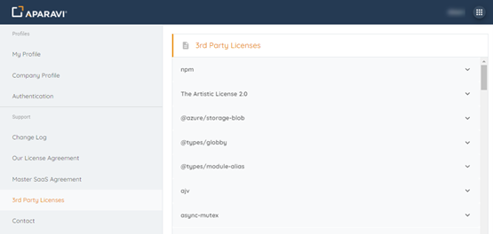
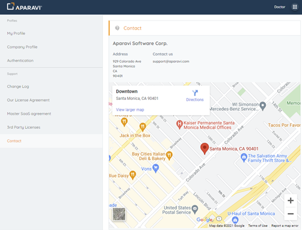

On the far right of the Menu bar, the grid icon opens the options menu with Platform, Profile and Support, and Logout options. Click Profile and Support to switch profiles.

\[caption id="" align="aligncenter" width="620"\] Menu Bar\[/caption\]

## **My Profile**

- In the My Profile section, customize email and text notifications, specifying the type and timing you prefer. For summary notifications, select specific days. Save changes to apply settings.
- Move to the Company Profile, update billing and mailing addresses, and click Save All Changes.

## Notifications

- If you are enabling notifications via email or text message, you’ll also want to specify the **type of notifications** to receive, **When to notify**, and **Send summary notifications on** specified days. The options for Type of notifications are
    - Notify on successful completion only
    - Notify on errors only
    - Notify on both successful completion and errors

### Type of notifications 

- Selecting When to notify will have the following options:
    - Send notifications as they happen
    - Send a single summary notification
- If Send a single summary notification is selected, you will also want to specify what days you would like to receive summary notifications. You can do this by simply clicking on the days when you would want the summary notifications. Once you are finished, click Save All Changes to apply the settings to your profile.

## **Authentication**

- By default, **Authentication Providers** are set to **Inherited from System**. If you would like to specify only a specific **Authentication Provider**, uncheck the box and click **Add Provider**. The Add Provider modal will pop up and here you will have the following provider selection:
    - Integrated
    - Google
    - Microsoft

- Once the desired provider has been selected, click OK to accept. If you would like to add another provider, repeat the previous steps, and when finished, click Save All Changes.

## **Support**

- The first option under the **Support** section of the tree is the **Change Log**. Selecting the **Change Log** will display the current version along with any highlighted changes associated with the version.

- Our License Agreement, selecting this option will display the **Aparavi Software Corp. EULA**.

- Master SaaS agreement, selecting this option will display the Master SaaS Agreement.

- 3rd Party Licenses section, selecting this option will display a collapsed collection of all 3rd party licenses. You can click on the down arrow to display the actual license agreements one by one.

<figure>

</figure>

- Contact option, selecting this option will display all of Aparavi Software Corp.’s contact information, including address (with map) and support email address.

