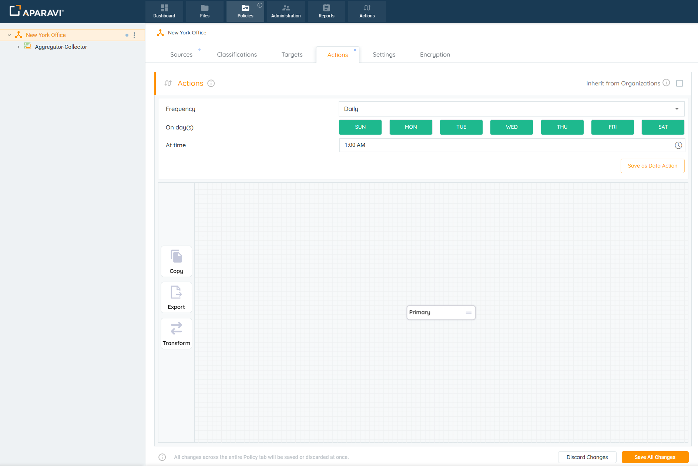
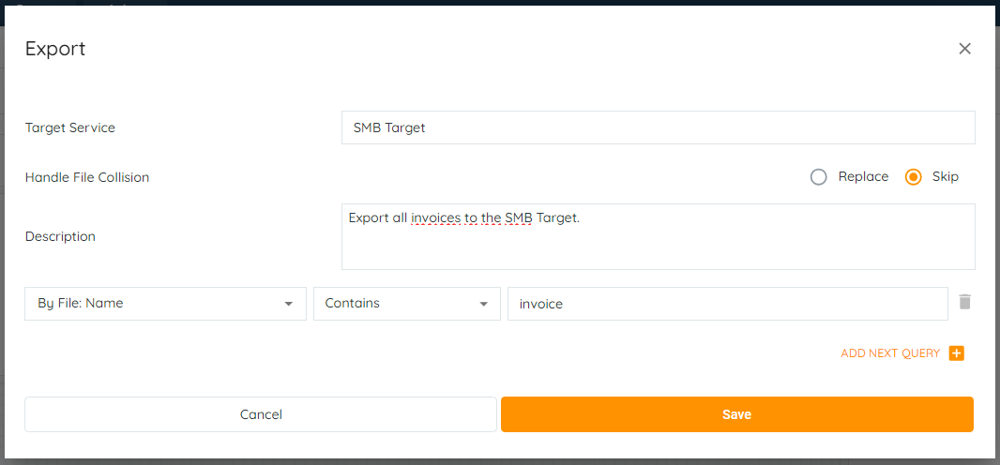
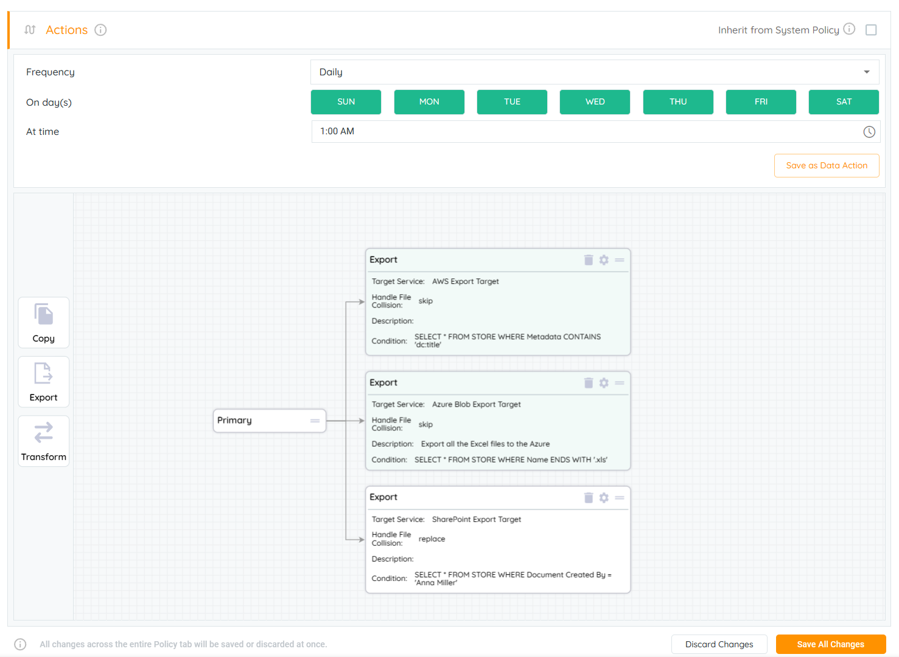
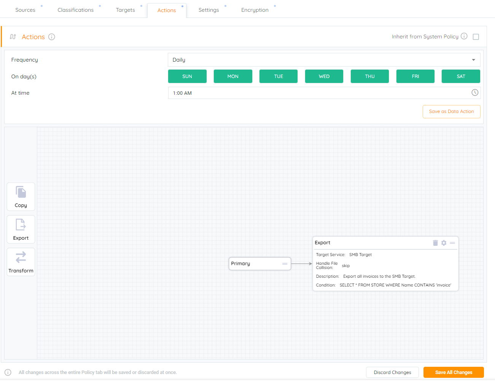

This guide can be applied to different types of actions: Export or Transform.

Setting up a target service on the Targets subtab must be completed before configuring an Action.

1. Click on the Policies tab, located in the top navigation menu.
2. Click on the Actions subtab. Drag the Export button inside of the Actions Grid hovering on the "Primary". The Export pop-up box will open and display additional fields.
    
    > If the "Export" action cannot be moved to the Actions Grid, check that the "Inherit from .." checkbox is unchecked.
    
3. Using the Query Builder, build the most optimized query at ease for the export action and click Save.
    
    - If creating a query based on the file’s path, the \[Local Path\] filter must be selected.
    - Selecting the \[Parent Path\] filter will not produce any results at this time.
    
    
    
    > You can add multiple queries at once for automated actions. These queries will be executed sequentially. We could also configure the data actions to be executed automatically, but setting a schedule.
    
4. Click on the Save All Changes button.
5. Save the configured export action query by confirming on the Save Changes.
6. This action will send the most recent scanned version of the file to the target. From this point on, the system will copy the selected files to the target service specified, on the time interval chosen.
