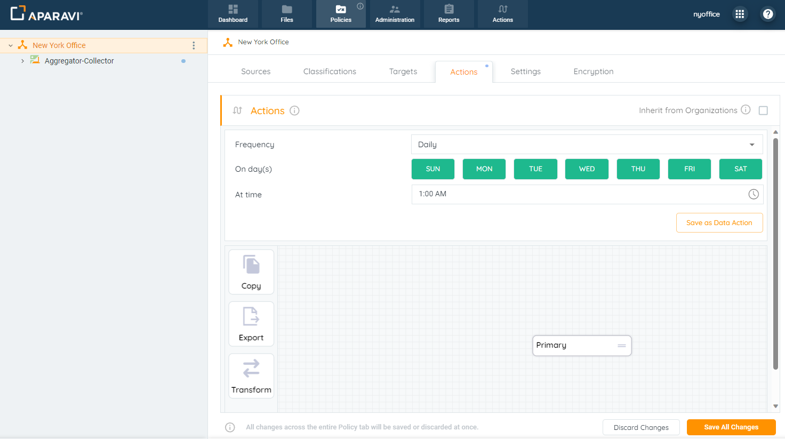
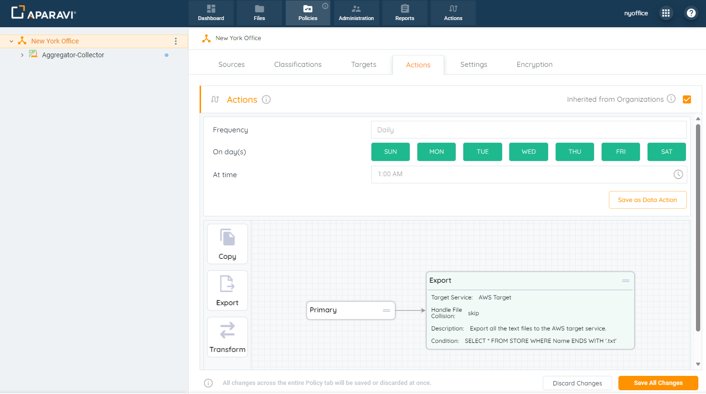
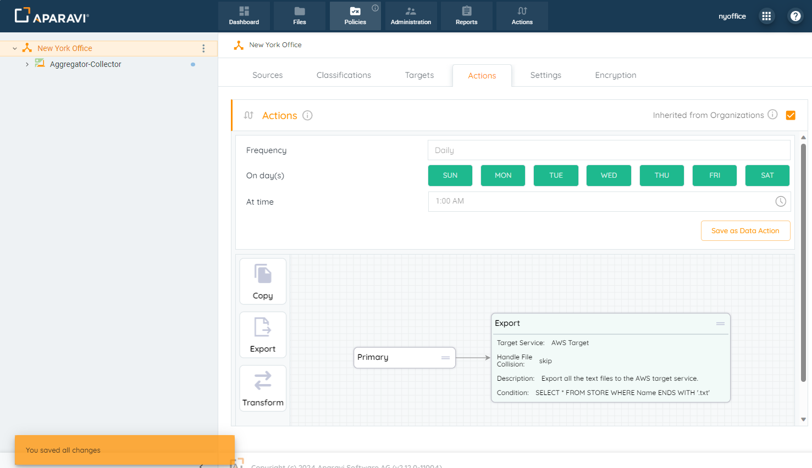
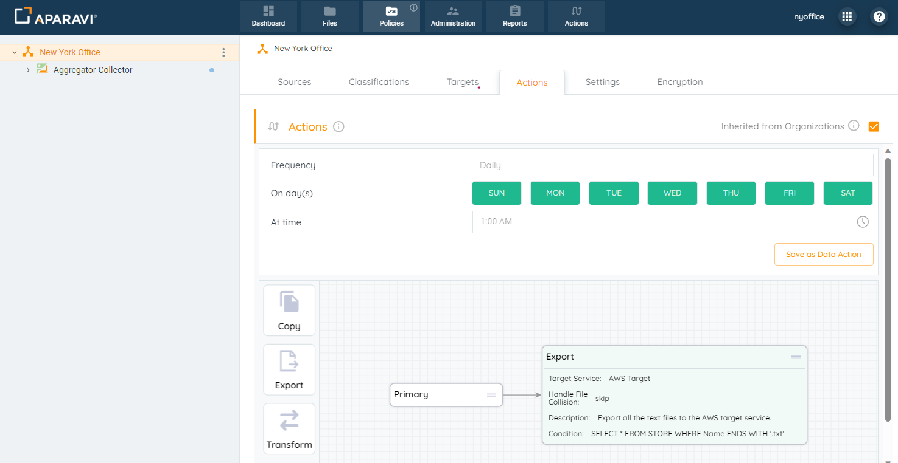

Nodes nested under organizations have the ability to inherit the actions that have been configured, or set up their own. By default, any new nodes will automatically inherit from the organization above. If new nodes want to configure their own actions, this inheritance policy will need to be deselected upon installation.

## **Inherit Actions Subtab**

1. Click on the Policies tab, located in the top navigation menu.
2. Click on the Actions subtab.

3. If the checkbox located next to “Inherited from \[Name of Node\]” is unchecked, click the checkbox to select it.
4. Once the checkbox is clicked, Save All Changes button will appear in the bottom right-hand corner of the screen. Click this button to apply the inheritance policy.

5. To save all changes, click OK.
6. From now on, the node would inherit the Export Action configured as the node above it.

## **Un-inheriting Actions Subtab**

1. Click on the Policies tab, located in the top navigation menu.
2. Click on the Actions subtab.

3. If the checkbox located next to “Inherited from \[Name of Node\]” is checked, click the checkbox to deselect it.
4. Once the checkbox is deselected, Save All Changes button will appear in the bottom right-hand corner of the screen. Click this button to remove the inheritance policy.
5. To save all changes, click OK.
6. At this point the node should be able to set up its own set of actions.

