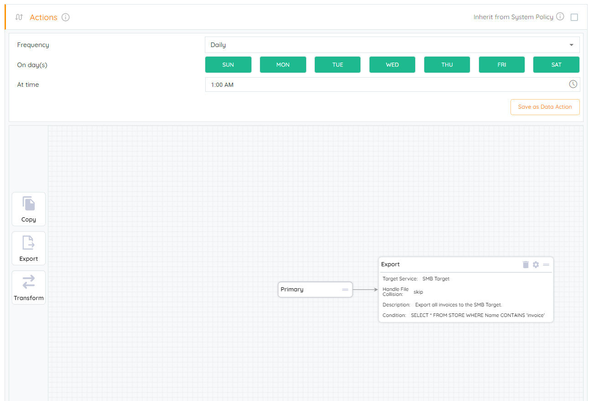
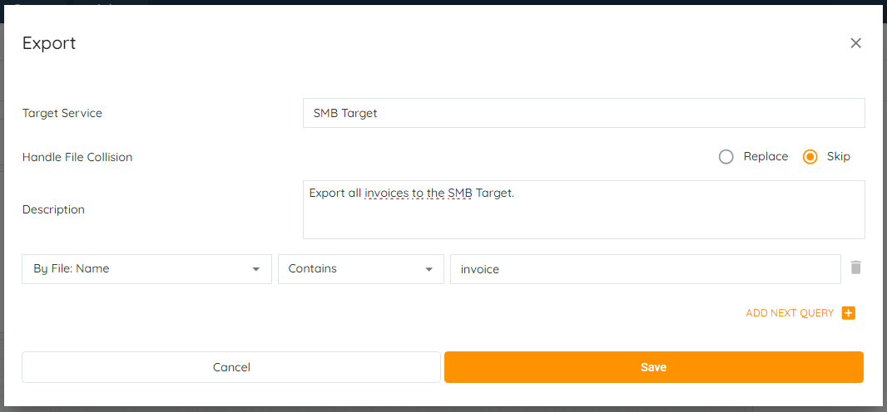
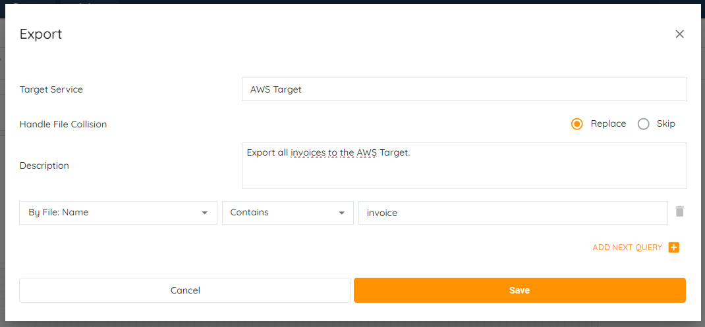
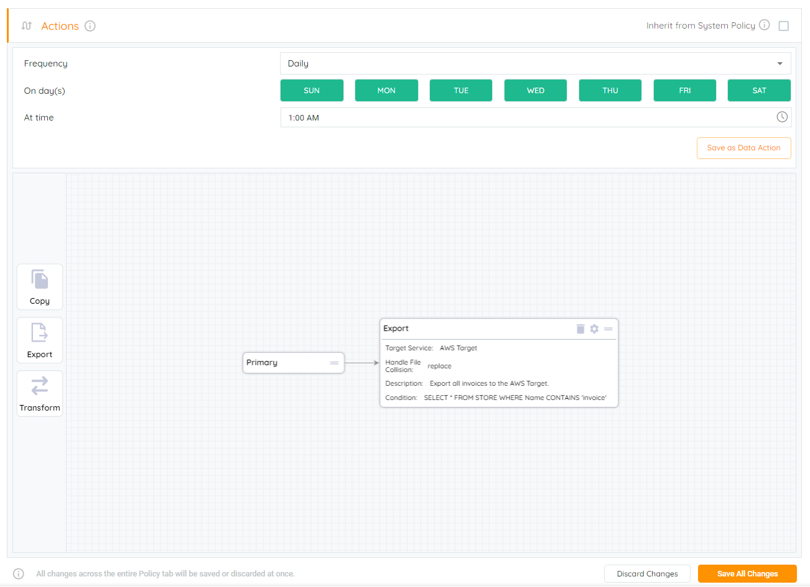
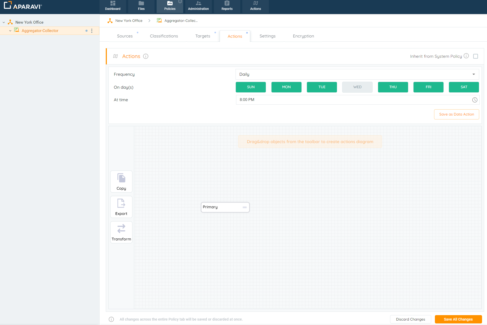
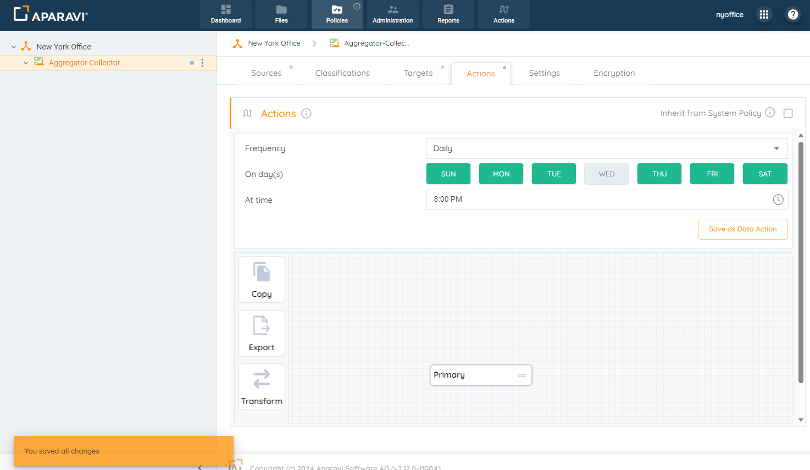
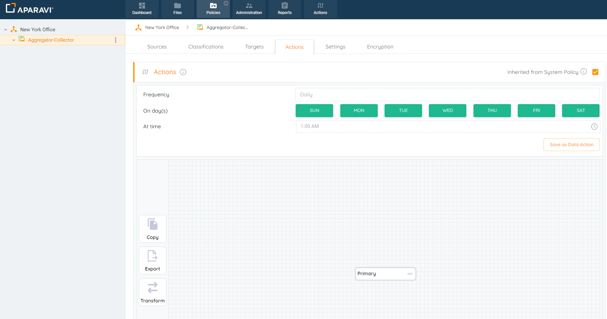
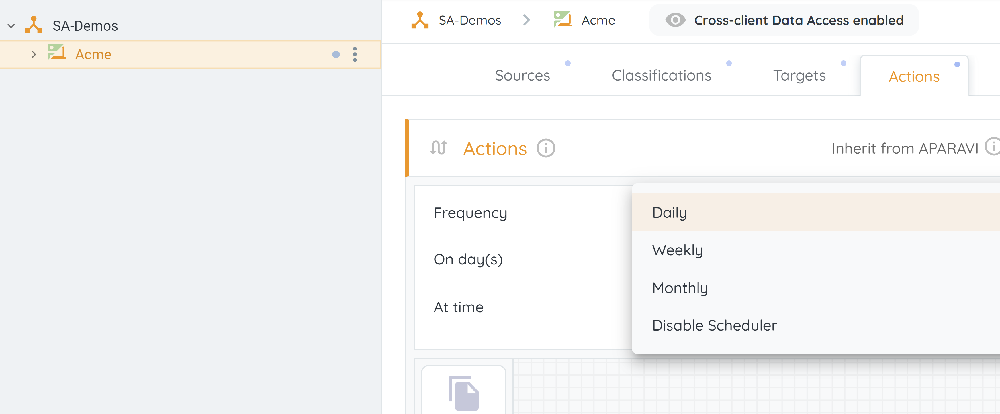
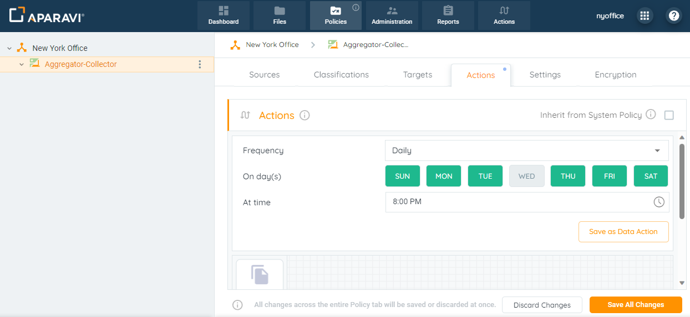
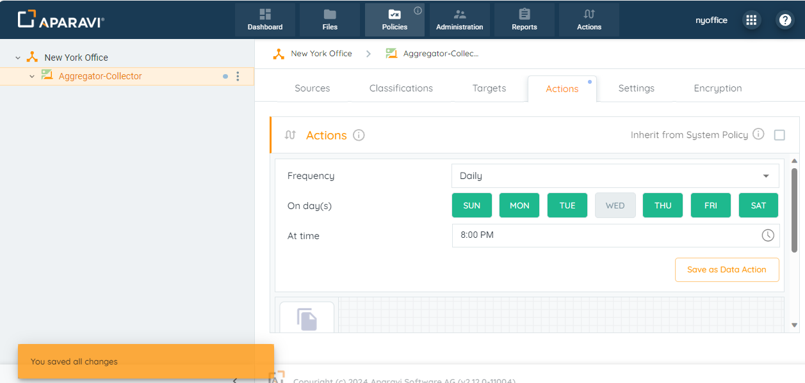

## Edit

1. Click on the Policies tab, located in the top navigation menu.
2. Click on the Actions subtab.

3. Click on the wheel icon, located inside the export action to view the configured query.

4. Alter the fields or search filters and click the Save button when completed.

5. Click on the Save All Changes button.

6. To save the changes, click the OK button.
7. Now, the system will export the selected files to the target service based on the new amendments.

## Delete

1. Click on the Policies tab, located in the top navigation menu.
2. Click on the Actions subtab. Located inside the action grid, click on the trash can icon. Once clicked, the action will disappear from the Action grid and only the Primary box will remain.

3. Click on the Save All Changes button.

4. Click OK to confirm all changes.
5. From this point on, the system will no longer perform any action on the files.

## Schedule

Automated actions can be configured to get executed during any interval entered.

> Actions could be scheduled separately from the scan schedule. When actions scan intervals are customized, this does not impact the system scanning files from the configured source.

1. Click on the Policies tab, located in the top navigation menu.
2. Click on the Actions subtab.
    
    
    > If the the Actions Schedule fields are disabled, check that the "Inherit from .." checkbox is unchecked.
    
3. The parameters to schedule a Data Action are as follows:
    
    - **Frequency**: How often will the action run automatically: Daily, Weekly, Monthly, or Disable Scheduler - we can turn off the schedule completely as well with "Disable Scheduler".
    - **On day(s)**: Days of the week on which the action will be executed.
    - **At time**: The exact time at which the action will be executed.
    
    
4. Once the action schedule has been selected, click on the Save All Changes button, located in the bottom right-hand corner of the screen.
    
    
5. Click the OK button, located inside of the Save Changes pop-up box.
6. The system will now perform Actions on files from the source and move them to the target during the configured time interval.

