Classifications are created by combining small specific rules with other small specific rules to create a larger classification.

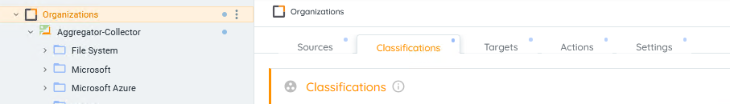

In the following examples, we'll build a classification for a Motor Vehicle.

1. Start by clicking ADD CLASSIFICATION and then CUSTOM CLASSIFICATION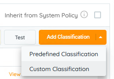
2. 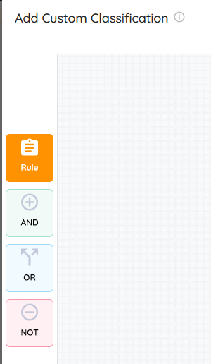Now click RULE. Sometimes in this window, you need to drag it onto the canvas. This is especially true when you are combining multiple rules.
3. 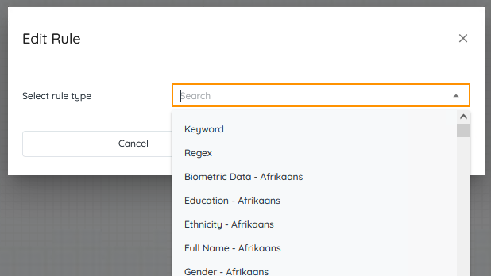You'll now have an option to define your rule. Most custom rules will be KEYWORD based.
4. REGEX rules allow you to create a REGEX rule. REGEX is a language for data and format matching.
5. For instance, you could create a rule that accepted 123-456-7890 or (123) 456-7890 or 1-123-456-7890 as phone numbers, but not 1234567890. You could even get more advanced and kick all of those examples out because a (North American) phone number cannot start with 1.
6. For more information on the REGEX language, visit sites like [https://regex101.com/](https://regex101.com/) where you can pass it test data and construct a REGEX match string.
7. Select KEYWORD for our Motor Vehicle classification and enter WHEEL as our value. The value is not case sensitive so WHEEL, Wheel, wheel, and WhEeL are all the same.
8. 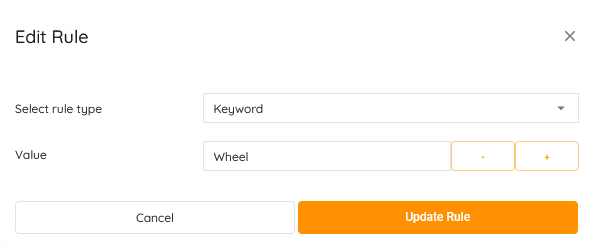 By dragging an AND operator over our KEYWORD rule, we can start to create more complex criteria. A and B and C or D or E. Based on how you arrange the AND/OR/NOT operators, you can create complex rules like ((A and B) or (C and D) or E) and (NOT F). In this case both A and B would be true...OR both C and D would be true...OR E would be true...AND, no matter which of the 3 were true, F is false (NOT true). 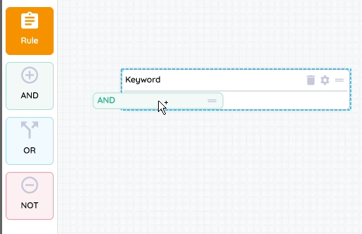 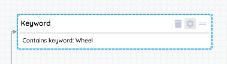 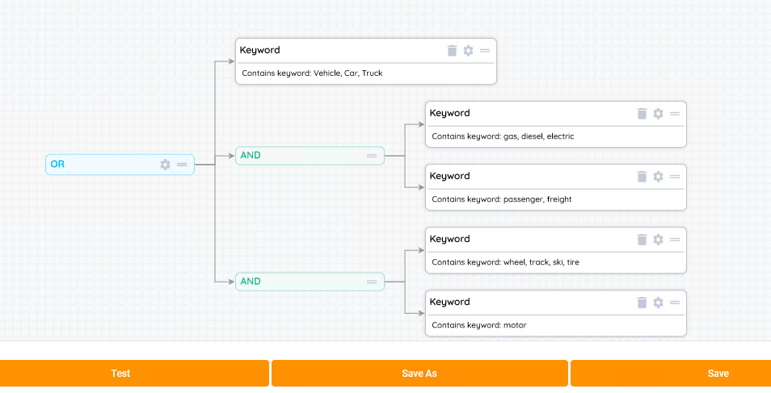
9. In this example, your document, in order to achieve a Motor Vehicle classification, must have VEHICLE/CAR/TRUCK OR (GAS/DIESEL/ELECTRIC AND PASSENGER FREIGHT) OR (WHEEL/TRACK/SKI/TIRE AND MOTOR). Or put another way, either says it's a VEHICLE or CAR or TRUCK, OR a GAS FREIGHT or a WHEEL MOTOR, etc.
10. We aren't defining proximity, just all in the same document.
11. 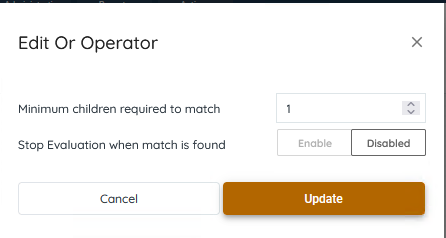 By clicking on the GEAR icon on the OR, you can define the rules for the OR.
12. A or B or C - how many have to be true;
     - 1 - A or B or C
     - 2 - (A and B) or (B and C) or (A and C)
13. Once it finds a match in the file, should it stop processing or should it continue and find more classifications?
14. Once you are happy with your classification, you can TEST the code by clicking TEST and providing it with a test file. 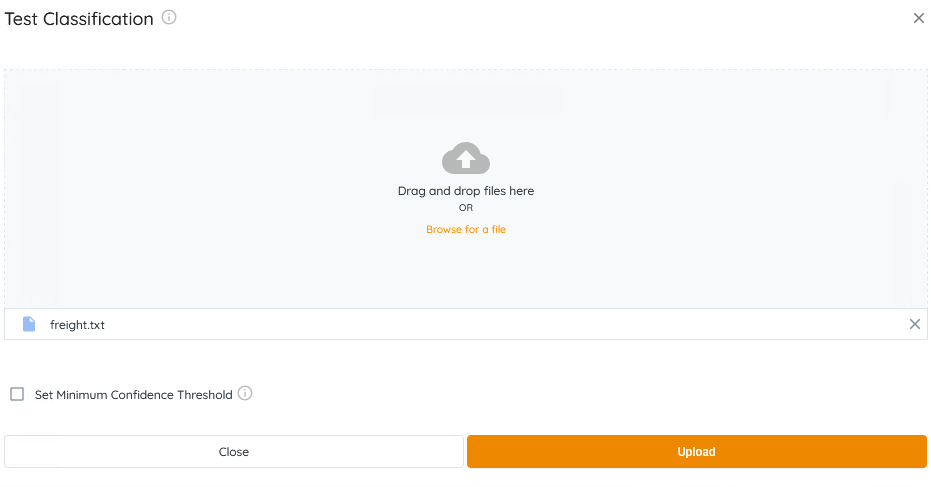
15. Once you click UPLOAD, the file will process and it will show you what the classification is and why. 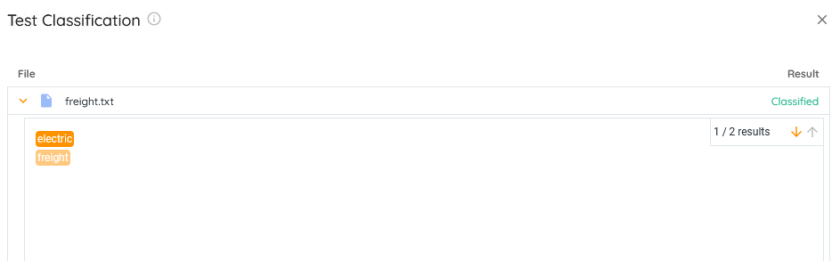
16. 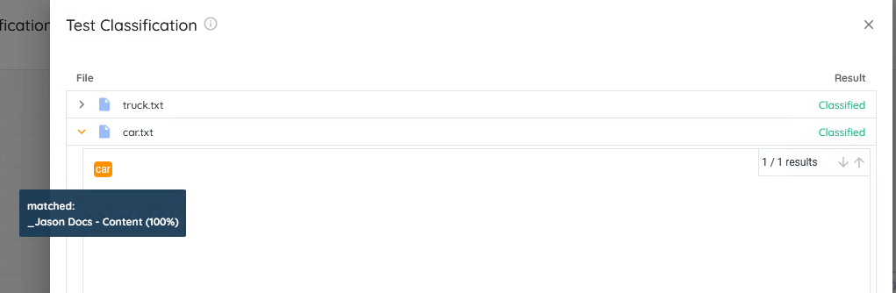
17. SAVE the classification and you can now use it in your system.
18. Once the Pre-defined or custom classification has been chosen, they could be viewed, edited or deleted by clicking on the respective buttons. 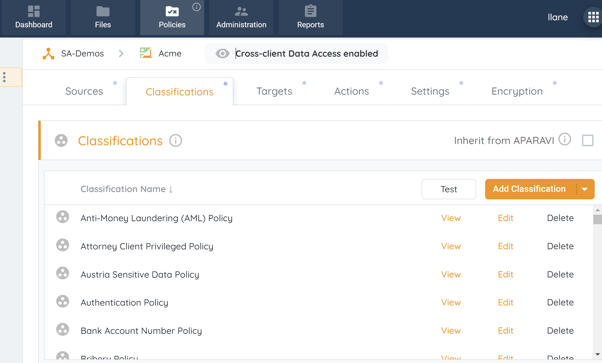
     - **View** – rules and operators appear in a side window to display the criteria of the classification. 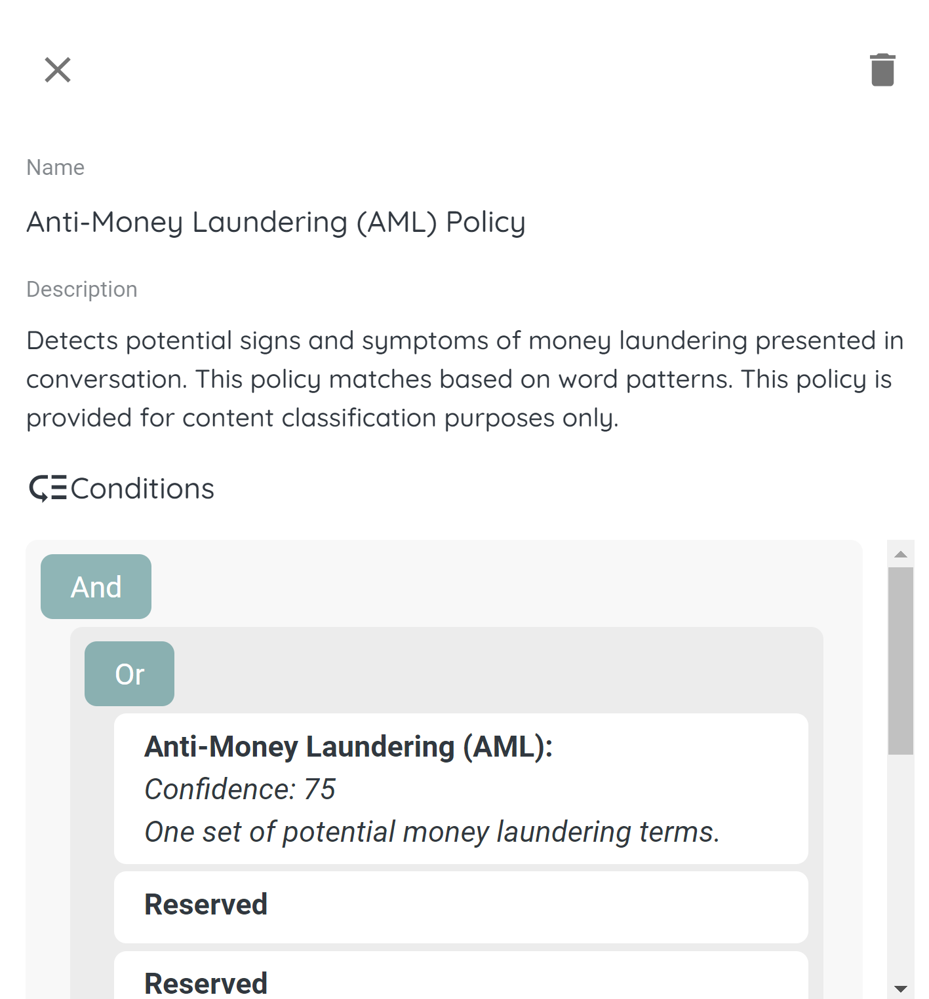
     - **Edit** – rules and operators can be edited, added or removed to alter the classification criteria. 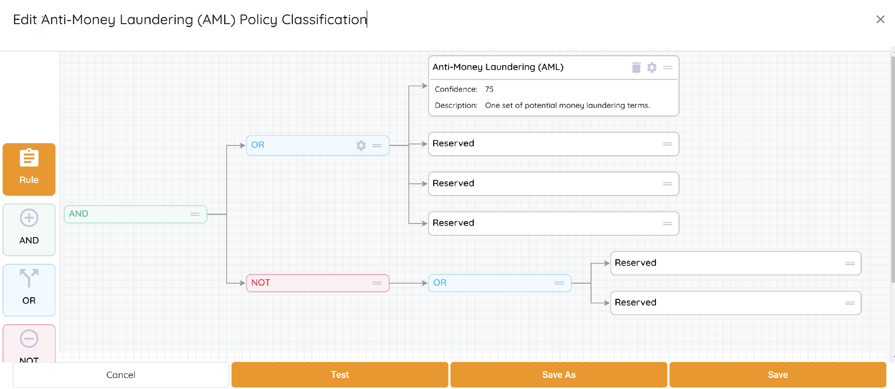
     - **Delete** – classification policy will be deleted and new files will not be ran against it. The system will also remove the deleted classification from all previously classified files. 
19. Modifying or deleting classifications will prompt a reclassification of the dataset, facilitating automatic cataloging of the data with the most recent updates.
