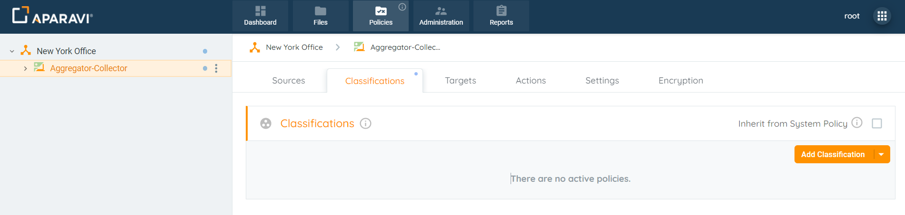
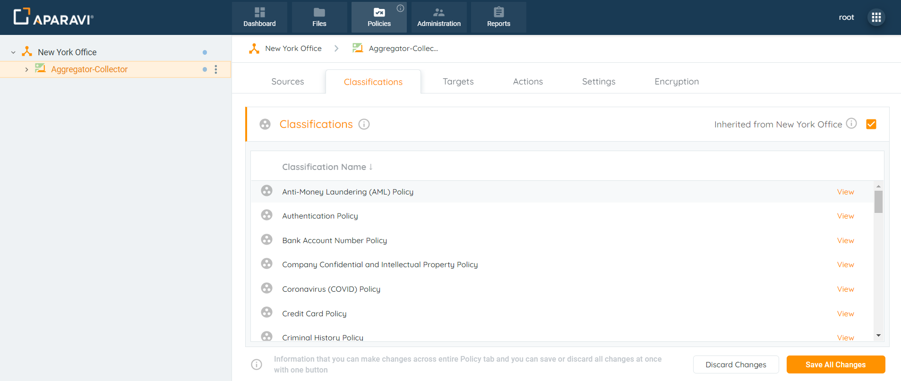
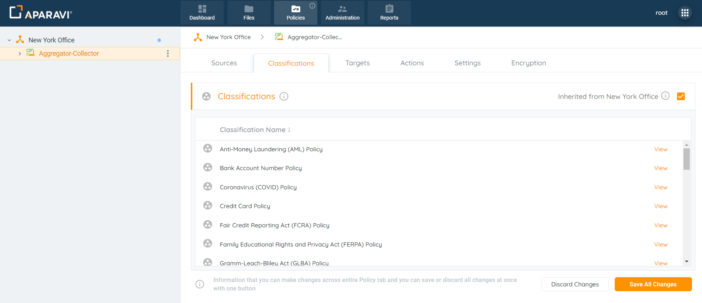
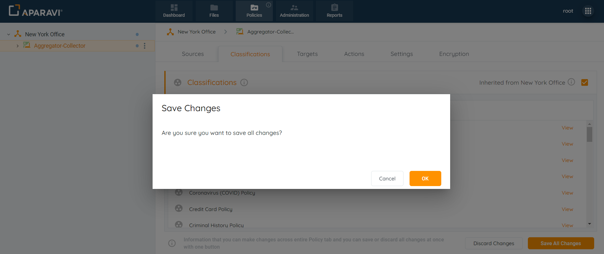
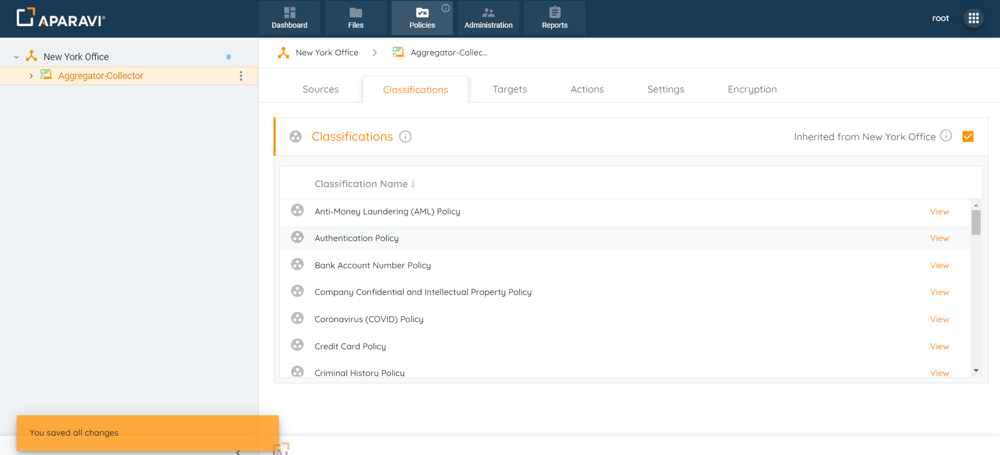
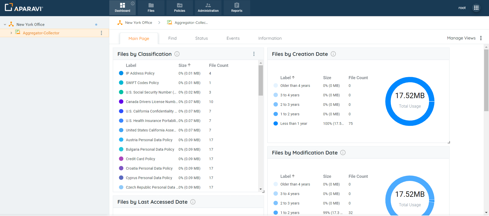
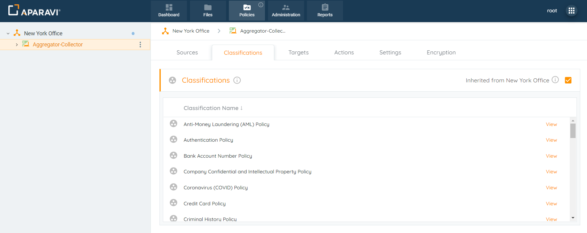
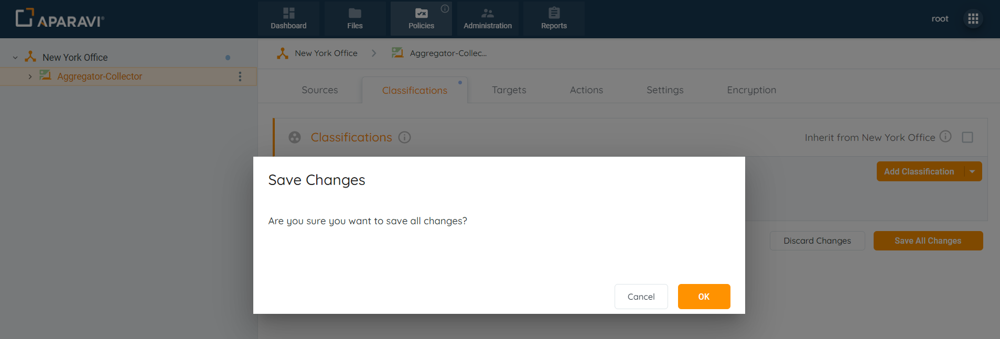
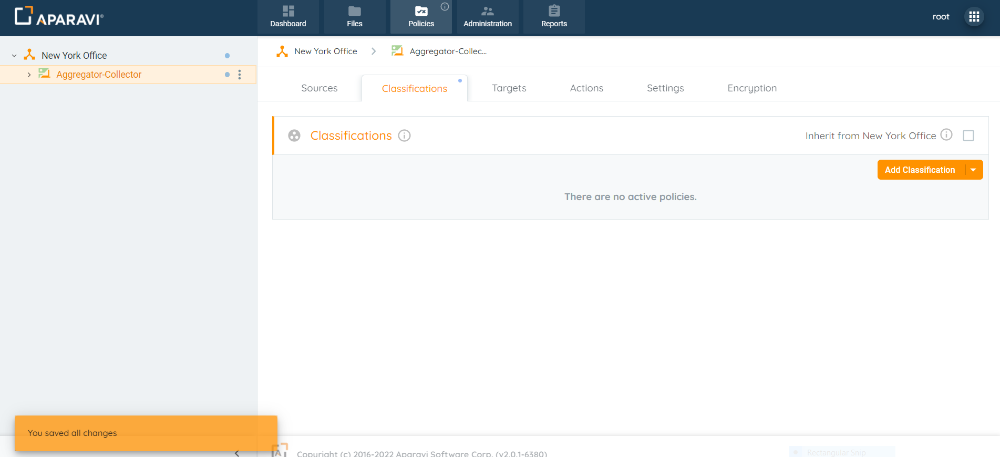

When configuring new classifications, it’s important to notice which node is selected on the navigation tree. The system allows the ability to configure uniform classifications for all nodes under the account, or specific classifications for each. By default, the inheritance policy is applied, and must be disabled to choose it’s own predefined classifications.

### **Inheritance Enablement**

When selected, this node will inherit all classifications that were configured for the organization above.

1. Select the node in the navigation tree to apply the configured classifications.
2. Click the Policies tab and then click on the Classifications subtab that appears.
3. Configure the node’s inheritance policy by selecting the checkbox next to the label “Inherit from \[Organization\].”
4. Once the Save All Changes button has been selected, a pop-up box will appear asking to confirm all new classification policies.
5. Click OK to apply the classification inheritance policies.

6. Once the classifications have been applied, all inherited classification policies for the node above will automatically be activated for the node below.

## Inheritance Disablement

When deselected, this node will require it’s own set of classification policies to be configured.

1. Select the node in the navigation tree to disable the configured classifications.
2. Click the Policies tab and then click on the Classifications subtab that appears.
3. Click on the checkbox next to the label “Inherit from _\[Organization\]”_ to deselect it.
4. Once the Save All Changes button has been selected, a pop-up box will appear asking to confirm all new classification policies.
5. Click OK to complete the classification disablement process.
6. Once deselected, the node will no longer inherit the classification policies configured for the node above. Predefined classifications for this node can now be selected.

