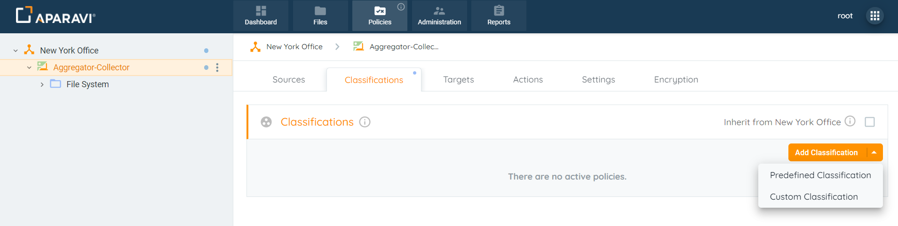
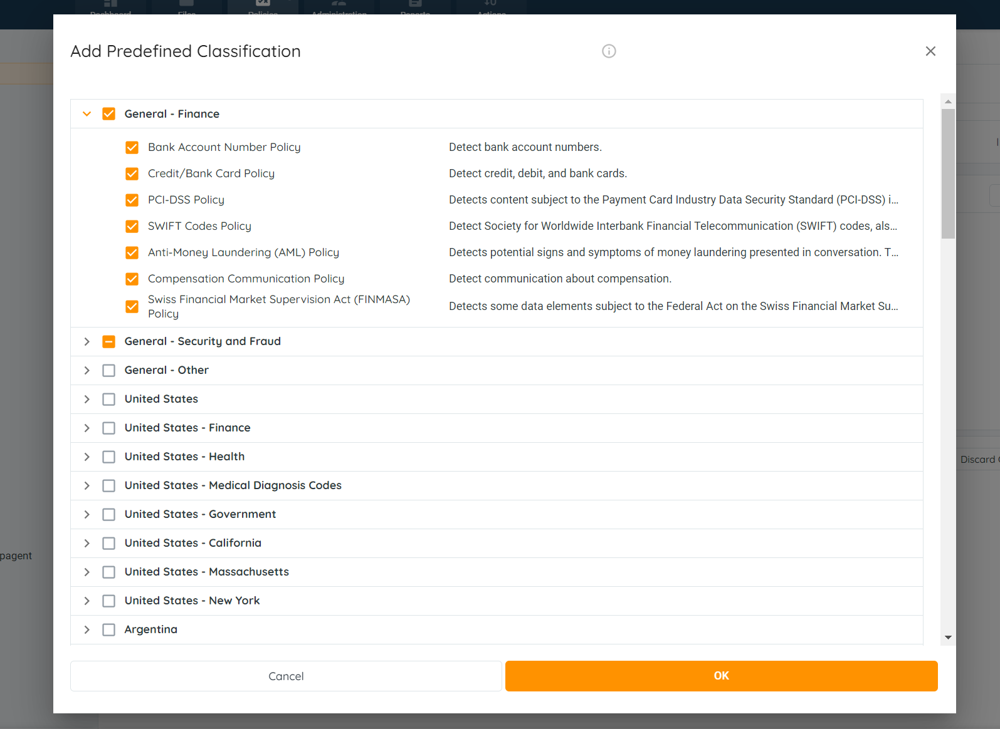
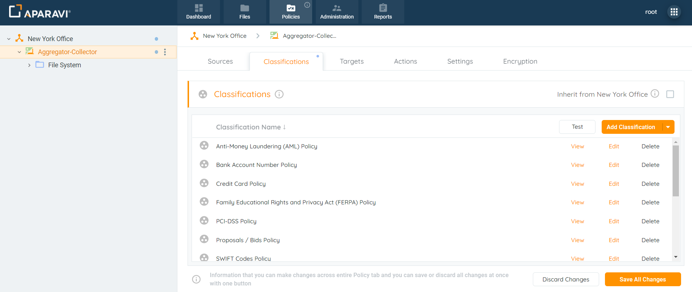
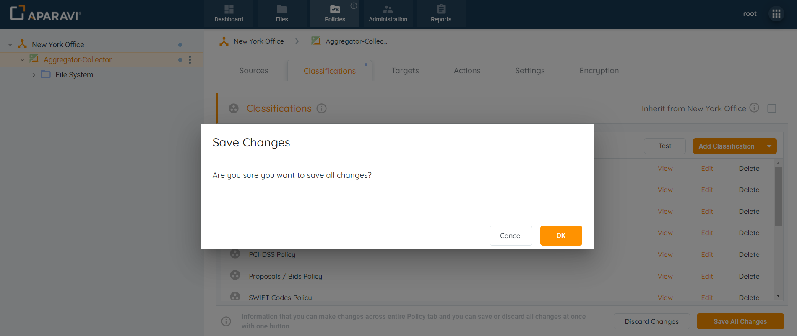
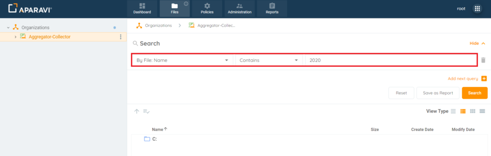
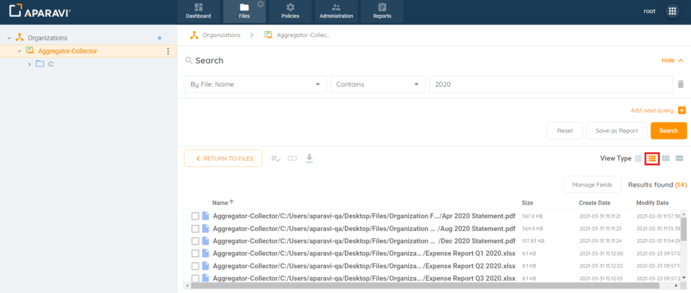
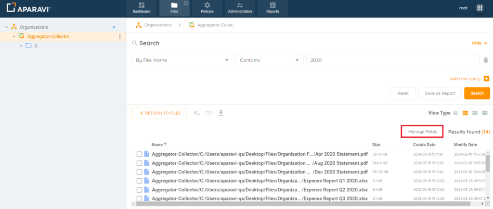
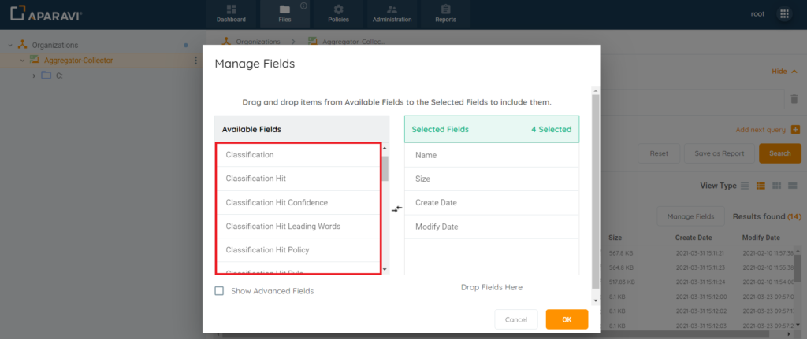
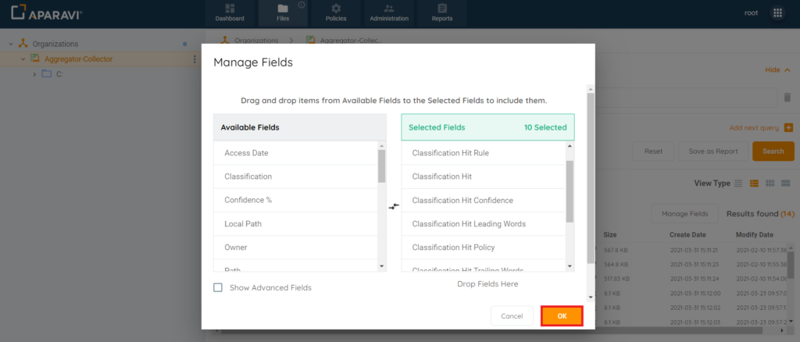
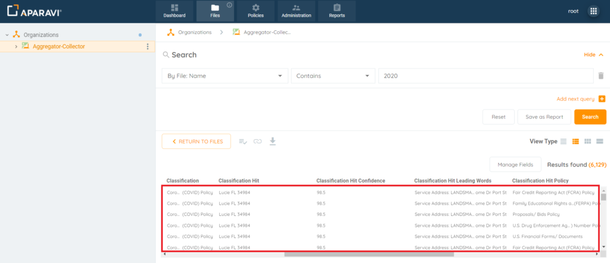

Classifications are the way Aparavi tags ingested files, based on the contents of the file. Files can be classified based on any rules the organization defines. Examples of classifications include "contains Health Information", "contains Credit Card numbers", "contains PII", etc.

Many classification rules are pre-defined with about 300 rules and policies supporting international rules and policies. Additionally, Aparavi allows administrators to create their own rules as well.

Once the files have been scanned and classified, users can query and report on files with that classification.

Classifications are built on rules. Rules are built on simple criteria. For instance, I have a rule for US Health Data and another rule for EU Health Data (and other rules for other regions as well). I can create a classification for Health Data that is a combination of rules; US Health Data OR EU Health Data (OR Africa OR China, etc). I might even include a rule to identify PII as well so it's PII and Health Data combined.

## Add Configured Classifications

Aparavi offers a vast list of predefined classifications that have already been configured to classify files, per various global standards. Many of the top classification policies that are required for businesses to track, are already set up, and with a click on a couple buttons can be applied to classify all files within the system that meet the criteria of the classification.

1. Click on the Policies tab in the top navigation menu and then click on the Classifications subtab.
2. Click on the Add Classification button and select Predefined Classification from the menu that appears.
3. The Add Predefined Classification policies pop-up box will appear with a list of all the options to choose from.
4. Any of the classifications that contain a chevron indicates that there are additional policies to choose from within that policy.
5. Click the checkbox to the left of the classification to select it.
6. Selecting the parent predefined classification policy, will select all policies nested under automatically.
7. Predefined Classifications and Rules
8. To deselect a policy that has already been selected, click the selected checkbox.
9. Deselecting the parent predefined classification policy, will deselect all policies nested under automatically.
10. Once completed selecting the appropriate policies, click OK to save the classifications.
11. Click the Save All Changes button, located under the classifications added.
12. Click OK at the bottom right-hand side of the Save Changes pop-up box to apply the new Predefined Classification(s) to the node selected.
13. Once the classifications have been saved, they will appear under the classifications subtab. A Re-classification scan will be triggered against the selected classifications.
14. Now that the classifications have been saved, the system offers several tools for File Discovery and reporting:
     - File searches can be performed to locate the classified files.
     - Report queries can be created to filter files by one or multiple classifications.
     - The classification Dashboard widget will display the statistics about the classified files.
15. Once files are classified using the classification policies saved in the system, the classified files are searchable by their classifications on the Files tab and Reports tab. When searching for files, several fields can be added to display not only the name of the classification triggered by a file, but also regarding the content within the file that triggered the classification policy to begin with. Once the search or query is performed, the details for the classification file contents display directly on the screen showing data such as, the content that triggered the classification policy and even the rule within that classification policy that was triggered by that content.

### Classification Hit Field Definitions

There are six classification hit fields that can be added to any files search or reports query:

- **Classification Hit** – File content that triggered the classification policy
- **Classification Hit Confidence** – Confidence level of file content that triggered the classification policy
- **Classification Hit Policy** – The name of the classification policy that the file content triggered
- **Classification Hit Rule** – The name of the rule that was triggered by the file content of the classification policy
- **Classification Hit Leading Words** – File content that appears just before the content that triggered the classification policy
- **Classification Hit Trailing Words** – File content that appears just after the content that triggered the classification policy

### Searching for Files by Classification Hits

After the search is performed, the classification hit fields can be added to the search results. It is important to note, that if a file is classified with multiple classification policies, the file will appear in the results duplicated for as many classifications as the file triggers. For example, if the same 1 file has 3 classification policies, this file will appear 3 times in the file results but contain different data within the classification hit fields added.

1. Click the Files Tab, located in the top navigation menu.
2. Perform File Search by selecting the search criteria, using the file search fields.
3. File Search Filters
4. Click Search.
5. Click the Details View button, located in the top right-hand corner, under the View Type section. Once clicked, the Manage Fields button will be visible.
6. Details View
7. Click the Manage Fields button, located in the top right-hand corner, directly above the file results. Once clicked, the Manage Fields pop-up box will appear.
8. Manage Fields Button
9. Click on the Classification hit field, located under the Available Fields column, drag it over into the Selected Fields column. Once the Classification Hits field has been successfully added, it will appear under the Selected Fields column and no longer display under the Available Fields column.
10. Classification Hit Fields in Available Fields Section
11. Repeat this process for the following fields:
     - Classification Hit Rule Field
     - Classification Hit Trailing Words Field
     - Classification Hit Policy Field
     - Classification Hit Leading Words Field
     - Classification Hit Confidence Field
12. Once all fields have been added and appear under the Selected Fields column, click OK, located in the bottom right-hand side of the Manage Fields pop-up box.
13. Once the Manage Fields pop-up box disappears, the newly added fields will display for the file results.
14. 
