Classifications are created by combining small specific rules with other small specific rules to create a larger weighted classification. Predefined Classifications are built into Aparavi to handle complex rules that may not be possible with Regex or Keyword searches.

1. Like Custom Classifications, click ADD CLASSIFICATION and choose PREDEFINED CLASSIFICATION.
2. 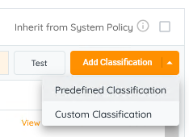Select the classification(s) you want to add.
3. 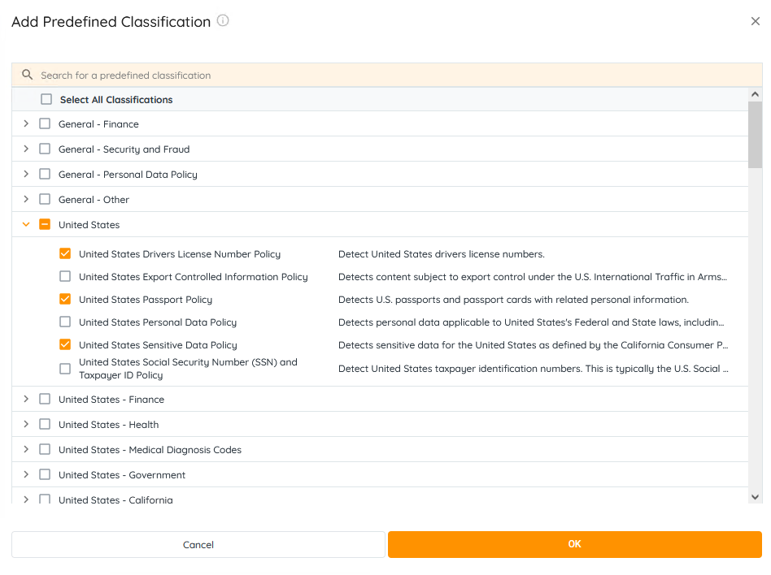This will add the classification to the list of available classifications.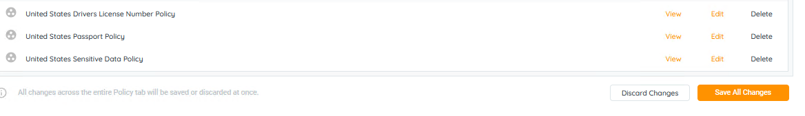
4. Click VIEW and you'll see the "quick panel" on the right showing the rules.
5. 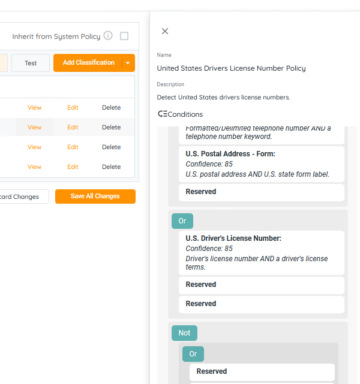By EDITing the classification, you can update weights and AND/OR type rules for the classification.
6. 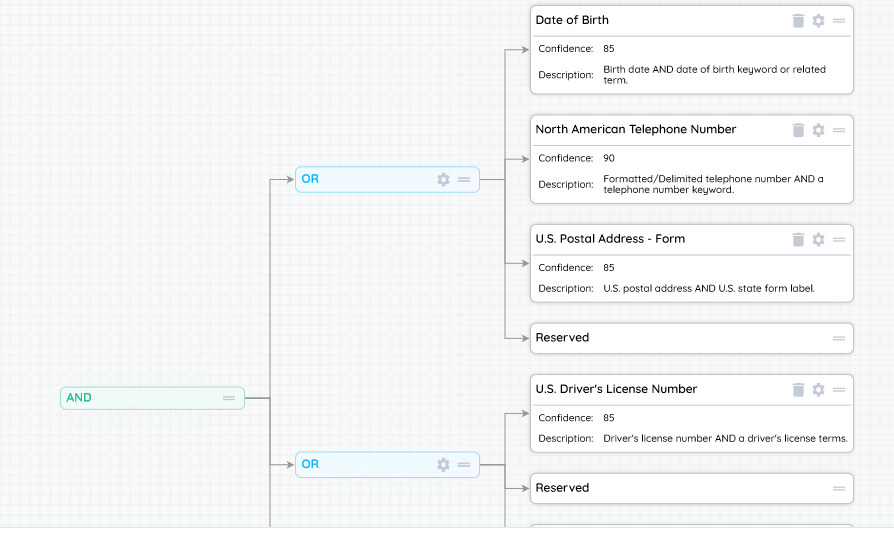If you click the GEAR icon, you can refine the confidence level and configuration for the rule.
7. 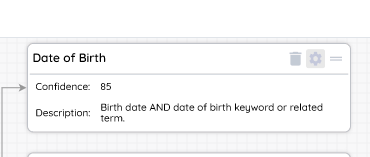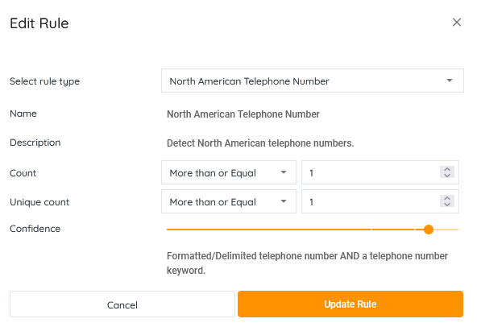You can adjust how many entries it must find, how many distinct entries it must find, and how the confidence is weighted.

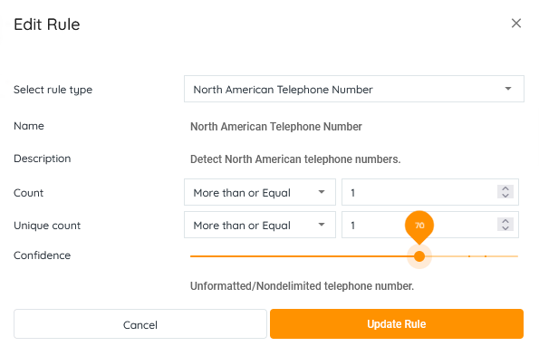

The classifications are used to categorize the scanned data set, and the ability to edit these classifications gives the user the power to alter the sensitivity of the classification or change the way it classifies files to suit your requirements.

1. 1. Login on your client level in the APARAVI platform, navigate to the “**Policies**” menu, and select the “**Classifications**” tab.
    2. 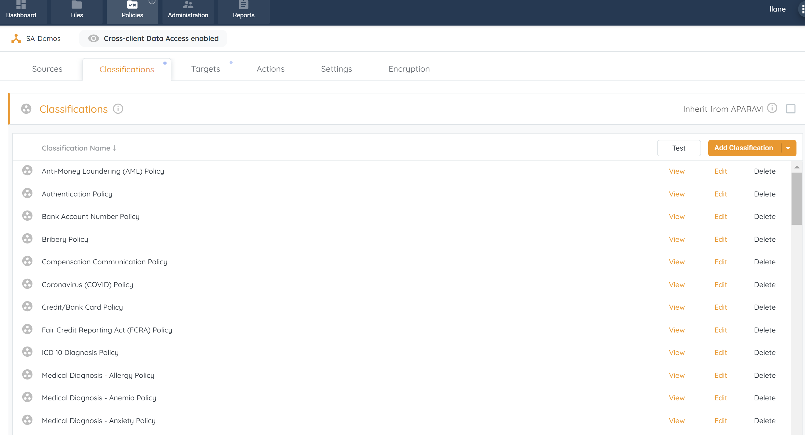To edit a classification, click on the “**Edit**” button.
    3. If you do not see a list of classifications you can add classifications by clicking on the “**Add Classifications**“ button the classification builder window will open.
    4. 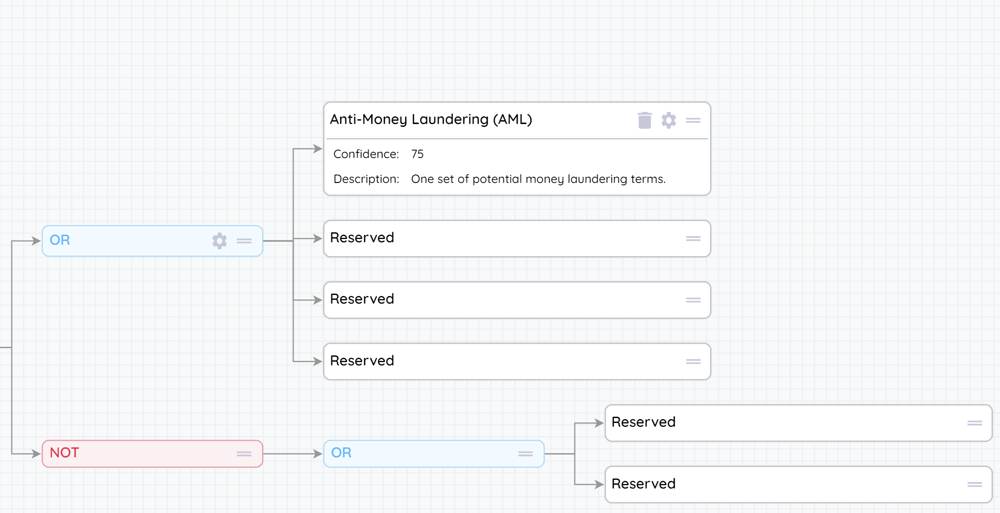Edit Classification pop-up
    5. In the classification builder you will see the layout of how the classification parameters are set. From this window you will be able to edit the classification rules by adding, removing, or editing the rules.
    6. To edit an operator rule click on the gear icon to enter the “**Edit operator**” window.
    7. 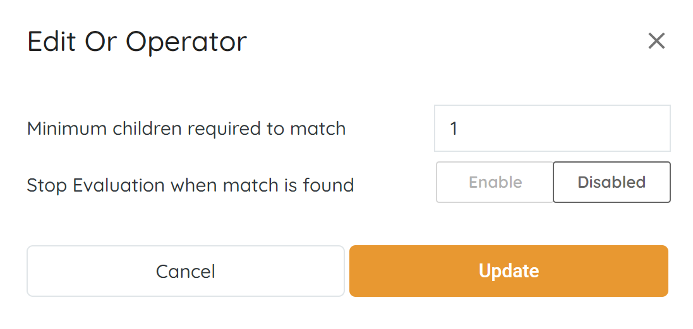Edit Or Operator pop-up
    8. Within the Operator editor, you will be able to make changes to the set rule:
        - **Minimum children required to match** – Value set of how many rules need to be met for the classification to be triggered.
        - **Stop Evaluation when match is found** – Enable / Disable the "Early out" value.
    9. When the "early out" value is disabled the classification will be triggered as soon as the minimum value is met. The scan will continue to parse through the document. When enabled and the minimum value has been met, the classification will be triggered and the document will no longer be parsed through.
    10. To edit a classification rule click on the gear icon to enter the “**Edit Rule**” window.
         1. 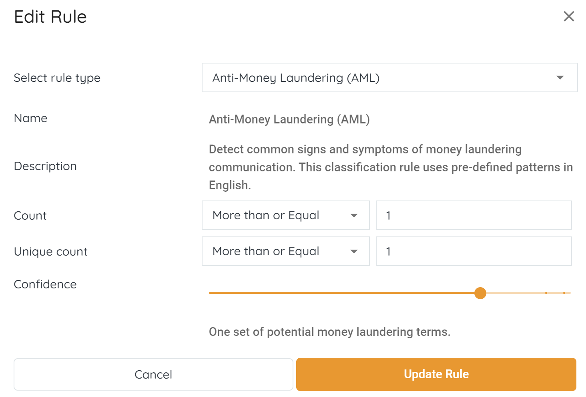Edit Rule pop-up
         2. When in the edit rule window you will be able to edit the classification rule based on a few presets:
             - **Select rule type** – Prefilled drop-down list of set rules.
             - **Name** – Name of the rule.
             - **Description** – Description of the rule.
             - **Count** –  Specific value of how many times the rule needs to be triggered with.
             - **Unique count** – Unique value of how many times the rule needs to be triggered with.
             - **Confidence** – Confidence value bar according to the sensitivity of the rule created.
