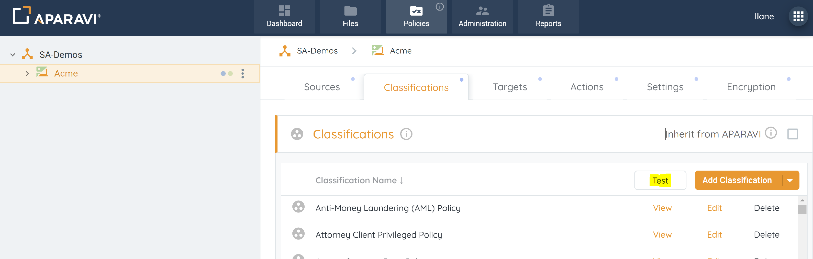
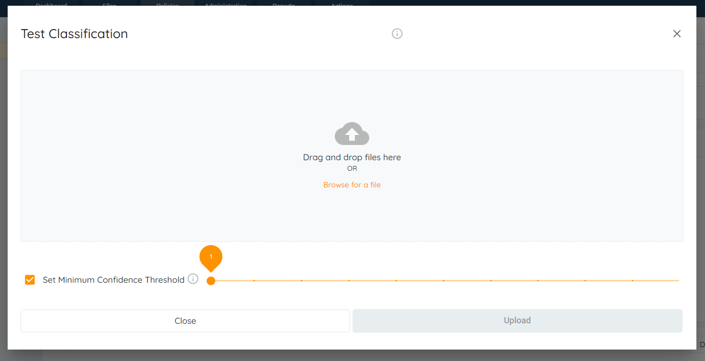
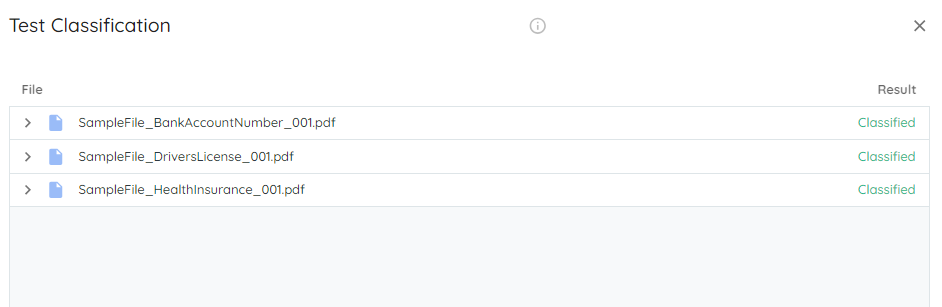

APARAVI provides the option to simulate how classifications work for the chosen classifications with certain test files. Testing a file against customized or predefined classification gives the ability to edit the classification to fit the specific user needs. This gives the user the ability to narrow down the scope of the classifications builder to find what is being looked for confidence that the appropriate desired classification is being used.

1. Login on your client level in the APARAVI platform, navigate to the Policies menu and select the Classifications tab.

2. Click on the Test button. A new window will appear where files to be tested against can be added either by drag and drop or by browsing the system. When you have added the file click on the Upload button.

> A maximum number of five files can be tested with this method.

3. Set Minimum Confidence Threshold - This provides the flexibility to adjust the confidence levels for selected classifications, allowing users to either decrease or increase them as needed.
4. When the classification test is run, a window will appear with the results of files uploaded against the classifications selected.

4. Within this window, you will be able to see if the document was classified or not by the selected classifications, as seen in the above example. Click on the arrows to the left of the file name to see what classifications had been triggered.
5. To complete the test, click on Reset button, to re-do the test again with other set of files or classifications.
