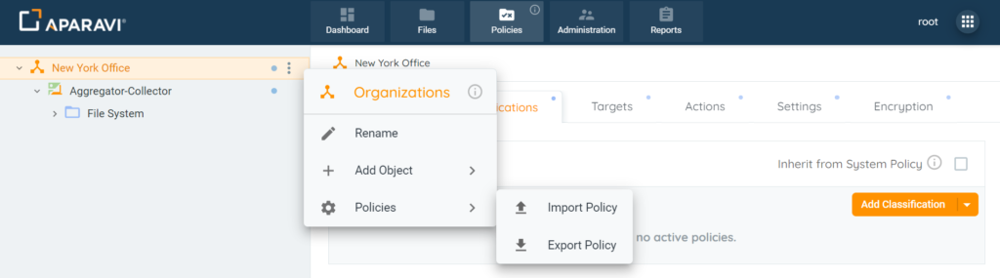
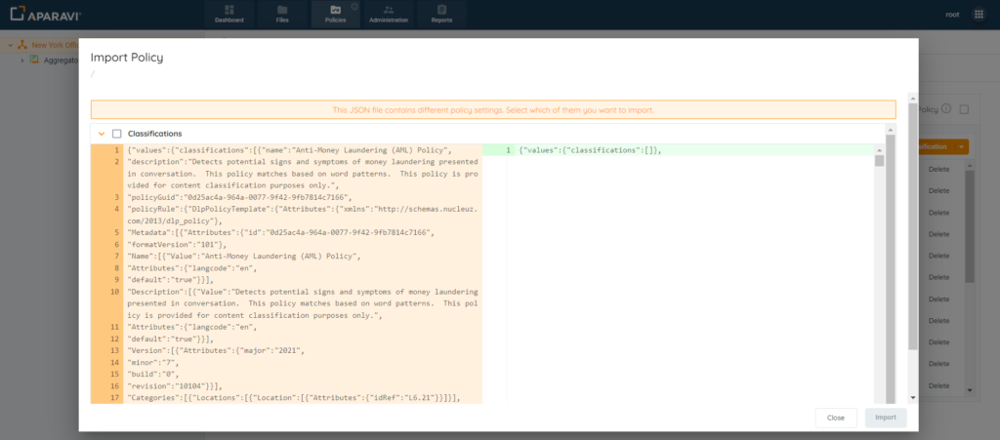
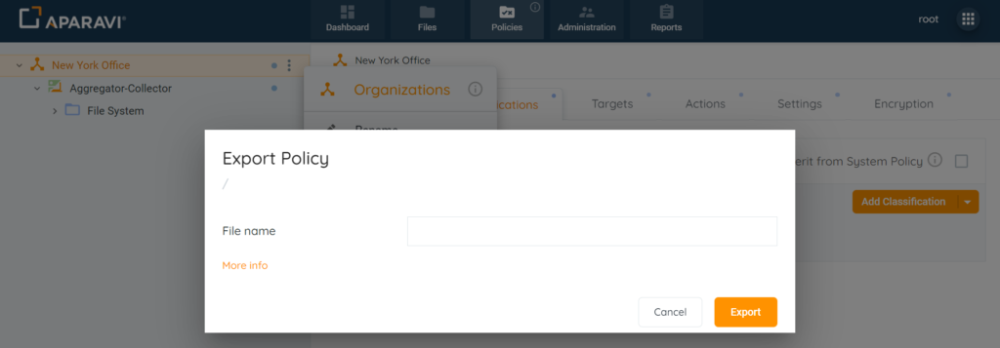

## Importing

Administrators for managed service providers require the ability to import and export the full set of their policy configurations to save, archive, and deploy to multiple customer environments. This enables them to be more efficient in creating and distributing custom classification policies and for managing settings for data sources, credentials, features and tuning.

Additionally, any administrator of the Aparavi application can utilize the ability to export and import policy configurations to backup and restore these configurations within their environment.

Policies can be exported from one object and imported to another. During import administrators have the option to select which policy sections will be overwritten.

Import Policies

1. Navigate to the desired level (client, group, aggregator, collector).
2. Right-click and select Policies.
3. Choose Import Policy.

4. Drag-and-drop or browse for the .json file.
5. If identical policies, Cancel Import.
6. For different settings, review differences in Scan, Classifications, Targets, Credentials, and Settings.
7. Select checkboxes for desired sections.
8. Click Import to apply the new policies. Note: Only entire sections can be imported.

### Known Limitations

If there is a substantial difference in policies, particularly when the policy file contains numerous updates or differences from the existing policies in the system, rendering the user interface for policy differences during review may take several seconds, potentially up to 30 seconds in certain cases.

## Exporting

Additionally, any administrator of the Aparavi application can utilize the ability to export and import policy configurations to backup and restore these configurations within their environment.

Policies can be exported from one object and imported to another. During import administrators have the option to select which policy sections will be overwritten.

### **Export Policies**

1. Navigate to the desired level (client, group, aggregator, collector).
2. Right-click on the level, choose Policies, and then Export Policy.

3. Enter a name, click Export, and save the .json file locally.

