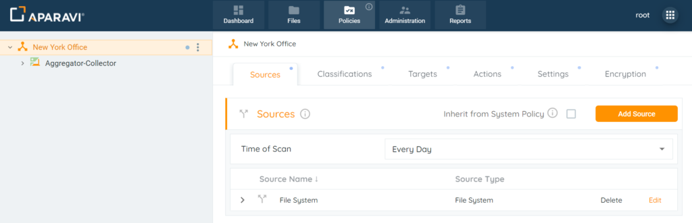
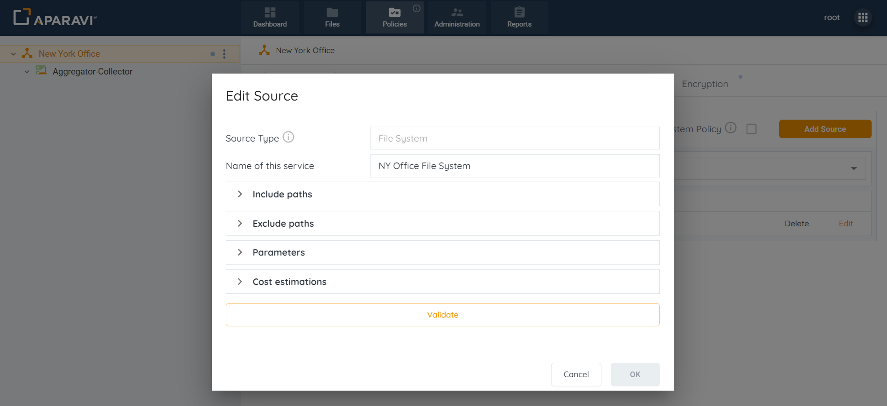
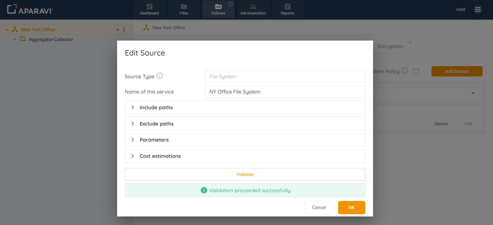
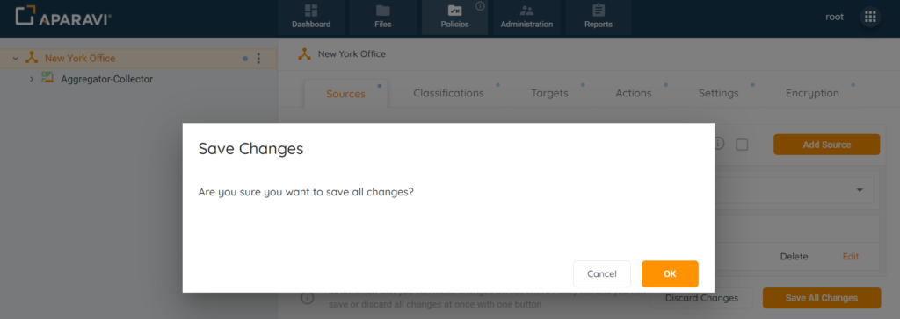
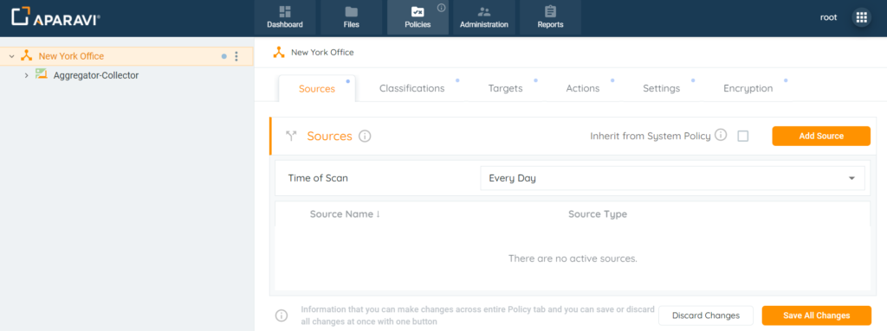
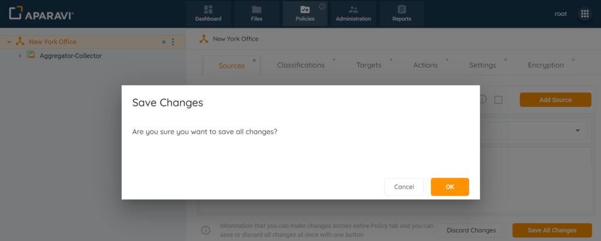

## What are Sources

1. Click on the Policies tab. By default, the system will navigate to the Sources subtab.
2. Click on the Edit button to the right of the any configured source.
3. Inside the Edit Source pop-up box, edit the previously configured File System fields.
4. Once the sections within the Edit source pop-up box are updated, select the Validate button. Ensure that the validation is successful.
5. Click OK.
6. Click on the Save All Changes button. Once clicked, a pop-up box will appear requesting to confirm all changes.
7. Click OK to confirm the saved changes.

## Delete

1. Click on the Policies tab. By default, the system will navigate to the Sources subtab.
2. Click on the Delete button to the right of the an configured source. Once selected, the corresponding source will disappear from the subtab.
3. Click on the Save All Changes button. Once clicked, a pop-up box will appear requesting to confirm all changes.
4. Click **OK**

<figure>

</figure>
