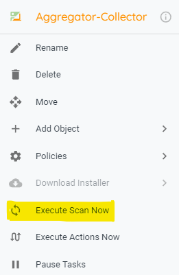
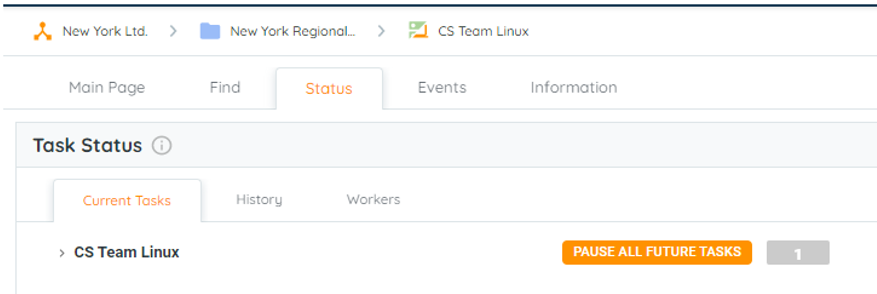
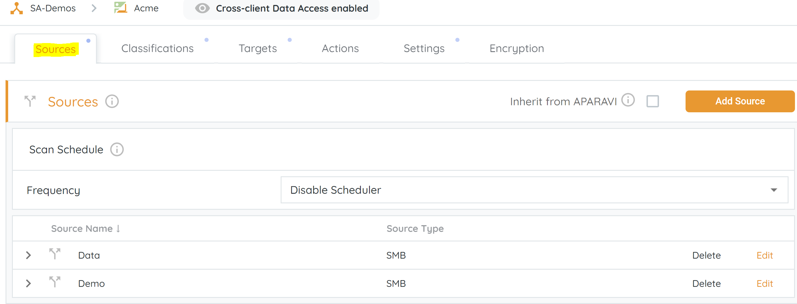
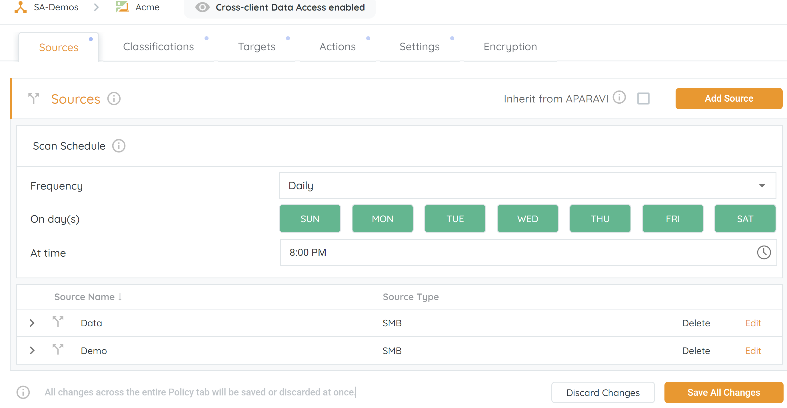
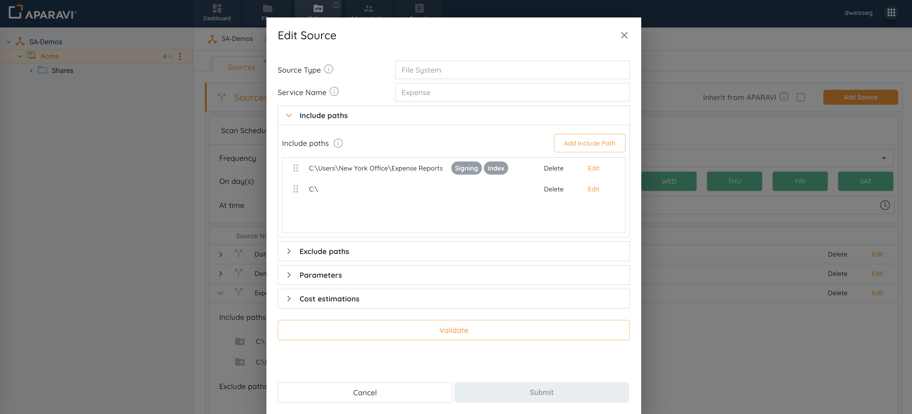
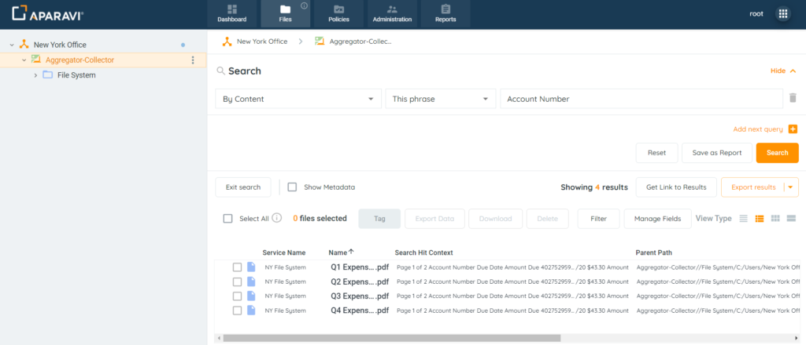
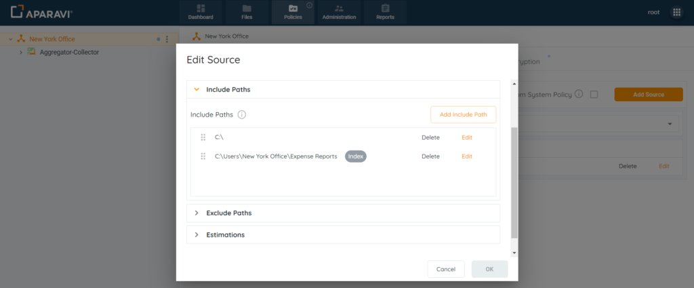

## **What is a Scan?**

A "scan" refers to the process of inspecting data to extract valuable information. It is the action APARAVI takes to comprehensively understand and gain insights into your data estate. The results of this scanning process are subsequently presented on the presentation layer for your review and analysis.

- **Manual scan** - manually start the scan process.
- **Auto scan** – Scan takes place when changes are made in the Policies tab
- **Scheduled scan** – Schedule a scan to start at a specific time and day of the week.

> A scan can also be paused and would need to be resumed manually. A scan can be cancelled or aborted when needed.

### Manual Scan

1. Log in to your client level in the APARAVI platform.
2. Find and click on the vertical ellipsis ( Three dots ) in the object tree.
3. Click on the "Execute Scan Now" button to start scanning the mounted data.

> Starting a scan can only be started when selecting a Aparavi node.

To be able to see the status of the scan, locate and click on the “**Status tab**” from here you will be able to see how long the scan has been going on and how many files it has already scanned.

Once the scan has been completed you will see the results of the scan in the “**History**” tab for a more in-depth look at what was done in the scan.

### Auto Scan

1. Log in to your client level in the APARAVI platform.
2. Navigate to the “**Policies**” menu and select the “**Sources**” tab.
3. Make and save changes to the policy will initiate an automatic scan.

 

> A source can be added in the Policies tab. A scan cannot take place if no data source is added. After adding and configuring a data source, the software will automatically trigger a scan.

## Scan Scheduler

The scan scheduler gives you the ability to automatically run scans according to your preference.

### **What is the advantage of the scan scheduler?**

Scheduling the scan allows you the flexibility to choose the day and time that suits you best. This freedom enables you to initiate the scan during non-critical business hours, whether it's at night or over the weekend.

### **How do I schedule a scan?**

1. Login on your client level in the APARAVI platform.
2. Navigate to the “**Policies**” menu and select the “**Sources**” tab. 
3. APARAVI provides the following parameters for an automatic scan:
    - **Frequency** – Scan frequency can take place daily, weekly, or Monthly.
    - **On day/days** – Scan can take place on any day selected.
    - **Time** – Scan Schedule to take place at a specific time.

> The scan scheduler can be set on the client level as well as on the Node level. When setting the scan on the client level all nodes that have the “Inherited from Organization” check box check will adopt the scan schedule settings from the client level.

## Order of Precedence

The system prioritizes the folder path listed first in the include and exclude paths sections. In cases where multiple paths share the same root directory, the system scans the initial occurrence of the subfolder and ignores any subsequent instances. It's important to note that, following the hierarchical structure, any subfolders should be listed above the root path.

### Example:

- User wants to scan and index the \[Expense Reports\] subfolder.
- However user does not want to index the files on the C: drive.
- As a result, the \[Expense Reports\] subfolder should appear above the C:\\ drive.
- The system will scan and index the \[Expense Reports\] subfolder, since it is listed **before** the folder path that **contains** the same subfolder.

1. **Index On:** C:\\Users\\New York Office\\Expense Reports
2. **Index Off:** C:\\

> If the subfolder path is not the first listed in the Include Paths section, so the system will only scan the subfolder using the root directory entry. The system will then skip the subfolder instance for all subsequent scans.

1. **Index Off:** C:\\
2. **Index On:** C:\\Users\\New York Office\\Expense Reports

## Scan Types

### **Core Scan**

- How old is the data?
- What type of data does the customer have - data categories?
- Total amount of data scanned
- Amount of data in each data category
- Size of data in each category
- Finding data by creation date
- Where are these files located?
- How much data has been created in the last 3 years?

### **Signature Scan** 

- Identify duplicate or redundant data
- Which file categories have the most duplicates?
- How many duplicates are there in different data sources (consolidated report)?

### **Index Scan** 

- Reading of metadata
- Deep content search, including support for multiple languages

### **Classification Scan**

- Use pre-built classifications to find appropriate data for country and industry-specific classifications (e.g., GDPR compliance).
- Create custom classifications to meet specific needs

### **OCR Scan**

- Extract and analyze the content of image-based data (e.g. PDFs)
- Index previously unknown forms of data (e.g. images of handwritten notes)
- Recognise characters in Latin and Cyrillic-based alphabets.
