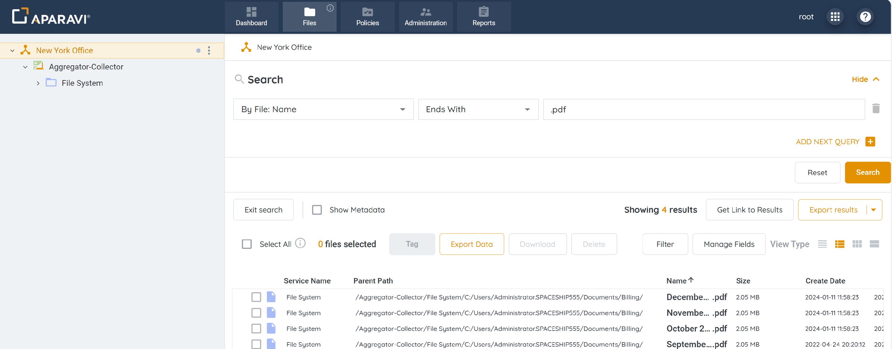
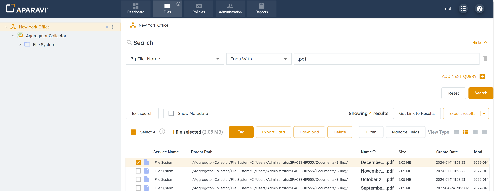
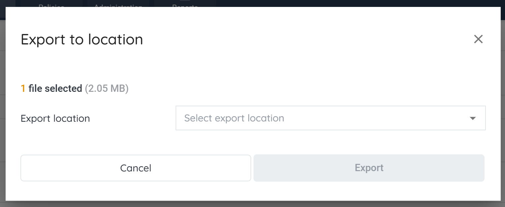
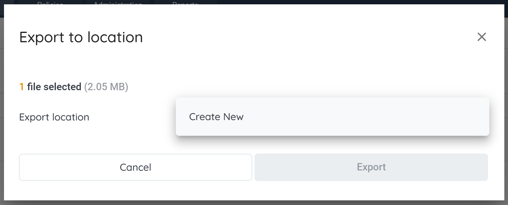
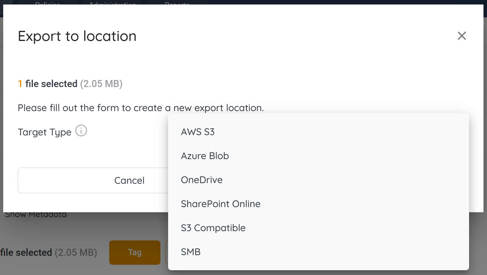
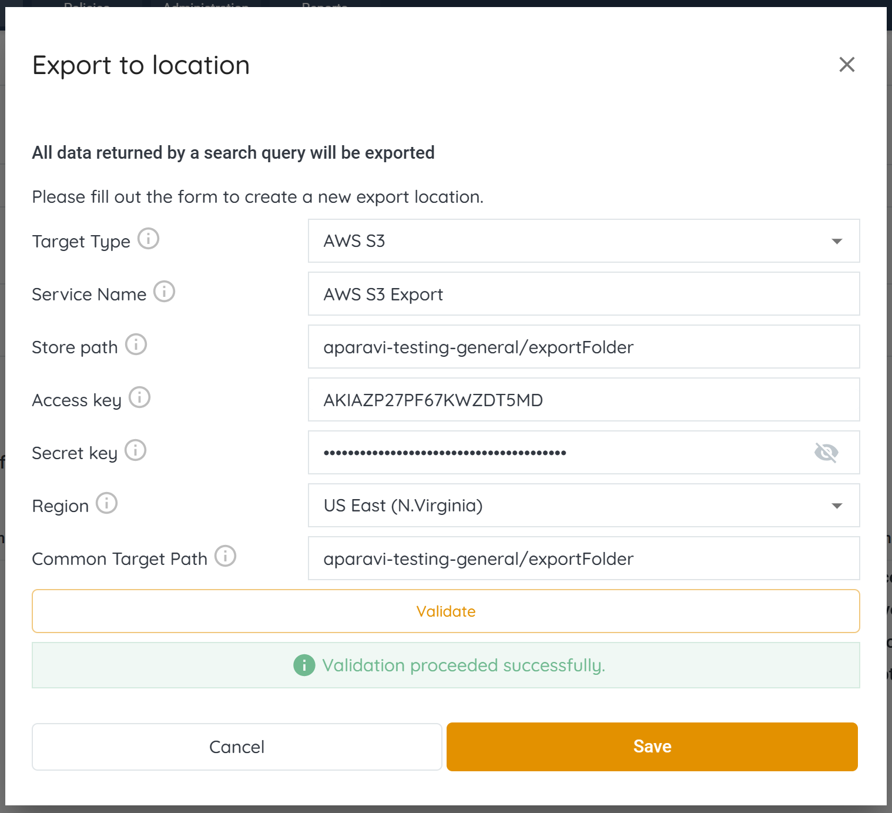
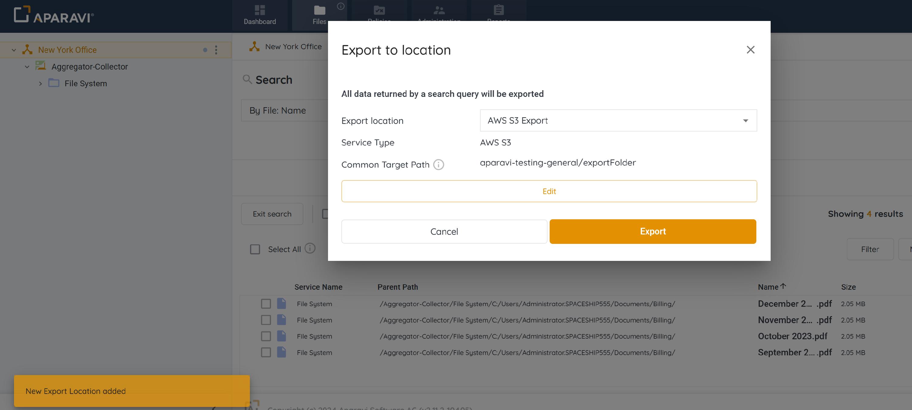
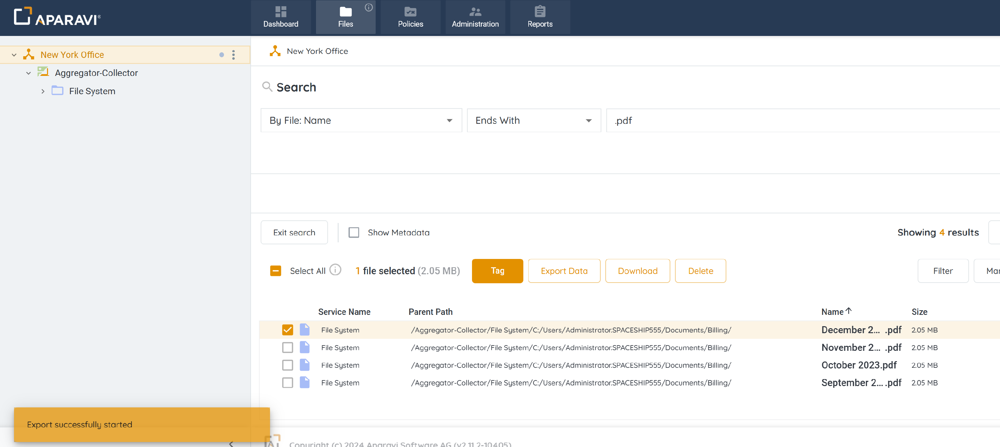
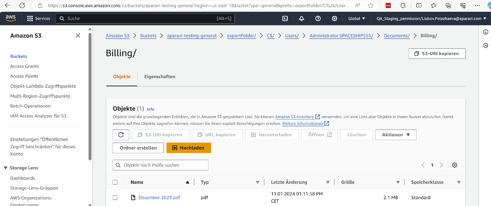

The system allows exporting 25,000 files from the platform to the local host machine. Manual data exports can be used to migrate files between storage systems or to extract data and review the files when they are stored in the Aparavi data format.

1. Click on the Files tab, located in the top navigation menu.
2. Perform any file search using the Query Builder and click the Search button.

3. Select the checkbox located to the left of the file’s name. This will select the file for export.

4. To begin the export process, click on the highlighted Export Data button, located above the file results.
5. Once clicked, the Export to location pop-up box will display and offer the Export location drop-down menu.

6. Choose \[Create New\] from the drop-down menu.

7. Inside of the Export to location pop-up box, select the AWS S3 option listed from the drop-down menu that appears under the Target Type field.

9. Inside the Export to location pop-up box, enter the fields to configure the AWS S3 export location:
    - **Target Type:** This field defines the kind of target to connect to.
    - **Service Name:** Enter any name for the AWS S3 target.
    - **Store path:** This path defines the exact specific folder in the filesystem. Format for AWS S3: **bucketname/foldername**. For example: aparavi-testing-general/exportFolder.
    - **Access key:** This is a key which gives access to your AWS resources. It is provided by the service provider. It is used to sign the requests you send to Amazon S3.
    - **Secret key:** This is a key used to access the AWS services.
    - **Region:** This is defined and provided by the service provider.
    - **Common Target Path:** A prefix path to strip off the destination.
10. Once all information has been entered into the Export to Location pop-up box, click Validate.

10. Click Save, located at the bottom right-hand side of the pop-up box. All information will be saved and the Export button will become active.

11. Click Export button. Once completed, the files will begin to export to the selected location.

12. To view the exported files, check the location specified during the export process. The folder will display all selected files in their native format.

Now that the target service has been configured, click on the Actions subtab and create an export action. Once completed the system will transmit all files matching the export action query to the SMB target service.
