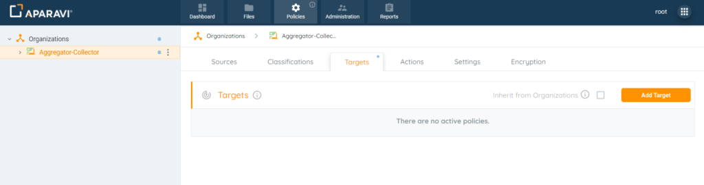
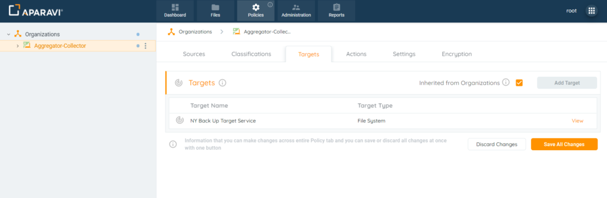
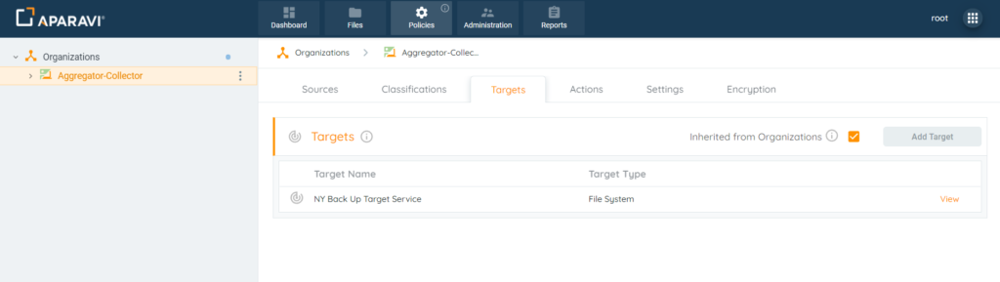
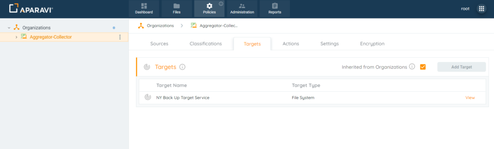
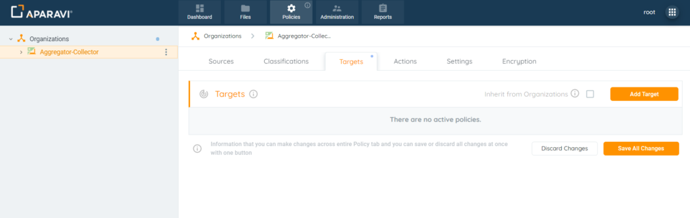
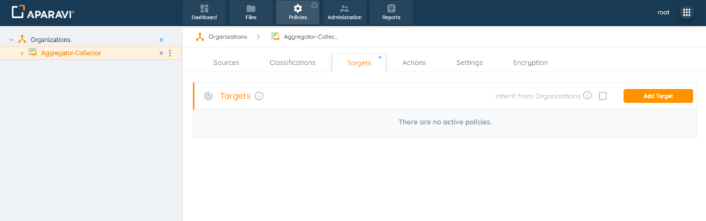

Nodes nested under organizations have the ability to inherit the target services that have been configured or set up their own. By default, any new nodes will automatically inherit from the organization above. If new nodes want to configure their own target services, this inheritance policy will need to be deselected upon installation.

## Inherit Targets Enablement Process

1. Click on the Policies tab, located in the top navigation menu.
2. Click on the Targets subtab.

3. If the checkbox located next to “Inherited from \[Name of Node\]” is unchecked, click the checkbox to select it.

4. Once the checkbox is clicked, a Save All Changes button will appear in the bottom right-hand corner of the screen. Click this button to apply the inheritance policy.
5. To confirm the changes, click the OK button.

From now on, the node will have the same target service configured as the node above it.

## Inherit Targets Disablement Process

1. Click on the Policies tab, located in the top navigation menu.
2. Click on the Targets subtab.
3. If the checkbox located next to “Inherited from \[Name of Node\]” is checked, click the checkbox to deselect it.
4. Once the checkbox is deselected, a Save All Changes button will appear in the bottom right-hand corner of the screen. Click this button to remove the inheritance policy.
5. To confirm the changes, click the OK button.

At this point the node should be able to set up its own target service.

