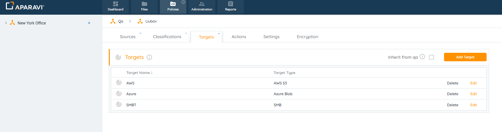
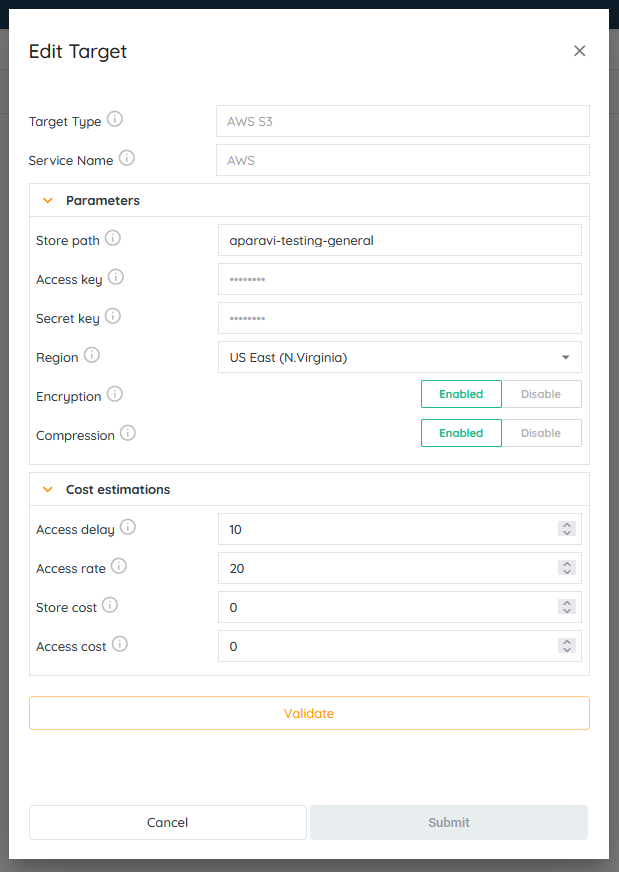
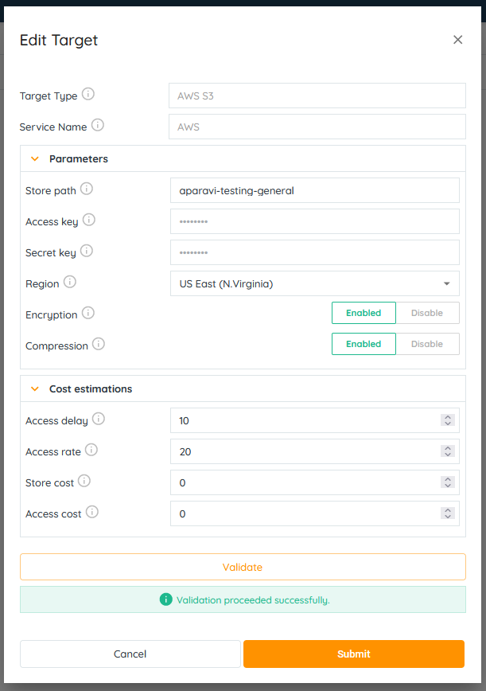
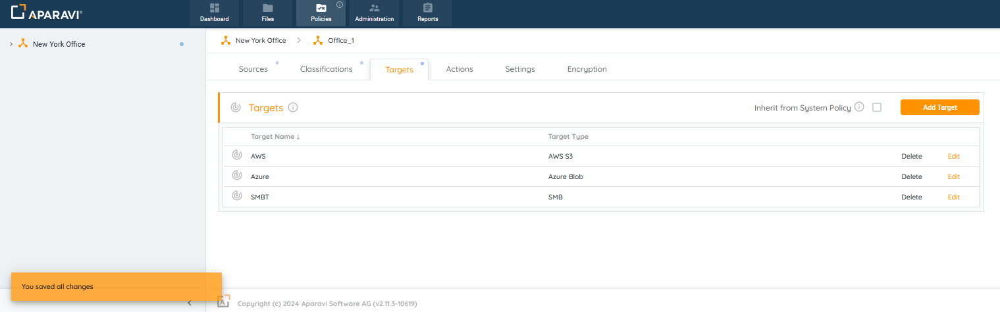
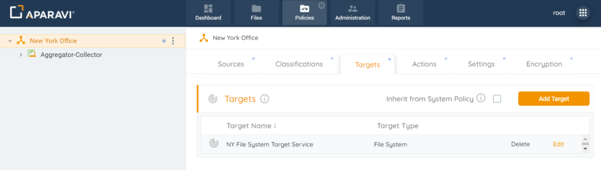
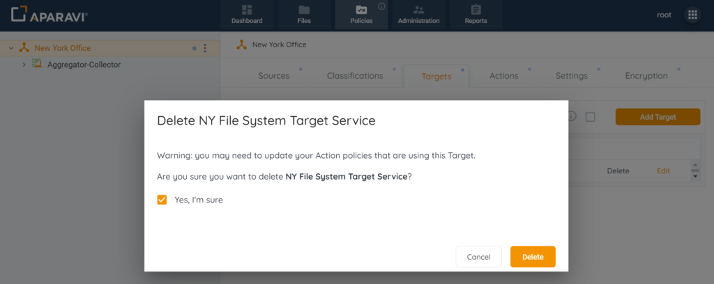
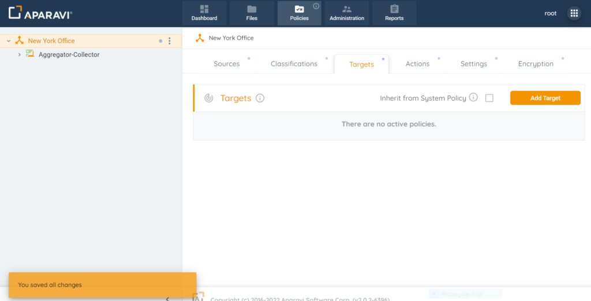

## Edit

1. Click on the Policies tab, located in the top navigation menu.
2. Click on the Targets subtab.

3. Click on the Edit button, located next to the Target Service. Once this button is clicked, the Edit Target pop-up box will appear.
4. Inside of the Edit Target pop-up box, alter the settings.

5. Once all required fields have been completed, click on the Validate button.

6. Once the system has completed validation with the target service, click on the OK button located inside the Edit Target pop-up box.

> If the OK button is inactive, this is due to the failure of the credentials and the fields should be checked for errors.

7. Click on the Save All Changes button.
8. Click on the OK button, located inside the Save Changes pop-up box.
9. Once the target service has been saved, it will appear under the Targets section.

> If any actions have been configured, the Target service will need to be updated for all actions containing this Target service.

## Delete

1. Click on the Policies tab, located in the top navigation menu.
2. Click on the Targets subtab.

3. Click on the Delete button, located next to the target service. Once this button is clicked, the target will disappear from the Targets section.

4. A pop-up box will appear with a warning that if any actions are configured, they need to be reconfigured once the Target service is deleted. Click on the \[Yes I’m Sure\] checkbox and then click the delete button.

5. Click the Save All Changes button.
6. Click on the OK button, located inside the Save Changes pop-up box.

From now on, the system will no longer perform the actions configured to the Target service that was deleted.

