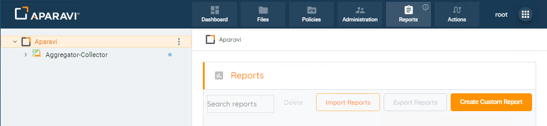
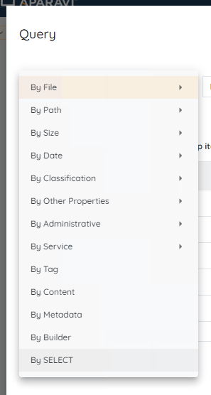
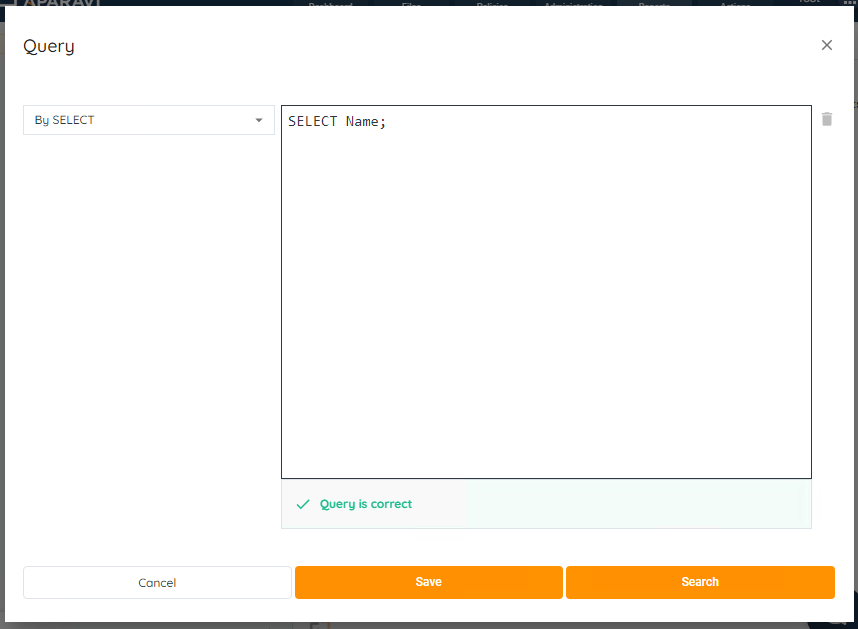
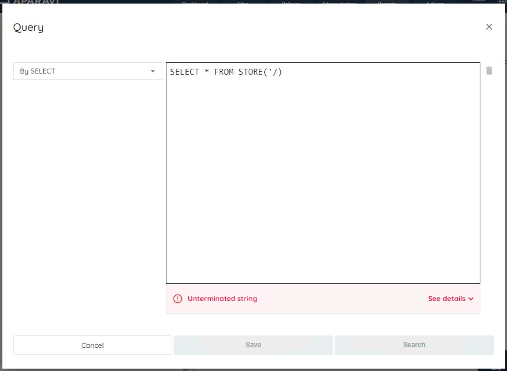

Aparavi Querying Language (AQL) is a SQL-92 compliant language that uses Node.js with SQL Common Table Expressions (CTEs) to provide a scalable way to query against your data no matter where it is. Node.js is used to build and pass queries between aggregators, while SQL CTE’s provide the ability to query across multiple tables and their columns. All of this is done behind the scenes while querying, similar to many popular SQL languages.

## Getting Started

1. Goto the **Reports** module
2. Click **Create Custom Report**
    
    
3. In the first drop down, (default value is **By File**) choose **By SELECT**

1. Type your new query

- When the query is parsed, it will either return "Query is correct" or an error. If you receive an error, you'll need to resolve the error before running the query. An attempt will be made at describing the found error and solution.

- 
    
- Click **Search** to run the report or **Save** to save and give the report a name.

## Compatibility

AQL shares most of its grammar and syntax with ANSI SQL-92. However, due to the distributed nature of Aparavi and the aggregators, JOINS and SUBQUERIES are not allowed.

### DATA TYPES

AQL supports four data types.

- NUMBER - Integer and Decimal
- DATE - This is a DateTime structure
- STRING - Text or Character of any length
- OBJECT

Expressions may operate differently based on the data type of the columns.

- 3 < 20 is a NUMERIC comparison and TRUE
- '3' < '20' is a STRING comparison and is FALSE
- 3 < '20' will dynamically convert to 3 < 20
    - If two types are different, the second term will dynamically convert to the first

Functions may also convert data types.

- DATE('2024-12-31 11:50:23') will convert a STRING to a DATE
