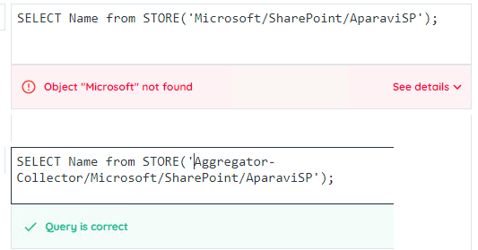

The AQL `SELECT` statement is used to query your Aparavi data. The data returned is a combination of the independent aggregator's files. The system runs your query against each aggregator, collects the results, and then returns a combined result.

```
SELECT column_list
  [FROM table]
  [WHERE criteria]
  [WHICH criteria]
  [HAVING criteria]
  [GROUP BY column_list]
  [ORDER BY column_list]
  [LIMIT count]
  [OFFSET count]

```

## SELECT

The `SELECT` clause defines which columns you want to pull from the Aparavi system.

```
SELECT column[,column]

```

To give a column header a more user-friendly name, you can use an `AS` alias

```
SELECT column AS name[,column AS name]

```

To select all columns rather than specific columns, you can use the asterisk.

```
SELECT *

```

**DISTINCT**

The `DISTINCT` keyword is a modifier to the `SELECT` statement. When used, only unique rows will be returned.

```
SELECT DISTINCT column,column

```

### Example

`SELECT name AS File_Name,classification AS Classification_Name`

This statement will return

- **The "name" and "classification" Aparavi columns**
- **The column headers will be "File\_Name" and "Classification\_Name"**

## FROM

- Unlike most SQL implementations, AQL does not require a `FROM` clause. When an AQL query is run, the `SELECT` statement is run against all data below it in the tree. If you run it against the Aparavi root, all data will be included, whereas if you run it against a single aggregator, only data within that agregator's system will be included. You can use the `STORE` function to explicitly define where the data source.

To query data from the current node, no `FROM` clause is required.

```
SELECT column

```

It can be used for readability using the `STORE` function without any parameters. The code below is equivalent to the one above.

```
SELECT column
  FROM STORE

```

### STORE

The `STORE` function is used to define what Aparavi Node should be the parent node for included data.

```
STORE [(Aparavi_Node)]

```

The `STORE` function takes a _STRING_ parameter which defines what node in the Aparavi System tree should be included in the resulting data set. All data below that node will be included.

```
SELECT column
  FROM STORE('Node/Path/To/Directory')

```

- When entering the Aparavi\_Node parameter, make sure you use the _forward slash_ ( / ) vs the _backslash_ ( \\ ).
- The path names are not case sensitive - `Node/Path/To/Directory` is the same as `node/path/TO/DiReCtOrY`
- If the path you enter is invalid, the AQL parser will give you an error.



### Example

`SELECT name AS File_Name,classification AS Classification_Name`

`FROM STORE('Aggregator-Collector/Microsoft/SharePoint/AparaviSP')`

This statement will return

- The "name" and "classification" Aparavi columns
- **From the AparaviSP node**
- The column headers will be "File\_Name" and "Classification\_Name"

## WHERE

The `WHERE` clause is used to filter the returned rows to only rows where specific conditions are met.

```
SELECT column_name
  WHERE [condition]

```

Multiple conditions can be combined following standard logic constructions and operators.

```
SELECT column_name
  WHERE 
    (column1=true AND
    column2=true) OR
    (column3=true)

```

### SQL OPERATORS

**Arithmetic**

  
| + | Add | 3+2 \[=5\] |
| --- | --- | --- |
| \- | Subtract | 7-5 \[=2\] |
| \* | Multiply | 2\*10 \[=20\] |
| / | Divide | 12/3 \[=4\] |
| % | Modulo | 5%2 \[=1\] |

**Comparison**

  
| = | Equal to | 10=10 |
| --- | --- | --- |
| > | Greater than | 10>5 |
| &lt; | Less than | 5&lt;10 |
| >= | Greater than or equal to | 10>=10, 10>=5 |
| &lt;= | Less than or equal to | 5&lt;=5, 5&lt;=10 |
| &lt;> | Not equal to | 5&lt;>10 |

**Logical**

  
| AND | TRUE if all the conditions separated by AND is TRUE | roses=red AND violets=blue |
| --- | --- | --- |
| BETWEEN | TRUE if the operand is within the range of comparisons | 5 BETWEEN 1 AND 10 |
| IN | TRUE if the operand is equal to one of a list of expressions | red IN (red, yellow, blue) |
| LIKE | TRUE if the operand matches a pattern  % = 0 to multiple characters, \_ = single character | red LIKE 'r%d' \[rd, red, road\]  red LIKE 'r\_d' \[red, rid\] |
| NOT | Displays a record if the condition(s) is NOT TRUE | NOT roses=blue |
| OR | TRUE if any of the conditions separated by OR is TRUE | roses=red OR roses=yellow |
| ( ) | Controls order of operations and AND/OR combinations | roses=red OR (roses=yellow and state=Texas) |

### Example

`SELECT name AS File_Name,classification AS Classification_Name`

`FROM STORE('Aggregator-Collector/Microsoft/SharePoint/AparaviSP')`

`WHERE name LIKE '%project%' OR name LIKE '%.mpp' OR name LIKE '%.mpt'`

This statement will return

- The "name" and "classification" Aparavi columns
- From the AparaviSP node
- The column headers will be "File\_Name" and "Classification\_Name"
- **For Microsoft Project Files or other files with project in the name**

## WHICH CONTAIN

`WHICH CONTAIN` is a special AQL clause that queries the Aparavi Word Database. This combines the Aparavi File data with the Word Database to provide context filters against the data. This clause is frequently modified with the modifiers listed below.

- Unlike the `WHERE` clause, `WHICH CONTAIN` clause filters operate against the entire record. Instead of `column_name=criteria` it is `record has criteria`
- `WHICH CONTAIN` and `WHICH CONTAINS` can be used interchangeably.
- `CONTAINING` can also be used in the same way, however the `WHICH` clause keyword is unneeded.
- Punctuation is ignored in the word database.

```
SELECT column_name
  WHICH CONTAIN word

```

is the same as

```
SELECT column_name
  WHICH CONTAINS word

```

is the same as

```
SELECT column_name
  CONTAINING word

```

- `WHICH CONTAIN 'IP'`
- `WHICH CONTAINS 'IP'`
- `CONTAINING 'IP'`

### NEAR

The `NEAR` keyword modifies the `WHICH CONTAIN` clause. When the `WHICH CONTAIN` clause identifies a word, `NEAR` adds to it by searching for additional words near the first identified word.

```
SELECT column_name
  WHICH CONTAIN word AND NEAR another

```

It also works with multiple values when surrounded by parentheses and separated by commas.

```
SELECT column_name
  WHICH CONTAIN word AND NEAR (another,different,word)

```

- `WHICH CONTAIN 'IP' AND NEAR 'server'`
- `WHICH CONTAIN 'IP' AND NEAR ('server','network')`

### SYNONYM

The `SYNONYM` keyword modifies the `WHICH CONTAIN` clause. `SYNONYM` looks for all words that are synonyms to word.

AQL uses the Merriam-Webster dictionary to identify synonyms.

```
SELECT column_name
  WHICH CONTAIN SYNONYM (word)

```

- `WHICH CONTAIN SYNONYM ('doctor')`

### STEM

The `STEM` keyword modifies the `WHICH CONTAIN` clause. `STEM` looks for all words that are share the root to the given word.

AQL uses the Merriam-Webster dictionary to identify stems.

```
SELECT column_name
  WHICH CONTAIN STEM(word)

```

- `WHICH CONTAIN STEM ('drive')`

### PHRASE

The `PHRASE` keyword modifies the `WHICH CONTAIN` clause. `PHRASE` looks for a full phrase instead of single words.

```
SELECT column_name
  WHICH CONTAIN PHRASE(phrase)

```

- `WHICH CONTAIN PHRASE ('roses are red')`

**OPERATORS**

  
| ALL | TRUE if all of the evaluations meet the condition |
| --- | --- |
| ANY | TRUE if any of the evaluations meet the condition |
| NONE | TRUE if none of the evaluations meet the condition |

### Example

`SELECT name AS File_Name,classification AS Classification_Name`

`FROM STORE('Aggregator-Collector/Microsoft/SharePoint/AparaviSP')`

`WHERE name LIKE '%project%' OR name LIKE '%.mpp' OR name LIKE '%.mpt'`

`WHICH CONTAIN ALL SYNONYM ('start') NEAR ('date')`

This statement will return

- The "name" and "classification" Aparavi columns
- From the AparaviSP node
- The column headers will be "File\_Name" and "Classification\_Name"
- For Microsoft Project Files or other files with project in the name
- **Which discuss a starting or beginning date**

## GROUP BY

The `GROUP BY` clause groups rows that have the same values into summary rows.

- Any column in the `SELECT` clause must be an _AGGREGATE FUNCTION_ or included in the `GROUP BY` clause.
- If the `GROUP BY` clause is omitted but _AGGREGATE FUNCTIONs_ are included, the aggregates will be for the entire result set vs just by group.

**COUNT**

The `COUNT` function returns the number of rows returned in the _GROUP_.

`SELECT COUNT (column_name1),column_name2`

`GROUP BY column_name2`

Will return the `COUNT` of rows for each column\_name2

If the `GROUP BY` is omitted

`SELECT COUNT (column_name1)`

Will return the total `COUNT` of rows

If the modifier `DISTINCT` is included

`SELECT DISTINCT COUNT (column_name1)`

Will return the unique column\_name1 values across all the rows

**SUM**

The `SUM` function returns the sum of a numeric column in the _GROUP_.

`SELECT SUM (numeric_column) AS name, column_name`

`GROUP BY column_name`

Will return the sum of numeric\_column for each column\_name

**AVG**

The `AVG` function returns the average (mean) of a numeric column in the _GROUP_.

`SELECT AVG (numeric_column) AS name, column_name`

`GROUP BY column_name`

Will return the mean of numeric\_column for each column\_name

**MIN**

The `MIN` function returns the minimum value of a column in the _GROUP_.

`SELECT MIN (numeric_column) AS name, column_name`

`GROUP BY column_name`

Will return the minimum of numeric\_column for each column\_name

**MAX**

The `MAX` function returns the maximum of a column in the _GROUP_.

`SELECT MAX (column_name1) AS name`

Will return the maximum of column\_name1

### Example

`SELECT COUNT(classification) as Classification_Count,classification AS Classification_Name`

`FROM STORE('Aggregator-Collector/Microsoft/SharePoint/AparaviSP')`

`WHERE name LIKE '%project%' OR name LIKE '%.mpp' OR name LIKE '%.mpt'`

`WHICH CONTAIN ALL SYNONYM ('start') NEAR ('date')`

`GROUP BY classification`

This statement will return

- The "classification" Aparavi column
- **And the count of records by each "classification"**
- From the AparaviSP node
- The column headers will be "Classification\_Count" and "Classification\_Name"
- For Microsoft Project Files or other files with project in the name
- Which discuss a starting or beginning date

## HAVING

The `HAVING` clause is used to filter the returned summaries to only summaries where specific conditions are met. This is in contrast to the `WHERE` clause which looks at the detail rows, `HAVING` is looking only at the _AGGREGATE FUNCTION_ type columns. It relies on the _ALIAS_ of the column.

```
SELECT AGG_FUNCTION(column_name1) AS alias,column_name2
  GROUP BY column_name2
  HAVING alias>35

```

### Example

`SELECT COUNT(classification) as Classification_Count,classification AS Classification_Name`

`FROM STORE('Aggregator-Collector/Microsoft/SharePoint/AparaviSP')`

`WHERE name LIKE '%project%' OR name LIKE '%.mpp' OR name LIKE '%.mpt'`

`WHICH CONTAIN ALL SYNONYM ('start') NEAR ('date')`

`GROUP BY classification`

`HAVING Classification_Count>=100`

This statement will return

- The "classification" Aparavi column
- And the count of records by each "classification"
- From the AparaviSP node
- The column headers will be "Classification\_Count" and "Classification\_Name"
- For Microsoft Project Files or other files with project in the name
- Which discuss a starting or beginning date
- **And the count of each "classification" is at least 100**

## ORDER BY

The `ORDER BY` clause is used to sort the results in ascending (`ASC`  ) or descending (`DESC`  ) order. This is generally a presentation preference vs altering the result set itself.

- When not specified, ascending (`ASC`  ) is implied.

```
SELECT column[,column]
  ORDER BY column[order_direction]

```

### Example

`SELECT COUNT(classification) as Classification_Count,classification AS Classification_Name`

`FROM STORE('Aggregator-Collector/Microsoft/SharePoint/AparaviSP')`

`WHERE name LIKE '%project%' OR name LIKE '%.mpp' OR name LIKE '%.mpt'`

`WHICH CONTAIN ALL SYNONYM ('start') NEAR ('date')`

`GROUP BY classification`

`HAVING COUNT(classification)>=100`

`ORDER BY COUNT(classification) DESC`

This statement will return

- The "classification" Aparavi column
- And the count of records by each "classification"
- From the AparaviSP node
- The column headers will be "Classification\_Count" and "Classification\_Name"
- For Microsoft Project Files or other files with project in the name
- Which discuss a starting or beginning date
- And the count of each "classification" is at least 100
- **The full result set will be sorted by the count of each "classification" in descending order**

## LIMIT

The `LIMIT` clause is used to specify the maximum number of records to return.

- When used with `ORDER BY` , the sort order will be applied first.

```
SELECT column[,column]
  LIMIT [row_count]

```

or with the ORDER BY clause

```
SELECT column[,column]
  ORDER BY column[order_direction]
  LIMIT [row_count]

```

### Example

`SELECT COUNT(classification) as Classification_Count,classification AS Classification_Name`

`FROM STORE('Aggregator-Collector/Microsoft/SharePoint/AparaviSP')`

`WHERE name LIKE '%project%' OR name LIKE '%.mpp' OR name LIKE '%.mpt'`

`WHICH CONTAIN ALL SYNONYM ('start') NEAR ('date')`

`GROUP BY classification`

`HAVING COUNT(classification)>=100`

`ORDER BY COUNT(classification) DESC`

`LIMIT 500`

This statement will return

- The "classification" Aparavi column
- And the count of records by each "classification"
- From the AparaviSP node
- The column headers will be "Classification\_Count" and "Classification\_Name"
- For Microsoft Project Files or other files with project in the name
- Which discuss a starting or beginning date
- And the count of each "classification" is at least 100
- The full result set will be sorted by the count of each "classification" in descending order
- The sorted set will then return only the first 500 records

## OFFSET

The `OFFSET` clause is used to start the record return after so many records. This allows you to get a middle block of records.

- When used with `ORDER BY` , the sort order will be applied first.

```
SELECT column[,column]
  OFFSET [row_count]

```

or with the ORDER BY clause

```
SELECT column[,column]
  ORDER BY column[order_direction]
  OFFSET [row_count]

```

### Example

`SELECT COUNT(classification) as Classification_Count,classification AS Classification_Name`

`FROM STORE('Aggregator-Collector/Microsoft/SharePoint/AparaviSP')`

`WHERE name LIKE '%project%' OR name LIKE '%.mpp' OR name LIKE '%.mpt'`

`WHICH CONTAIN ALL SYNONYM ('start') NEAR ('date')`

`GROUP BY classification`

`HAVING COUNT(classification)>=100`

`ORDER BY COUNT(classification) DESC`

`LIMIT 500`

`OFFSET 500`

This statement will return

- The "classification" Aparavi column
- And the count of records by each "classification"
- From the AparaviSP node
- The column headers will be "Classification\_Count" and "Classification\_Name"
- For Microsoft Project Files or other files with project in the name
- Which discuss a starting or beginning date
- And the count of each "classification" is at least 100
- The full result set will be sorted by the count of each "classification" in descending order
- The sorted set will then return 500 records
- **Starting at record 501 (ie record 501 to 1000)**
