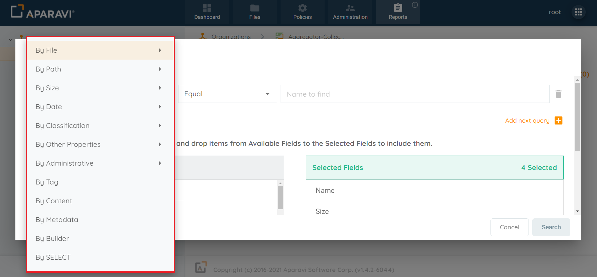
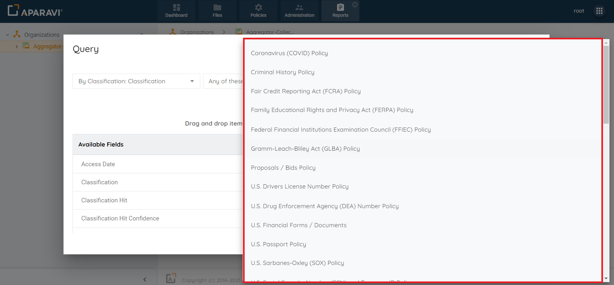
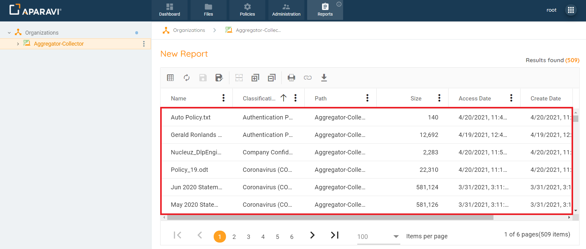
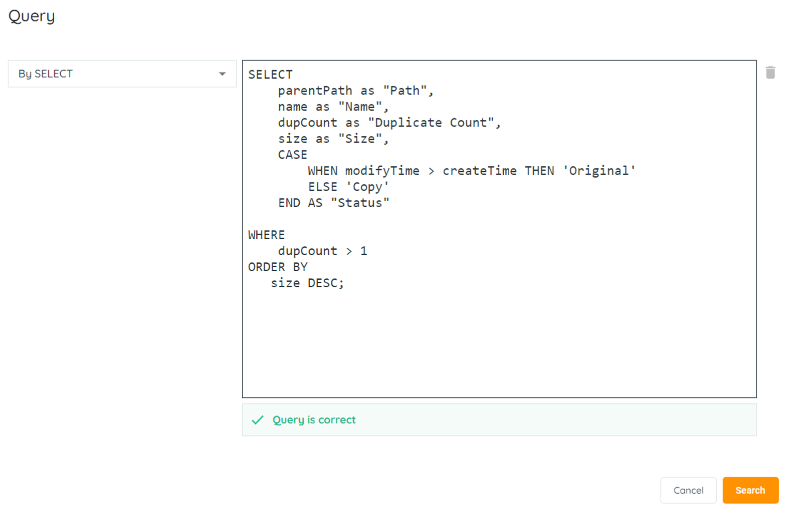
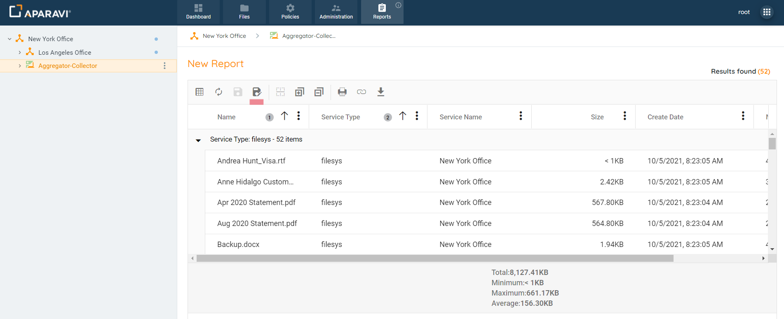
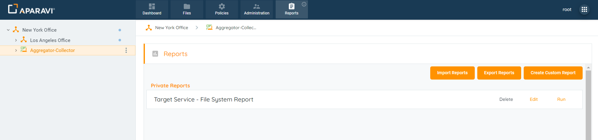

Custom reports help users find all about their unstructured data tailored to their needs. This feature could be customized using the elaborative search criteria across the entire system or a specific folder, depending on the selected node or folder. Saving the query as a report enables quick reporting without repeating the steps. Saved reports can show real-time results, be exported to PDF or Excel, or shared with other APARAVI users within the system.

1. Select the appropriate client or Node to execute the query on, by clicking on it in the navigation tree, located on the left-hand side.
2. Click on the Reports tab.
3. Click on the Create Custom Report. Once clicked, the Query pop-up box will appear.
4. Once the Query pop-up box appears, click on the first search filter drop-down field and then click on one of the search options listed. Once the search filter is selected, the menu will disappear and the selection will appear inside the field.

> _All filters that contain a side arrow icon, directly to the right of the filter’s name, indicates there are more options to choose from within that filter subject._

5. Click on the third field and enter the search criteria. This field will vary, depending on the selections of the first two drop-down fields. Once the information is entered or selected, it will appear inside of the field.

6. Once the query search criteria have been selected, begin adding or removing fields that should display along with the query results.
7. Click the Search button.
8. The results should now be available based on the query prepared.

9. If you would like to save the report, please follow the instructions in the link [https://secure.helpscout.net/docs/64b0120a114ed272f0d4712a/article/64c002d02af2e15078a7f3eb/](https://aparavi-software.helpscoutdocs.com/article/66-saving-a-custom-report)

## AQL Reports

AQL stands for APARAVI Query Language and using our pre-defined set of Reports, it is possible to get the results even faster. You can create reports with different search fields. These pre-set list of reports or elaborative list of search criteria's help you narrow down your search to understand the data better. The results of the reports could be saved as Excel or PDF files for easy use.

1\. On an existing report, click the Edit button to view the AQL select statement.

3. A new window will appear with the AQL select query. Within this query window, you are able to edit or add details to the AQL query to suit your search criteria.

When the Query is defined correctly, you will be notified if the query is correct or has a syntax error.

## Saving

Once a query has been completed, it can be reproduced without having to repeat the process of performing the same steps each time. After a report has been saved, simply click on the run button and the query results can be searched for automatically, applying the same filters and alterations of columns.

1. Once the query results are displaying, click on the Save As button, located in the reports toolbar. The Save As option will be shown as a floppy disk icon. Once this button is clicked, the system will display the Save As pop-up box.

2. Inside of the Save As pop-up box, click the textbox next to the label “Name” enter the name the report should be saved as.
3. Inside the Save As pop-up box, choose whether the report will be a Private report or Public report.

- **Private reports:** can only be viewed by the account under which it was created, no other Aparavi users will be able to view this report.
- **Public reports:** can be viewed by all Aparavi users within the same organisation, enabling quick results to be shared.

4. Once all selections have been entered into the Save As pop-up box, click the OK button.
5. Once the report has been successfully saved, the system will display an alert, located in the bottom left-hand side of the screen.
6. To view the saved report, click on the Reports tab, located in the top navigation menu.
7. Once on the Reports tab, the saved report will appear under either the Private reports section, or Public reports section, depending on which option was selected.

8. Once the report has been run, the results are displayed in the window below the toolbar.
