After preparing a query, easily tailor your report by adding or removing fields to display data customized to customer needs.

## **Fields**

1. Click on the field name from the list of Available Fields section.
2. Once selected, drag the selected field from the Available Fields section, into the Selected Fields section.

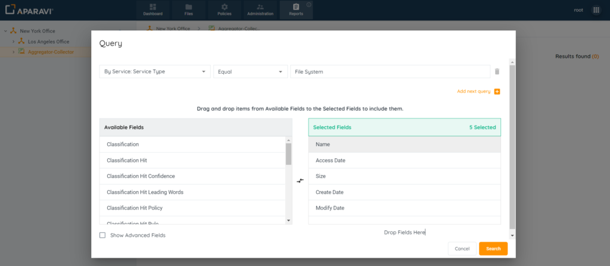

## **Remove fields**

1. Click on the field name from the list of Selected Fields section.
2. Once selected, drag the selected field from the Selected Fields section, into the Available Fields section.

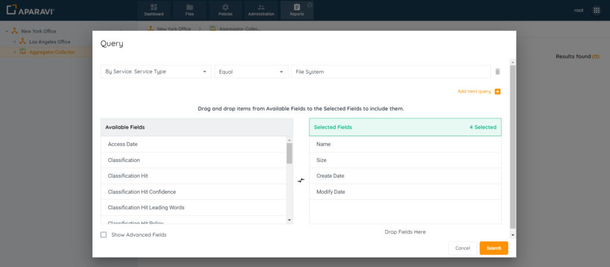

## Sorting

All fields regardless if they are alphabetic or numerical, offers the ability to sort the fields in ascending or descending order.

1. Navigate to the Reports tab.
2. Create a report with the desired search criteria. When the report has been created it will forward you to the report page.
3. Click the three dots on the column you want to format to see the formatting styles.
4. Select Sort Ascending option.

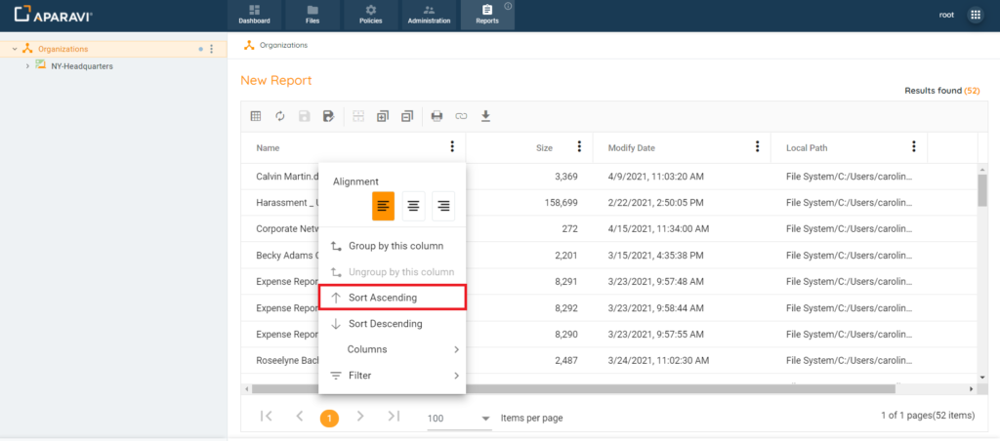

5. The text of the entries inside the column is sorted in ascending order.

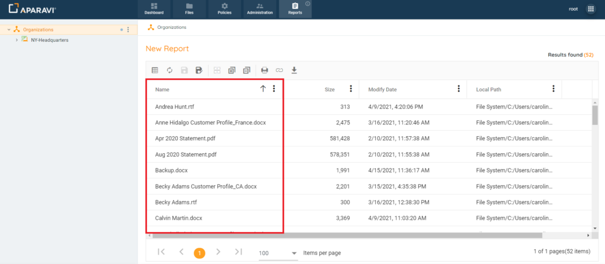

## Grouping

Grouped query results can be expanded or collapsed by clicking the arrow next to the selected field. Easily ungroup and revert to the original state through the menu.

1. Navigate to the Reports tab.
2. Create a report with the desired search criteria. When the report has been created it will forward you to the report page.
3. Click the three dots on the column you want to format to see the formatting styles.
4. Select Group by this Column option.

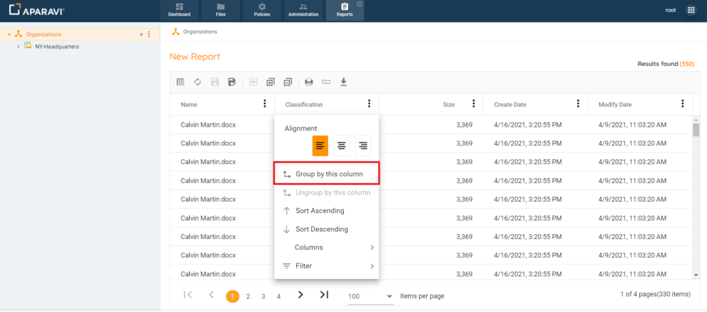

5. As a result of grouping, files are displayed in a group according to the selected criteria.

<figure>

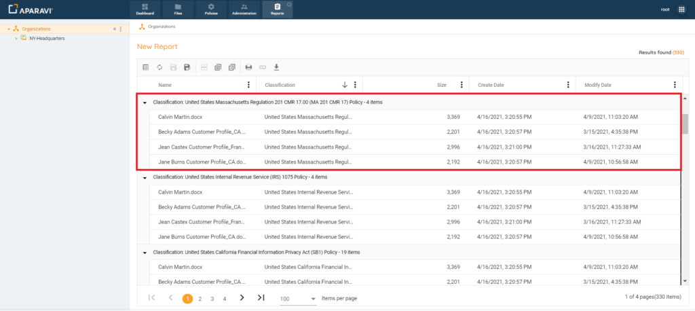

</figure>

## **Show Advanced Fields**

In addition to the fields that appear within the two sections, there is a checkbox located in the bottom left-hand side of the pop-up box, beside the label “Show Advanced Fields” that when clicked on, offers many more data fields.

To add or remove these fields, follow the same steps as above.
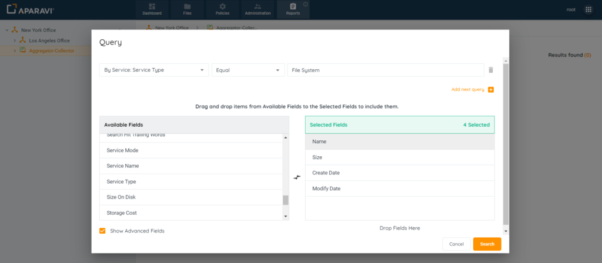

## Interactive

Modify displayed columns by unchecking the corresponding checkbox in the fields menu. Easily restore columns by checking the checkbox again.

1. Navigate to the Reports tab.
2. Create a report with the desired search criteria. When the report has been created it will forward you to the report page.
3. Click the three dots on the column you want to format to see the formatting styles.
4. Select Columns option.

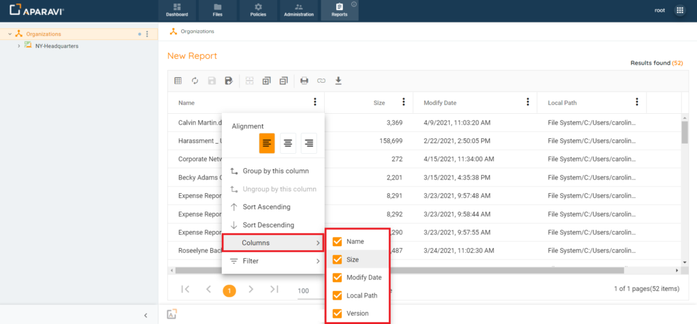

5. Uncheck Size column. The column will be automatically hidden.

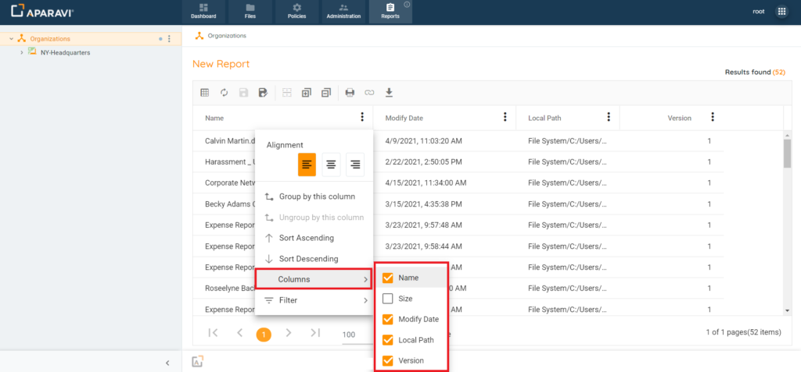

## Alignment

This function allows the user to change the position of the text within the column. It can be aligned left, center or right, depending on which option is selected.

1. Navigate to the Reports tab.
2. Create a report with the desired search criteria. When the report has been created it will forward you to the report page.

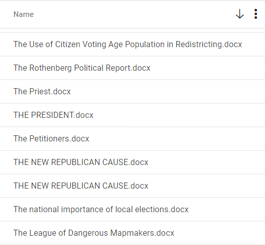

3. Click the three dots on the column you want to format to see the formatting styles.

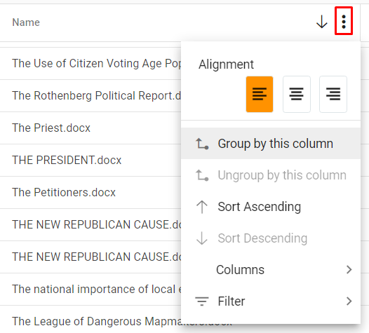

4. Select "Center". Column text will be centered.

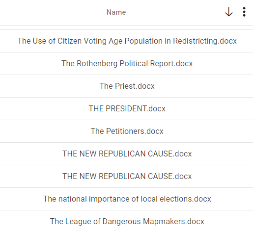

## Filters

Depending on the type of field selected, the field menu offers filter operators to further narrow the query results.

1. Navigate to the Reports tab.
2. Create a report with the desired search criteria. When the report has been created it will forward you to the report page.
3. Click the three dots on the column you want to filter to see the filtering options.
4. Select Filter option.

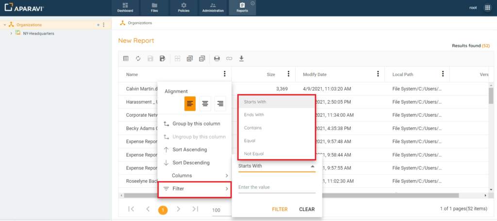

5. Change "Starts With" to "Contains" and add the search criteria, e.g. "Expense".

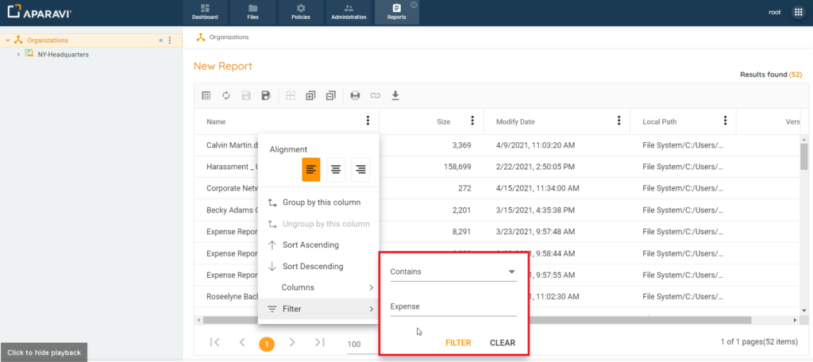

6. Click FILTER button. The column will be filtered by the specified criteria.

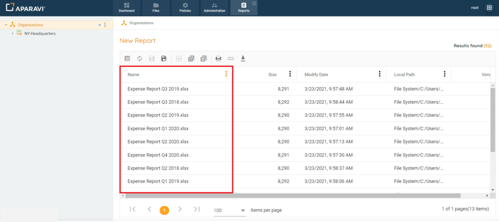

## Aggregations

This function allows the user to apply aggregations to numeric value fields:

- - **SUM:** Displays the total amount of all the files for the query.
    - **MIN**: Displays the smallest size from the field of the query.
    - **MAX:** Displays the largest size from the field of the query.
    - **AVG:** Displays the average numerical value from the field of the query.

1. Navigate to the Reports tab.
2. Create a report with the desired search criteria. When the report has been created it will forward you to the report page.
3. Click the three dots on the column you want to format to see the formatting styles.

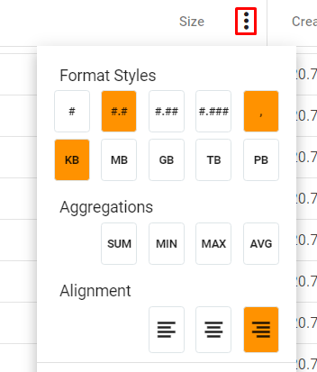

4. Select all the Aggregations: SUM, MIN, MAX, AVG. Information on all selected aggregation functions will be displayed below the report.

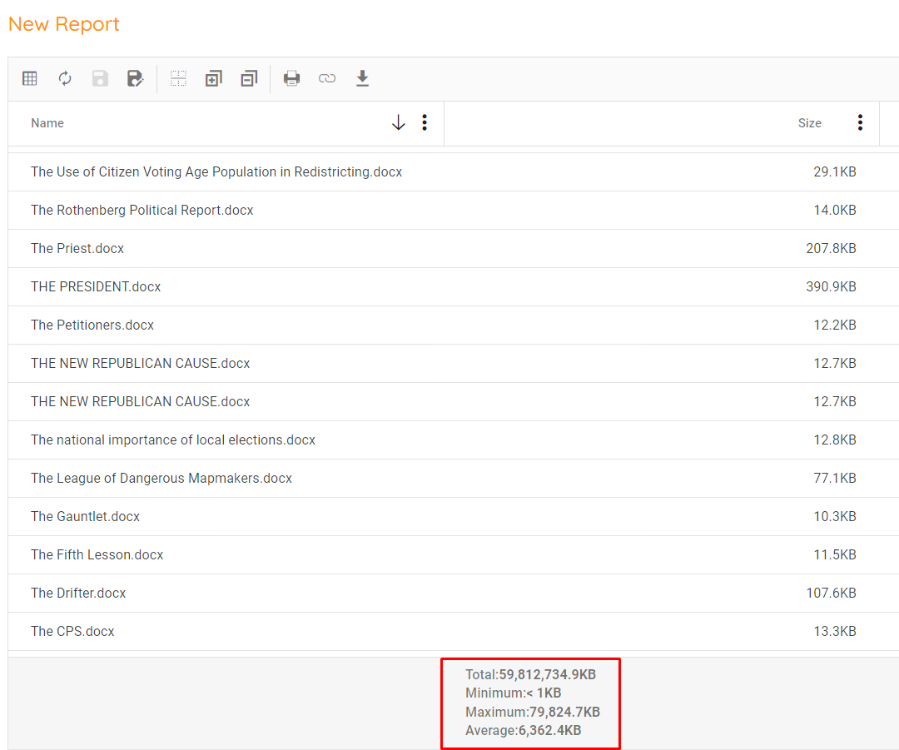
