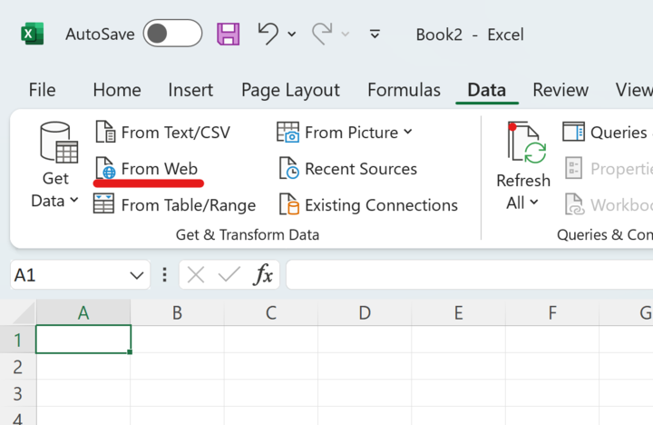
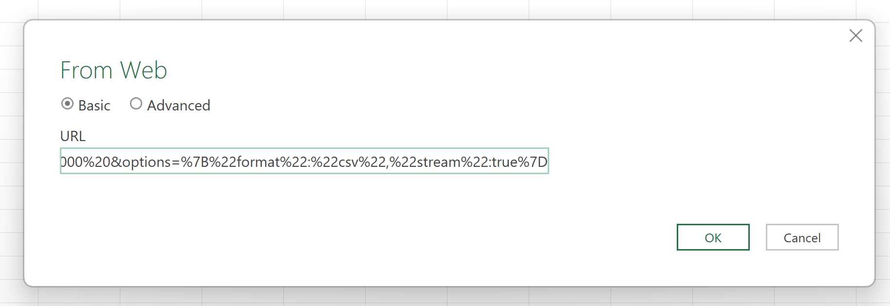
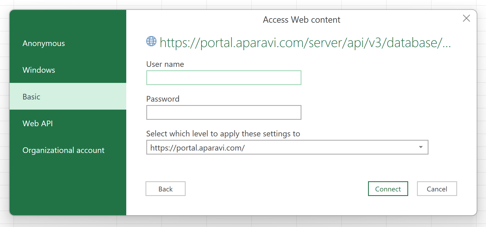
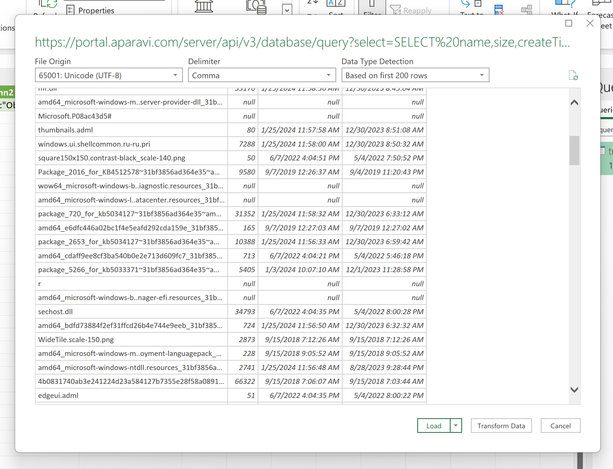
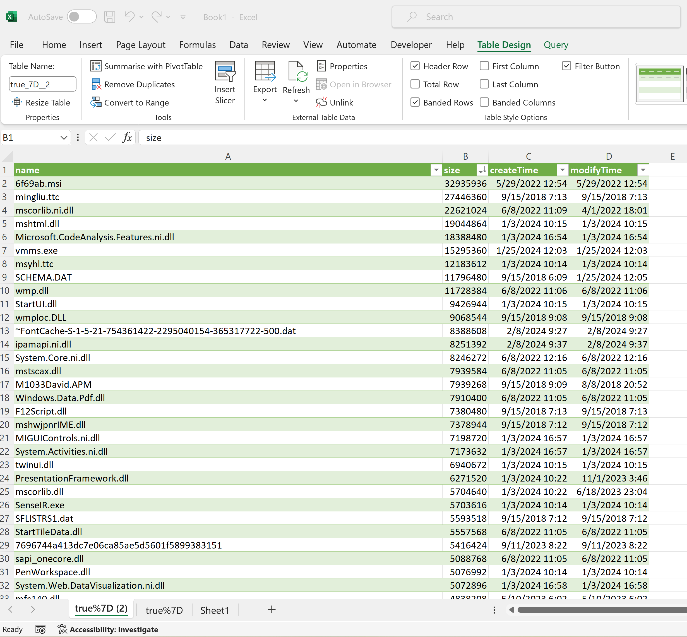

1. First we need to obtain a link. How to obtain the link using Get Link to Results is described here:

- - [Reports - Report Output](https://aparavi-software.helpscoutdocs.com/article/67-printing-a-report)

2. Open Microsoft Excel on the local host machine and click on the Data navigation tab. Once there, click on the From Web button, located in the upper left-hand side of the Excel spreadsheet toolbar.

3. Insert the URL in the From Web window, URL field. The Basic option is selected by default. Click OK.

4. The Access Web Content window appears. Select Basic option and enter your username and password.

5. Once the changes have been saved, Microsoft Excel will produce another pop-up box, displaying all the query data that was converted to the generated link. Click the Load button located at the bottom of the pop-up box.

6. Once the Load button has been clicked, Microsoft Excel will automatically populate all data from the query into the Excel spreadsheet. From here the file can be saved, customized, shared with others and accessed at any given time.

> If new files meet the criteria of the custom report stored in the system, the spreadsheet is automatically updated to include the newly scanned files by clicking the Refresh All button on the Data navigation tab.

