## Open a Report

1. Open the Reports Module

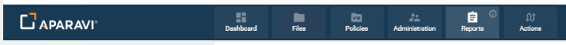

2. You'll be brought to your reports list

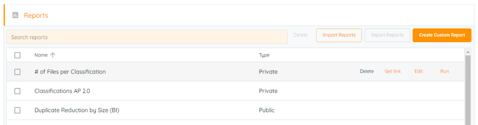

2. The Search Reports bar will allow you to filter your reports list by name
3. When hovering over a report, you'll have four options. **DELETE**, **GET LINK**, **EDIT**, and **RUN**

## Run a Report

4. Click **RUN** and the **Loading report data...** screen will show

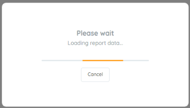

5. Once the report has loaded, you'll be on the report preview screen

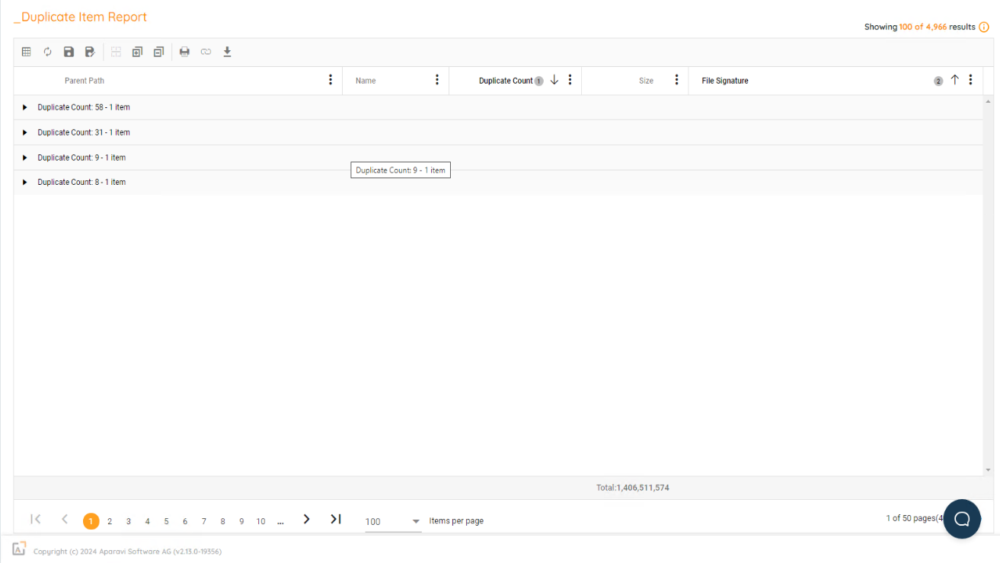

6. Across the top are Actions for the report page

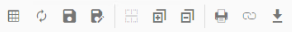

6. - **QUERY** takes you to the create report page to add additional fields or filters
    - **REFRESH** reloads the report applying any changes such as grouping or sorting
    - **SAVE** saves the current report with the current name, overwriting the older version
    - **SAVE AS** saves the current report with a new name
    - **TOGGLE GRIDLINES** rotates through the gridline options (Vertical, Horizontal, Both, None)
    - **EXPAND ALL GROUPED ITEMS** opens all groups to show all detail items within the groups
    - **COLLAPSE ALL GROUPED ITEMS** closes all groups to a summarized level
    - **PRINT** opens the Browser Print dialog with the report
    - **GET LINK TO RESULTS** allows you to get a link to schedule...something
    - **EXPORT RESULTS** gives the option to output the report to PDF or CSV

 

7. The top right corner shows how many total rows and across the bottom of the page are the page change options

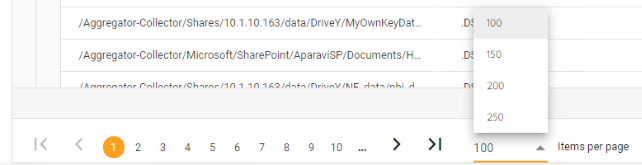

7. - `|<` takes you to the first page
    - `&lt;` takes you to the previous page
    - **#**'s take you to the page specified
    - `>` takes you to the next page
    - `>|` takes you to the last page
    - **Items per page** lets you set the number of rows per page

## Interactive Reporting

1. The report header allows you to interact with the report by clicking on the "Kebab" button ( ⋮ ). Different _DATA TYPES_ have different options

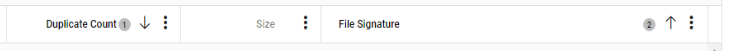

2. - Common Settings
        - **Group by this column** creates an interactive Drill Up/Down summarization on the column. This allows use of the **COLLAPSE** and **EXPAND** buttons
        - **Ungroup by this column** removes the **GROUP**ing on the column
        - **Sort Ascending** orders the column in A..Z/1..9 order
        - **Sort Descending** orders the column in Z..A/9..1 order

When Group by or Sort by options are used, other symbols appear for additional updates

- ❶, ❷, etc show the levels of **GROUP**ing used. Clicking on them will reorder the **GROUP**s
- **↑**, **↓** show the order of the **SORT**. Clicking on them will reverse the **SORT**

2. 1. - **Columns >** turns off the display of included columns

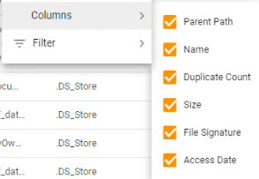

- - - **Filter >** adds or edits a filter on the column

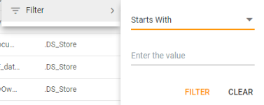

1. - _STRING_
        - **Alignment** sets the alignment for the column (Left, Center, or Right)

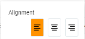

- - b. _NUMBER_
        - Format Styles
            - **#** sets a _NUMBER_ to use no decimal places
            - **#.#** sets a _NUMBER_ to use a single decimal place
            - **#.##** sets a _NUMBER_ to use two decimal places
            - **#.###** sets a _NUMBER_ to use three decimal places
            - **,** sets a _NUMBER_ to use a comma for the thousands place (and beyond)
            - **KB/MB/GB/TB/PB** seta a _NUMBER_ to format as a data size (ex 1000 would show as 1 KB). _NUMBER_s smaller than the threshold are shown as &lt;1KB
        - Aggregations
            - **SUM** sums _NUMBER_ and it shows in the summary of each **GROUP BY** section
            - **MIN** finds the smallest value of the column and it shows in the summary of each **GROUP BY** section
            - **MAX** finds the largest value of the column and it shows in the summary of each **GROUP BY** section
            - **AVG** finds the average (the _MEAN_) value of the column and it shows in the summary of each **GROUP BY** section

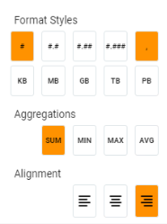

3. - c. _DATETIME_
        - Format Styles
            - **MM/DD/YYYY** will show the _DATETIME_ value in MM/DD/YYYY HH:MM:SS format
            - **YYYY/MM/DD** will show the _DATETIME_ value in YYYY/MM/DD HH:MM:SS format
            - **ISO** will show the _DATETIME_ value in the ISO format (YYYY-MM-DDtHH:MM:SS.NNNz format)
            - **Local** will show the _DATETIME_ value in the local long date format
            - For **MM/DD/YYYY** and **YYYY/MM/DD** formats, an additional option is available to define 12 hour or 24 hour time notation

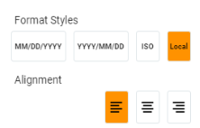

## Export a Report

1. Click the **EXPORT RESULTS** button

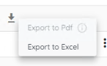

Export to Pdf may be disabled if too many items are returned in the results. If exporting to Pdf is desired in spite of the data volume, PRINT, then choose a PDF printer.

2. Once the Export option is chosen, the file will be downloaded.

## Saving

Once a query has been completed, it can be reproduced without having to repeat the process of performing the same steps each time. After a report has been saved, simply click on the run button and the query results can be searched for automatically, applying the same filters and alterations of columns.

 

1. Once the query results are displaying, click on the Save As button, located in the reports toolbar. The Save As option will be shown as a floppy disk icon. Once this button is clicked, the system will display the Save As pop-up box.

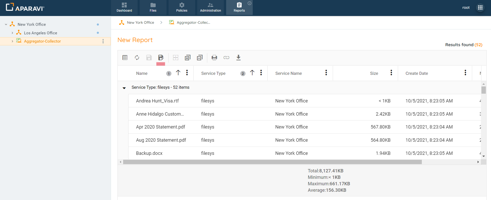

2. Inside of the Save As pop-up box, click the textbox next to the label “Name” enter the name the report should be saved as.
3. Inside the Save As pop-up box, choose whether the report will be a Private report or Public report.

- **Private reports:** can only be viewed by the account under which it was created, no other Aparavi users will be able to view this report.
- **Public reports:** can be viewed by all Aparavi users within the same organisation, enabling quick results to be shared.

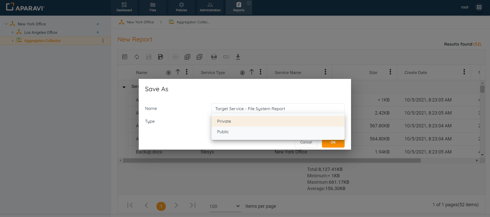

4. Once all selections have been entered into the Save As pop-up box, click the OK button.
5. Once the report has been successfully saved, the system will display an alert, located in the bottom left-hand side of the screen.
6. To view the saved report, click on the Reports tab, located in the top navigation menu.
7. Once on the Reports tab, the saved report will appear under either the Private reports section, or Public reports section, depending on which option was selected.

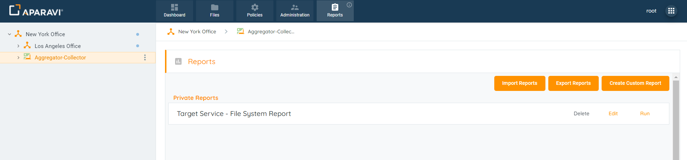

8. Once the report has been run, the results are displayed in the window below the toolbar.
