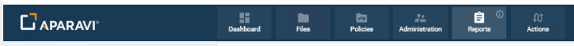
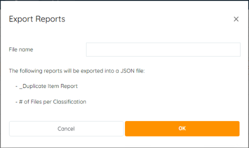
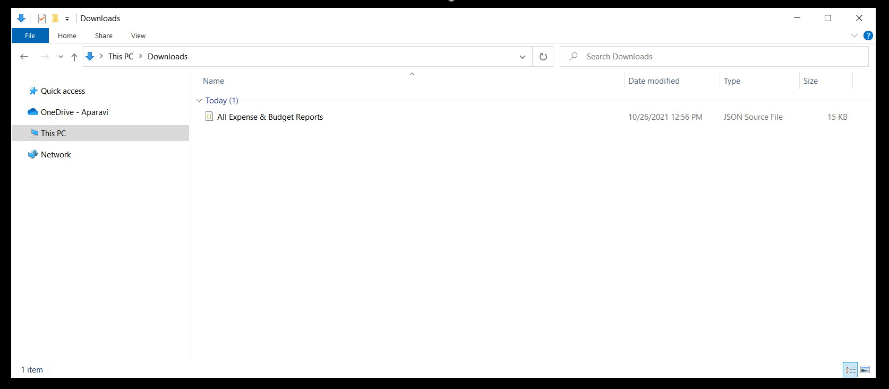
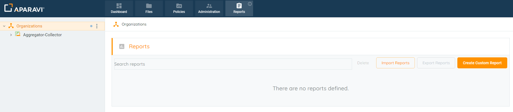
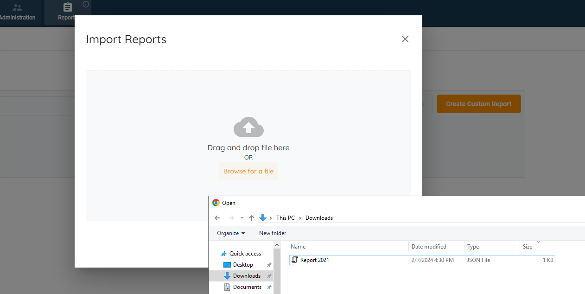
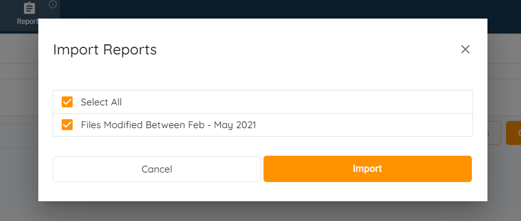
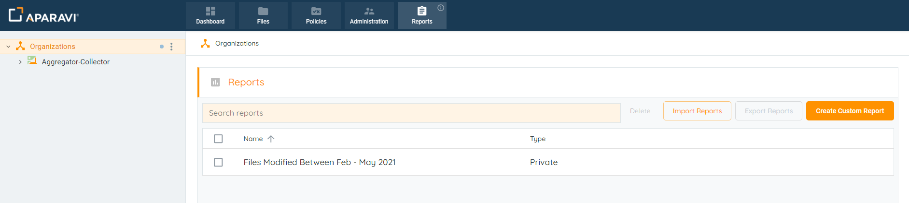

## Export Report Library

1. Open the Reports Module

2. You'll be brought to your reports list

2. Select the reports to export (or the top checkbox to select them all)
3. Click the **EXPORT REPORTS** button
4. You'll then be asked for a name for the export file

5. Once entered, click **OK**
6. Aparavi will generate the file for the selected reports and when complete, it will be in your downloads folder

<figure>

<figcaption>

Exported Reports JSON File

</figcaption>

</figure>

From this point the file can be imported into the system and the same criteria for the reports can be ran without having to complete the process of recreating and saving the reports.

## Import Report Library

In addition to creating custom reports, reports in JSON file format can also be imported into the system. This allows for exporting of reports from one system and importing them into another, without having to repeat the process of recreating and altering previously configured reports. Both public and private reports are able to be imported and either one report or many reports can be imported at the same time.

_**Please Note:**_ _Exporting the reports must be completed prior to importing them._

 

1. Click on the Reports Tab, located in the top navigation menu.
2. Click on the Import Reports button, located in the upper right-hand side.

<figure>

<figcaption>

Import Reports Button

</figcaption>

</figure>

3. Once the button is clicked, the Import Reports pop-up box will appear.
4. Drag & Drop the JSON file into the Import Reports pop-up box or click on Browse for a file button and select the file from the local directory.

<figure>

<figcaption>

Select JSON File for Upload

</figcaption>

</figure>

5. Once the file has been imported, the Import Reports pop-up box will update to offer an entry for the uploaded file with a checkbox located just to the left of the report’s name.
6. Click on the checkbox to select the report, once selected the checkbox will have an orange background with a tick to indicate it is selected.

<figure>

<figcaption>

Import Reports pop-up

</figcaption>

</figure>

7. Once selected, click the Import button.
8. Once the Import button is clicked, the system will upload the JSON file and display the new report automatically on the Reports Tab.

<figure>

<figcaption>

Report Imported Successfully

</figcaption>

</figure>
