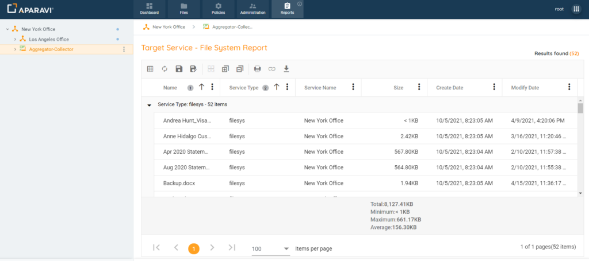
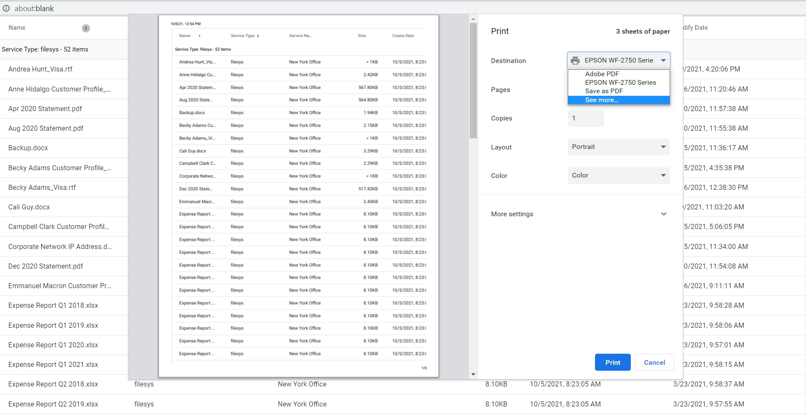
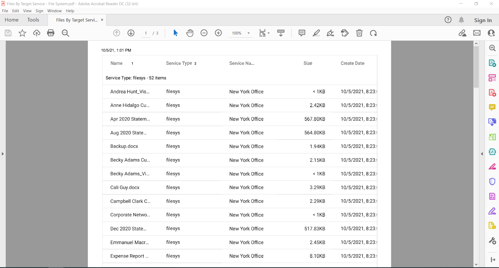
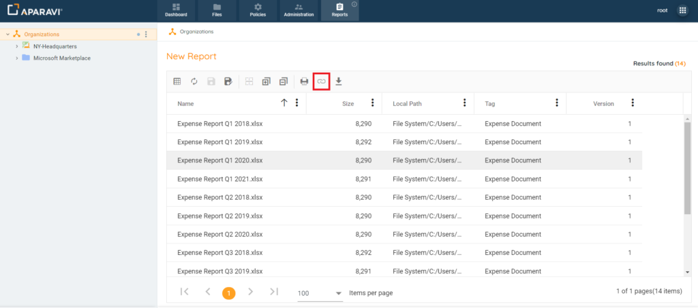
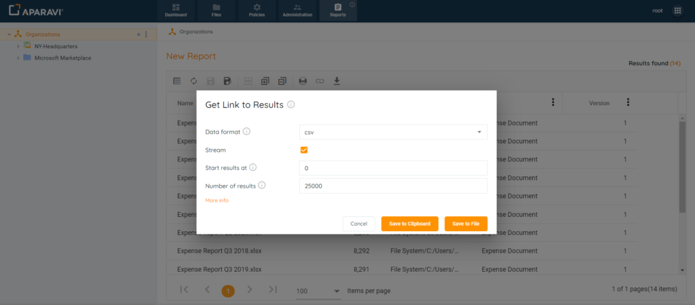

Once a query has been completed, the report can be printed, exported to a PDF, or a link can be created to use the data online or in Excel.

## Print or PDF

1. Create a new query report or run an existing saved report.
2. Immediately above the query results, click on the Print button on the left-hand side of the screen.

3. A pop-up window will appear showing a preview of the report with the print options available for selection.

4. Once all selections have been made, click Print. Once clicked, the report will begin printing to the selected printer.

## Export Link

Generate a link with the Get Link to Results feature in Excel for up-to-date, identical query results. The linked spreadsheet updates automatically with new files, providing a current view when opened locally. The advantage of this method of creating a report is that you can get all the results exported to an Excel file using the query without limits.

> Any fields that were selected during the original query will appear in Excel once the URL has been configured.

1. Click on the Reports tab and create the custom report query.
2. Once the query results are displaying, click on the Get Link to Results button that appears in the toolbar above the query results.

3. Inside the Get Link to Results pop-up box, configure the settings for the generated link.

Configuration Options:

- **Export type** – select the output format for your query results. The options are csv and json formats.
- **Stream** – the maximum number of query results returned is 25,000. If your results are greater than this limit, you can use the **Stream** option to paginate your results per URL (25,000 max for each link generated). By default the **Stream** option is enabled.
- **Start results at** – Enter the position to start the query results.
- **Number of results** – Enter the number of results to include, starting from the **Start results at** value.

4. Once all settings have been configured, the system offers two options to gain access to the link:

- **Save to Clipboard** – selecting this button will save the generated URL to your local computer’s clipboard. This link can then be directly pasted into Excel.
- **Save to File** – selecting this button will save the generated URL to a file on your local computer (location determined by your browser setting for downloads). Once the file has been downloaded, it can be opened to copy and paste the URL into Excel.

5. To open the [link](../overview-5/overview-5.md) in Microsoft Excel, follow these instructions
