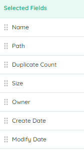
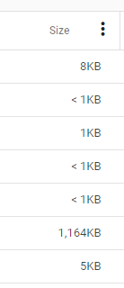
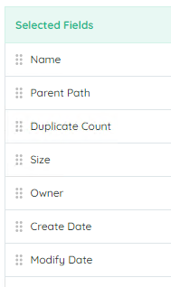
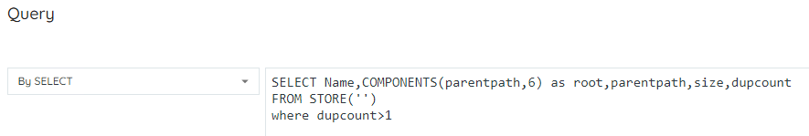

## Creating a Report

The creation of an Aparavi report is relatively simple. That does not mean that a report should be created without any forethought however.

### What Items Should Be Included

What items should be included in the report? Maybe only items greater than a certain size? Maybe items created less than 2 years ago? Maybe items with a specific permission level?

### What Data Should Be Included

What data (columns) should be shown for each of the items? Does the Path and File Name need to be separate columns or a single column? Is the Creation Date/Time needed or just the Last Accessed Date/Time?

### How Should The Data Be Presented

How should the data be presented to the user? Is it a report designed to be viewed and sorted in Excel? Is the report designed to be interactively manipulated? Should the report be raw data only to be loaded into another system's table?

### Why is this report being used?

Often this question needs to be asked throughout the report design process. Ask the user this question before any work has been done - often the user doesn't know what CAN be done, they may be asking for something assuming you can't do what they really want or need. Once it has been delivered and used, check back with the user with the following questions.

### What is it really telling you?

The report is just data representing the filter and the columns. What does this mean to the user and are there flaws in what they are interpreting the answer as? Can the answer be clearer? Can the data be constructed to be generic or specific to serve more or less purposes?

### What can make it more effective?

How much time is spent modifying the output after the fact? Can it be faster to the "final" result? Updating the filter, adding grouping/sorting, adding additional columns or even logic?

## Duplicate Item Report Recipe

We want to build a report that shows duplicate files across the Aparavi aggregations. This report will be used by IT, the CDO, and the CSO to identify a) "space hogs" by identifying larger files stored in multiple locations, b) loss of "Truth" by instances of the same file found in multiple locations, and c) potential security risks by storing a file in an unsecure or less secure location.

### **_The Recipe_**

- **What Items**: File: Duplicates >= 2
- **What Data**: Name, Path, Duplicate Count, Size, Owner, Create Date, Modify Date
- **Presentation**: Report for Excel Export

_The Steps_

1. Add a filter of _File: Duplicates >= 2_
2. Select the columns desired
3. Run the report

### Analyze the Results

Go back through the initial questions. Does it show what is needed? Can it be better?

## Interactive Variations

This first variation will use the report wizard and viewer to make it an interactive report. This will give an Aparavi user the ability to interactively add columns, sorts, etc to the report and overwrite or create a new report with the new design.

1. Change Sorts - Click on the header name or the triple dot button
    1. Sort by SIZE, DESCENDING - this lets you see the largest files that are taking double (or more) space
    2. Sort by MODIFY DATE, ASCENDING - this lets you see the oldest, untouched duplicate files
    3. Sort by OWNER - this lets you see the largest users/departments for duplicate files
2. Add Grouping - Click on the triple dot button
    1. Group by NAME - this lets you see each copy of the file together. **NOTE:** If a file has the same NAME as another (but is not duplicate) it will show together. See Adding fields for another way to handle this.
    2. Group by PARENT PATH - this lets you see the files by each parent folder.
3. Add a Filter - Click **QUERY**, then **ADD NEXT QUERY**
    1. Add Filter on `FILE: NAME <> .DS_Store` - this removes a large number of system files that are small, and frequently duplicates. Due to their size, they don't really have any impact.
4. Add a New Column - Click **QUERY**, the select from the **AVAILABLE FIELDS**
    1. Add File Signature (Click Show Advanced Fields) - this adds the file hash that identifies actual duplicate columns. If you GROUP BY Duplicate Count (Descending), then by File Signature, you'll be able to see all of the duplicated files together in order of "worst offender"

## Formatted Variations

1. Set Column Alignment - Click on the Triple Dot next to the column name
    1. Set the NAME column to RIGHT aligned and leave the PATH column set to LEFT aligned
    2. Set DATE columns to CENTER aligned
2. Add Subtotals - Click on the Triple Dot next to the column name
    1. Add aggregations (SUM, MIN, MAX, AVG) for numeric fields - when used with GROUPing, the aggregations will show at the bottom of each GROUP section...COUNT is added automatically when GROUPing is used and shows at the top of each GROUP section
3. Format Dates and Numbers
    1. Set DATE columns to MM/DD/YYYY format - note the TIME STAMP portion of the date will still show
    2. Set the SIZE column to show in KB (or MB or GB) format. This show "smaller" number since it shows Kilobytes (or Mega or Giga) instead of bytes.

## Designed for Spreadsheet Export

1. Replace PATH with PARENT PATH - This provides a better "data" column to sort by, if you want a "PATH" type column, export both or concatenate Parent Path and Name
    1. 

## Add Grouping and Subtotals

1. Add grouping on NAME or PARENT PATH. This will show you counts for each name or folder.
    1. Click on the column's triple dot and choose group by this column.
2. Add a subtotal on SIZE. This gives you an idea of the worst folders in terms of size of the duplicates.
    1. Click on the column's triple dot and choose SUM. The sum will appear in the footer of the group.

## Use AQL For Custom Columns

1. Go back and create a new report. When entering the filter choose BY SELECT

2. Enter the query.

> COMPONENTS(ParentPath,6) - this will take ParentPath and present up to (but not including) the first 6 folders and show it as a column.
> 
> AQL queries can be extremely slow compared to other queries due to complex processing, such as the Components function above.
