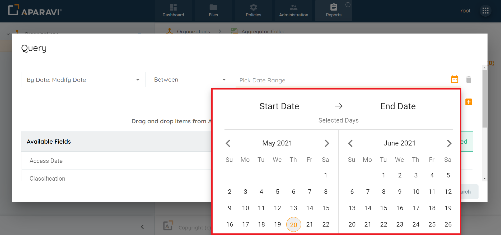
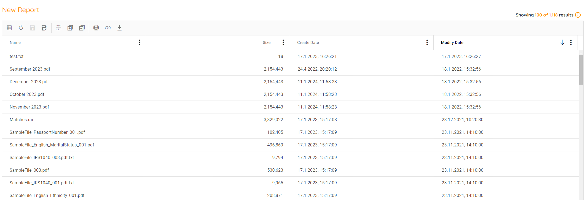

Now, you can create special reports that focus on when things were last changed. This helps you look at how much space you're using, plan your spending, and find stuff you don't need anymore. Just use the Reports Query tool to easily find files, make reports that suit you, and keep them for later.

1. Click on the Reports tab.
2. Click on the Create Custom Report button.
3. Inside the Query pop-up box, click on the first drop-down field and click \[By Date\]. Once the sub-menu displays, click on the \[Modify Date\].
4. Click on the second search filter drop-down field and choose one of the operators listed.
5. In the third search filter drop-down field, choose from the services listed. Click Search.

6. Once the Search button is clicked, the Query pop-up box will close, and the system will display all files within a specified range of the modified date.

From this point, the report can be exported, printed, columns can be altered, and the report can be saved for future use.
