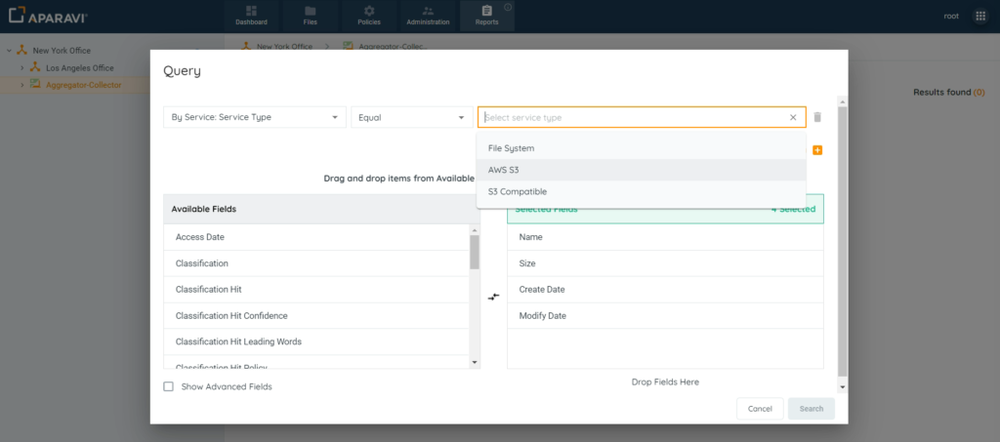
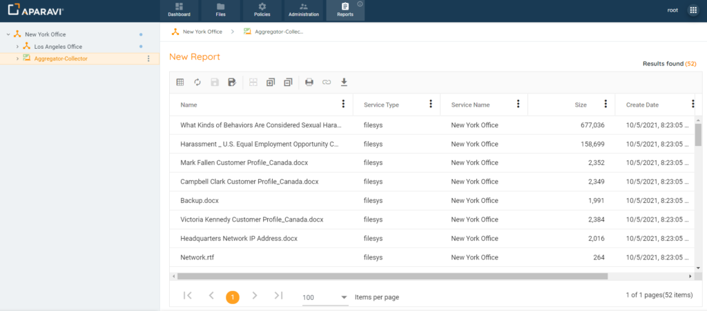

You can now make custom reports to check data for specific services. This helps analyze storage, budgeting, and find redundant data. Easily search for files with the Reports Query feature, customize reports, and save them for later.

1. Click on the Reports tab.
2. Click on the Create Custom Report button.
3. Inside the Query pop-up box, click on the first drop-down field and click \[By Service\]. Once the sub-menu displays, click on the \[Service Name\] or \[Service Type\] filter, depending on the type of search to be performed.
4. Click on the second search filter drop-down field and choose one of the operators listed.
5. In the third search filter drop-down field, choose from the services listed. Click Search.

6. Once the Search button is clicked, the Query pop-up box will close, and the system will display all files scanned by the specified Service.

From this point, the report can be exported, printed, columns can be altered, and the report can be saved for future use.
