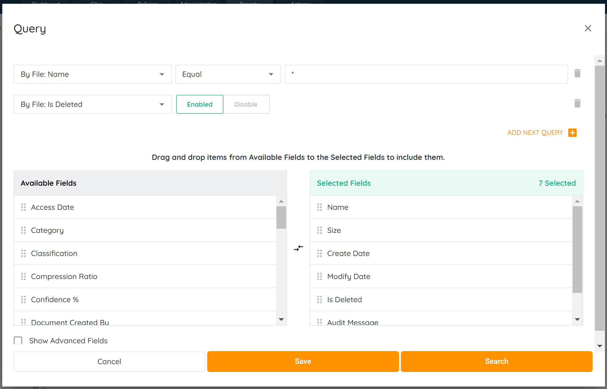
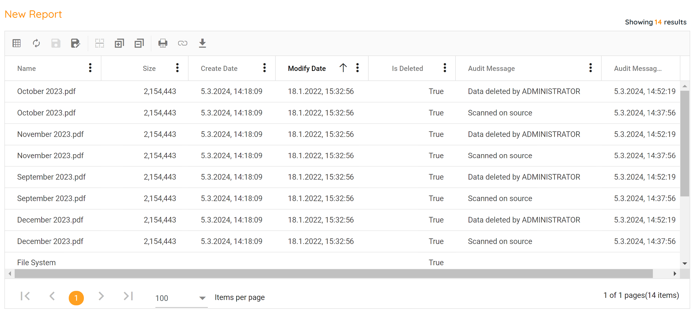

Deleted file reports can be generated from a files search or query report. These queries can provide administrators the ability to instantly view files that have been deleted, as well as when it was removed and by who.

1. Click on the Reports Tab, located in the top navigation menu.
2. Click on the Create Custom Report button. Once clicked, a query pop-up box will offer filter and field selections to customize the report.
3. Add the following fields to Selected Fields: Audit Message, Audit Message Time, Is Deleted. These fields allow administrators the ability to view when a file was deleted and who removed it.

4. Using three search filters, create a query report that identifies the files that were deleted, or simply select all files with the \* symbol. Add as a second condition "By File: Is Deleted" - "Enabled" option.
5. The files matching the search criteria will display. These reports can be exported and shared with other users, or saved for future use without having to continually repeat the same steps.

