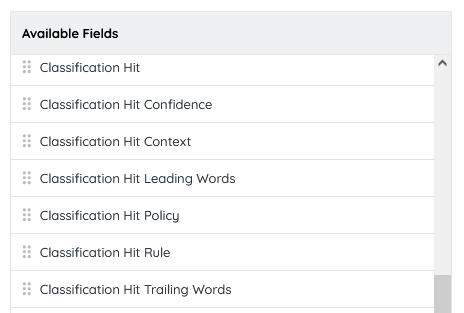
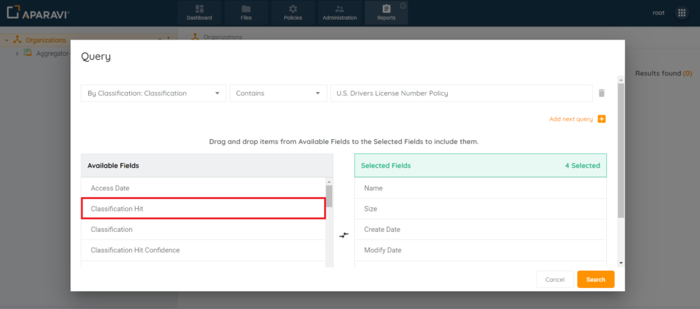
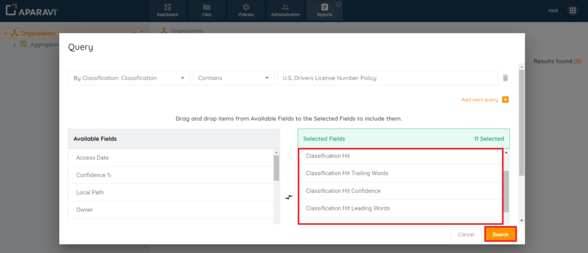
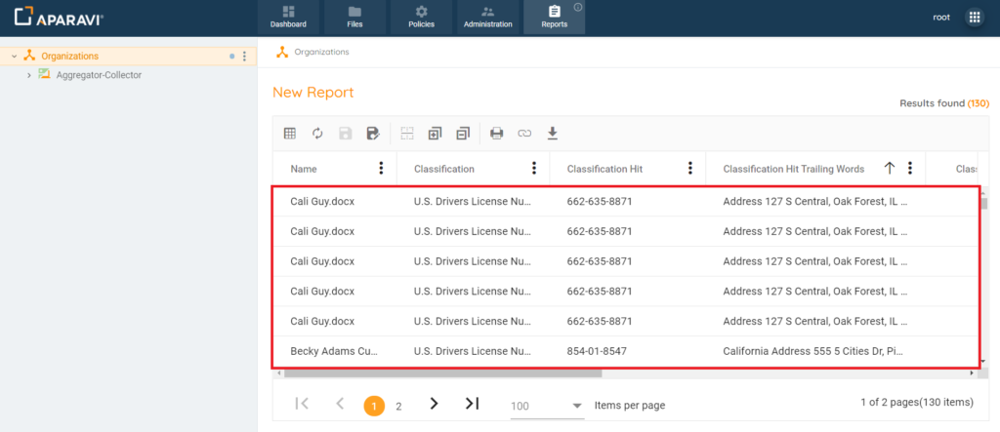

After classifying files with saved policies, you can easily search and see their classifications on the Files and Reports tabs. The search results can show details about the content that triggered the classification policy, including the specific rule within that policy.

## The 6 Classification Hit Fields

There are 6 classification hit fields that can be added to any file search or report query:

- **Classification Hit** – File content that triggered the classification policy.
- **Classification Hit Confidence** – Confidence level of file content that triggered the classification policy.
- **Classification Hit Context** - Context of a file content that triggered the classification policy.
- **Classification Hit Leading Words** – File content that appears just before the content that triggered the classification policy.
- **Classification Hit Policy** – The name of the classification policy that the file content triggered.
- **Classification Hit Rule** – The name of the rule that was triggered by the file content of the classification policy.
- **Classification Hit Trailing Words** – File content that appears just after the content that triggered the classification policy.

## Reporting on Classification Hits

While searching, you can include classification hit fields in the criteria. Keep in mind, if a file is classified with multiple policies, it will show up multiple times in the results, once for each classification rule it has found within the document. For instance, if a file has 3 policies, it will appear 3 times in the results, each time with different data in the added classification hit fields.

1. Click the Reports Tab, located in the top navigation menu.
2. Click on the Create Custom Report button.
3. Once the Query pop-up box appears, select the search criteria by altering the search fields, located above the list of Available and Selected Fields.
4. Once the search criteria have been selected, click on the Classification Hit field, located under the Available Fields column, and while holding down the mouse, drag it over into the Selected Fields column and release the mouse.

5. Repeat this process for the following fields:

- - Classification Hit Confidence
    - Classification Hit Context
    - Classification Hit Leading Words
    - Classification Hit Policy
    - Classification Hit Rule
    - Classification Hit Trailing Words

6. Once all fields have been added and appear under the Selected Fields column, click Search.

7. Once the Query pop-up box disappears, the file results matching the search criteria entered will appear, along with all Classification Hit fields added.

