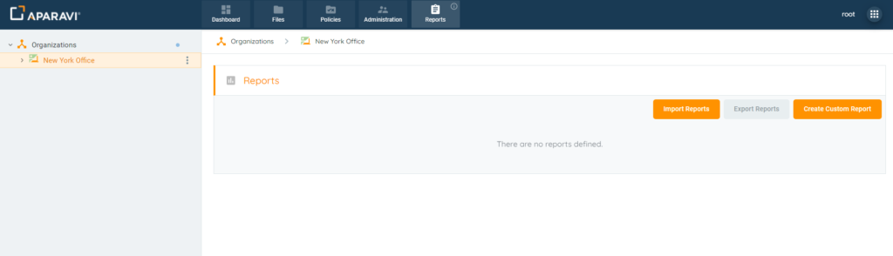
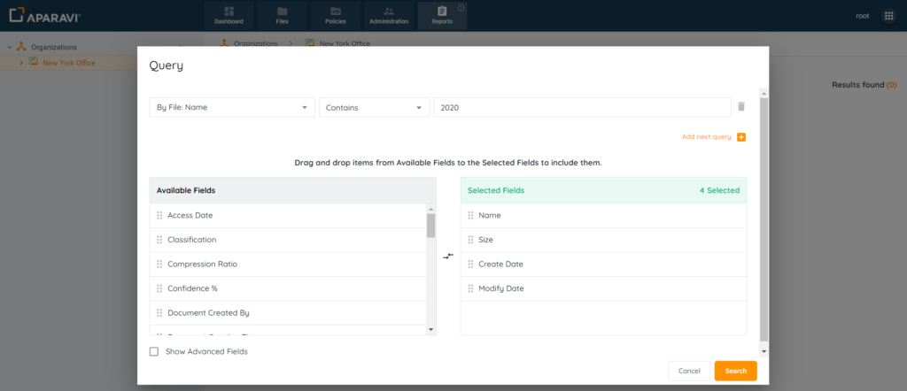
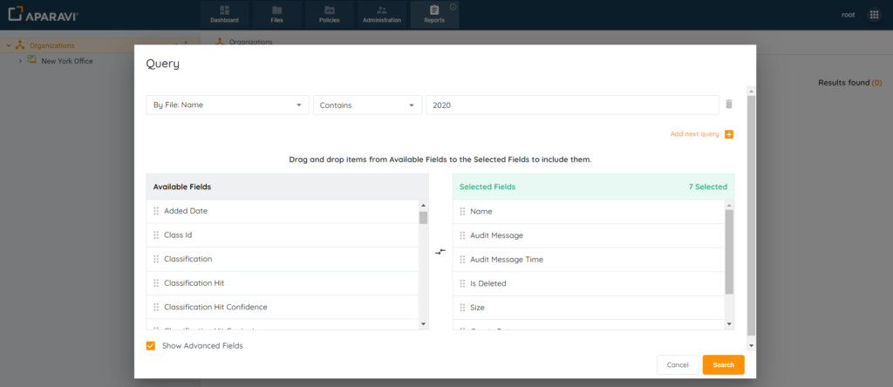
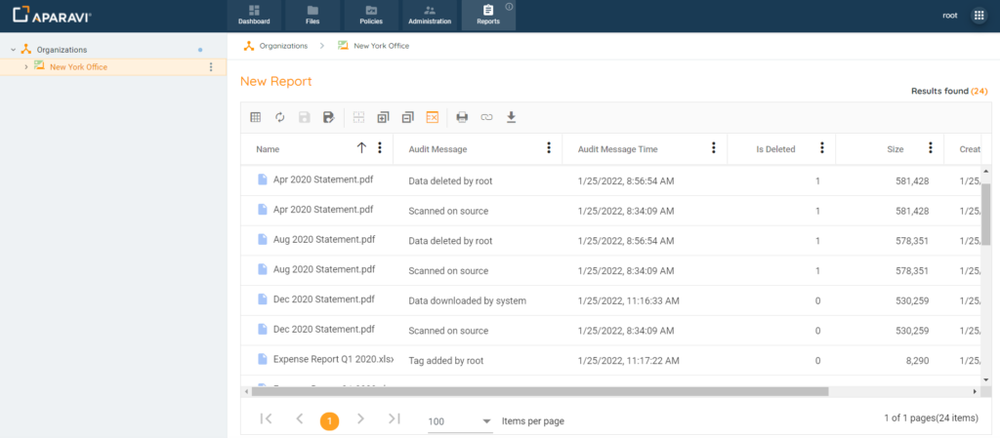

The platform provides administrative users the ability to view an audit log of actions taken in the system. This preserves the chain of custody and allows system administrators to monitor what is taking place and when. This audit log includes both actions performed by users, as well as the automated actions configured.

The Audit log could be generated for the following actions:

- Manually Deleting Files
- Downloading Files
- Tagging Files
- Manually Exporting Files
- System Automated Actions
    - Copy
    - Export
    - Transform

> Both File Searches and Reports will generate the audit log.

1. Click on the Reports tab, located in the top navigation menu.

2. Create a custom report.

3. Click the checkbox next to the label “Show Advanced Fields”. When enabled, the Available fields section will offer additional options, including the three fields above.
4. Add the following fields to the Selected fields section:

- - **Audit Message:** The action taken and who performed it.
    - **Audit Message Time:** timestamp for the action taken
    - **Is Deleted:** displays if the file has been deleted from the system

5. To add a field, drag it from the Available Fields section into the Selected Fields section. Once completed, click Search.

Once the Audit log query has been prepared, it can also be saved as a report for quicker executions.

> The name ‘system’ will appear for automated actions only. All other actions will record the name of the user who performed it.

