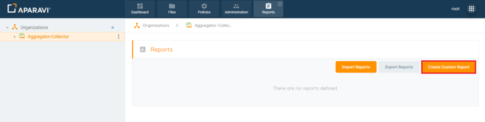
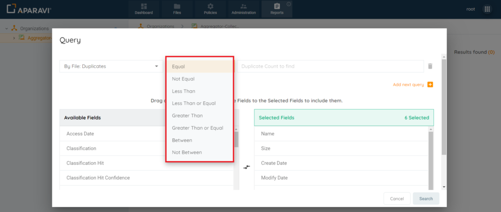
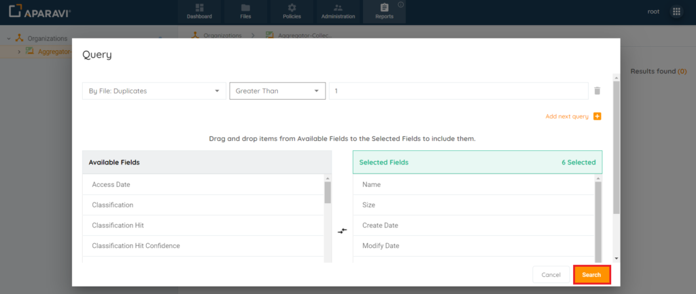
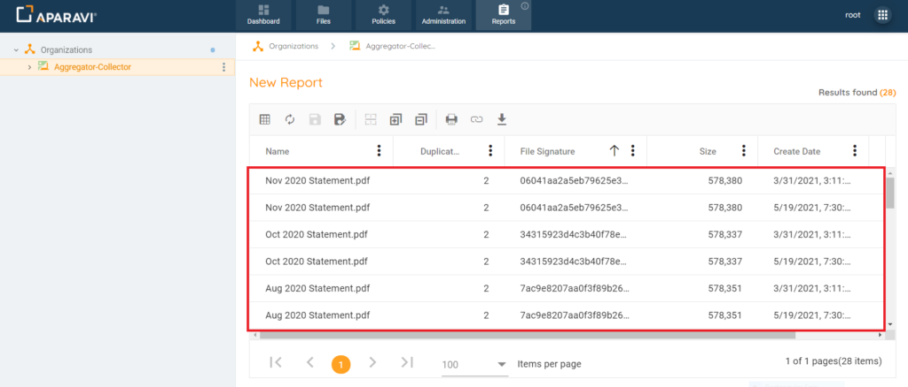

Searching for duplicate files allows for organizations to view the redundant data that is being stored within the system across all your data storages. Managing redundant data is a requirement in managing ROT (Redundant/Obsolete/Trivial) and offers many benefits such as consolidating storage, reducing risk, and imposing defensible disposition of data. Saving these duplicate file queries in report form allows for quick reporting of all duplicate files that have been scanned by the system.

1. Click on the Reports tab.
2. Click on the Create Custom Report button.

3. Inside the Query pop-up box, click on the first drop-down field and click on the first option listed, \[By File\] -> Duplicates.
4. Inside the Query pop-up box, click on the second drop-down field and choose one of the operators listed.

5. Inside the Query pop-up box, click on the third field and enter the search criteria. This field will vary, depending on the selection of the second drop-down menu (list of operators). E.g: Duplicates Greater Than 1.
6. Fields can be added or removed from this view to ensure that only the required fields are displayed on the Duplicate Files report.

> _The system defaults with some fields in Selected Fields and others in Available Fields. Click "Show Advanced Fields" for more options, follow the same steps to add or remove them. Click [here](/data-suite/reports/reports/customizing-reports) to learn how to add or remove fields from reports._

7. Once completed with selections, click Search.

8. Once the Search button is clicked, the Query pop-up box will close, and the system will display all duplicate files that have been scanned by the system.

> By default, when using the \[By File Duplicates\] filter, the system will display the two columns “Duplicate Count” & “File Signature.”

**Duplicate Count:** The values in this field represent the number of duplicate files. For example, Duplicate Count = 3 - means that this file is the third duplicate of the original scanned file.

**File Signature:** This field contains a hash value(file signature) that is used to identify or verify the contents of the duplicated file.

