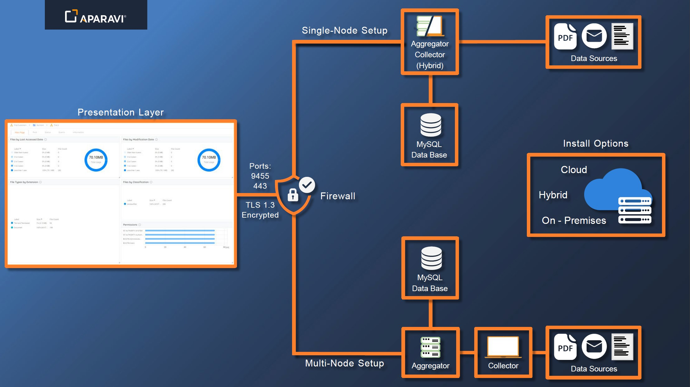

<head>
  <title>Overview - Aparavi Data Suite Documentation</title>
</head>

### This overview introduces the key components of the APARAVI architecture, explaining how they work in harmony.

APARAVI infrastructure offers two installation methods, multi-node and single-node setups, as depicted in the diagram below. The nodes can be deployed across different environments, providing users with the flexibility to install them in the cloud or on-premises, including multi-cloud and hybrid-cloud options.

 

## **Multi-node setup**

Within this installation, the APARAVI software is split into two main components. One being the Aggregator and the collector respectively. With this type of setup, the two nodes require their own environment. (VM, Server, instance)

**Collector**

The collector is the link and main worker of the APARAVI software. This component connects to the data source and then does the indexing of the data. When the collector has completed the tasks, it sends the information to the aggregator to store the gathered information.

**Aggregator**

The aggregator’s primary function is to connect to the APARAVI platform, gather the data coming from the collector and store it in the Database.

**Single-node setup**

Similar to the multi-node setup, the single-node setup is the combination of the two nodes and can be installed onto one machine.

**Presentation/Platform**

The presentation layer/ APARAVI platform is the user interface where all actions occur. This layer sends the queries to the aggregator that then sends the corresponding commands to gather the information requested and sends it back to the APARAVI platform.

This layer communicates to the aggregator via TLS1.3, HTTPS (443) APARAVI Port (9544). These ports need to be opened on the firewall where the aggregator is installed.
