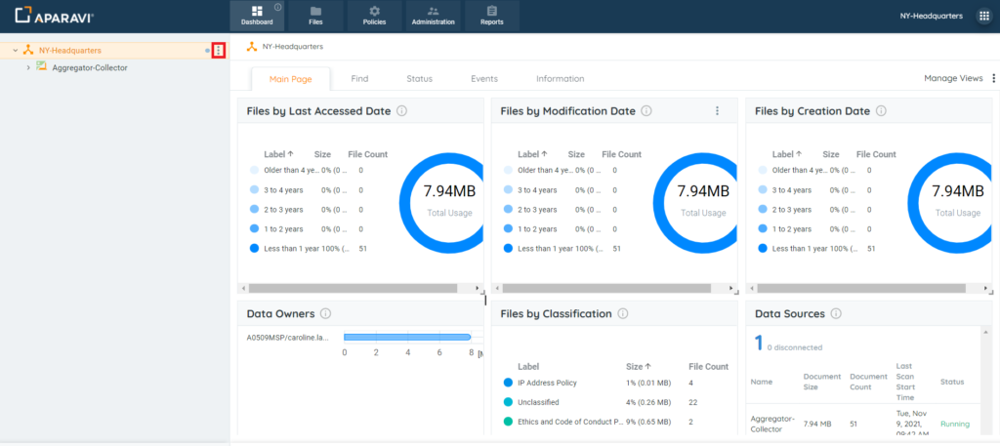
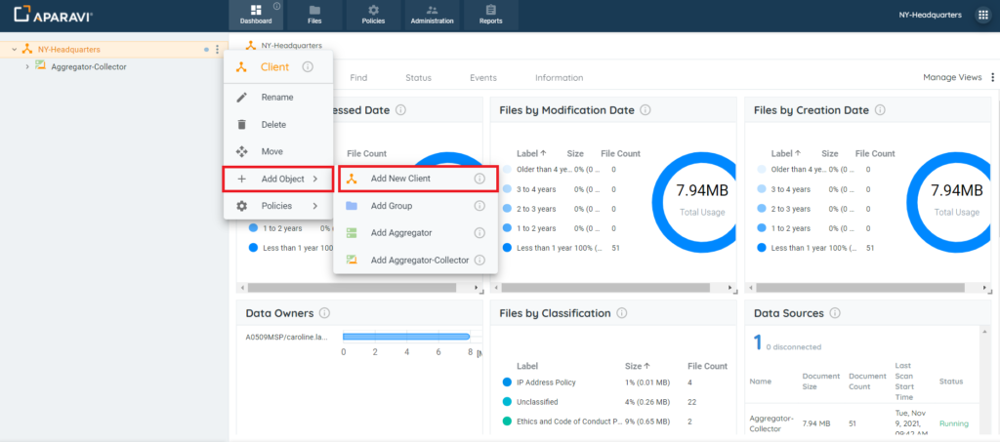
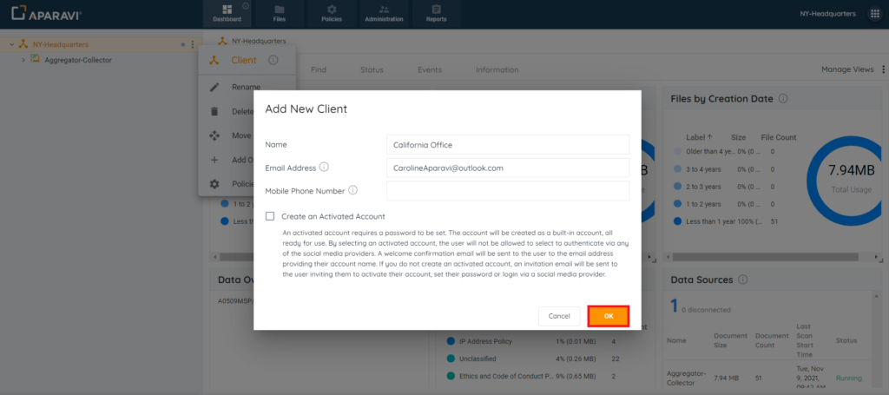
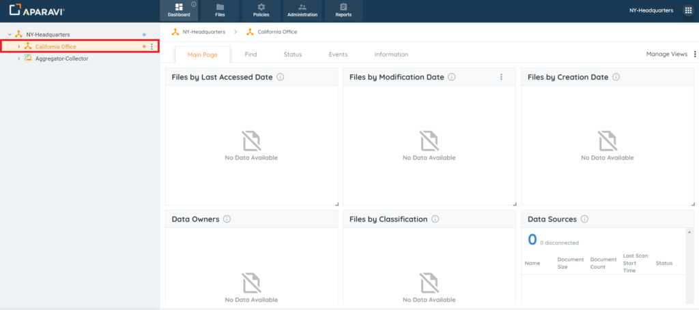

<head>
  <title>Clients - Aparavi Data Suite Documentation</title>
</head>

1. Click on the three vertical dots next to the Organization/Client this new client should be nested under in the navigation tree. Once clicked, a menu will appear.

2. In the menu, click on the "Add Object" option and a sub-menu will display. Once displaying, choose the "Add New Client" option that appears in the sub-menu.

3. Once clicked, the Add New Client pop-up box will appear with options to input:

- **Name:** Enter the name of the new client.
- **Email Address:** Use any email address for the new user.
- **Mobile Phone Number:** \[Leave this field empty\].
- **Create an Activated Account:** By default the system will have the checkbox unchecked. Leave this checkbox as it is.

4. When completed, click on the OK button, located in the bottom right-hand corner of the Create User pop-up box to save the changes.

Once the new client has been added, the client will appear in the navigation tree under the Organization/Client that was chosen when the new client was created. At this point, the user will receive an email to configure their account. The red dot to the right of the client's name will turn blue once the account has been activated.

